# Linux内核简介
Unix强大的根本原因：
1. 简洁：仅仅提供几百个系统调用
2. 一切皆文件
3. Unix的内核和相关系统工具软件是用C语言写的
4. Unix进程创建非常迅速
5. 提供了一套非常简单但又稳定的进程间通信元语

- 在系统中运行的应用程序通过系统调用来与内核通信：应用程序通常调用库函数，再由库函数通过系统调用让内核完成各种不同任务

## 单内核与微内核设计之比较
- 单内核（宏内核）就是整体上作为一个单独的大过程来实现，同时也运行在一个**单独的地址空间**上，所以这样的内核通常以单个静态二进制文件的形式放于磁盘中，所有的内核服务都在这样一个大内核地址空间上运行
  - 简单、性能高：内核之间的通信是微不足道的，因为大家都运行在内核态

- 微内核的功能被划分为多个独立的过程，每个过程叫做一个服务器。所有的服务器都保持独立并运行在**各自的地址空间**上。并且只提供一些必要的服务
  - 因此不可能像单模块那样直接调用函数，而是使用IPC（进程间通信）机制互通消息


# 进程管理
## 进程描述符及任务结构
- 内核把进程的列表存放在叫做任务队列的双向链表中
  - 链表中的每一项都是类型为task_struct，称为进程描述符的结构
  - 进程描述符包含一个具体进程的所有信息：它打开的文件、进程的地址空间、挂起的信号、进程的状态等
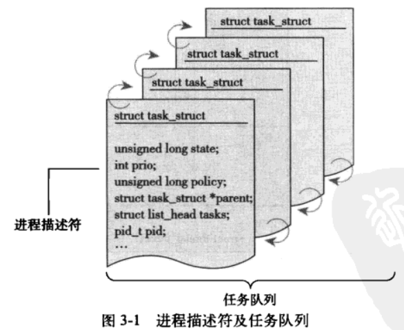

## slab机制
- 用于针对一些小块内存及经常分配和释放的对象，如进程描述符

### 分配进程描述符
- Linux通过slab分配器分配task_struct结构

### 进程描述符的存放
- 内核使用PID来标识每个进程

### 进程状态
- 进程描述符中的state域描述了进程的当前状态，系统中的进程必将处于五种进程状态中一种：
  1. TASK_RUNNING(运行)：进程可执行、正在执行、或者在运行队列中等待执行；这是进程在用户空间中执行的唯一可能的状态，也可以应用到内核空间中正在执行的进程
  2. TASK_INTERRUPTIBLE(可中断)：进程正在睡眠（被阻塞），等待条件的达成；一旦条件达成，内核就会把它设置成运行
  3. TASK_UNINTERRUPTRIBLE(不可中断)：除了就算接收信号也不会被唤醒，这个状态与可中断相同
  4. __TASK_TRACED：被其他进程跟踪的进程，例如通过ptrace对调试程序进行跟踪
  5. ————TASK_STOPPED(停止)：进程停止执行，进程没有投入运行也不能投入运行。通常这种状态发生在收到SIGSTOP、SIGTSTP等信号的时候
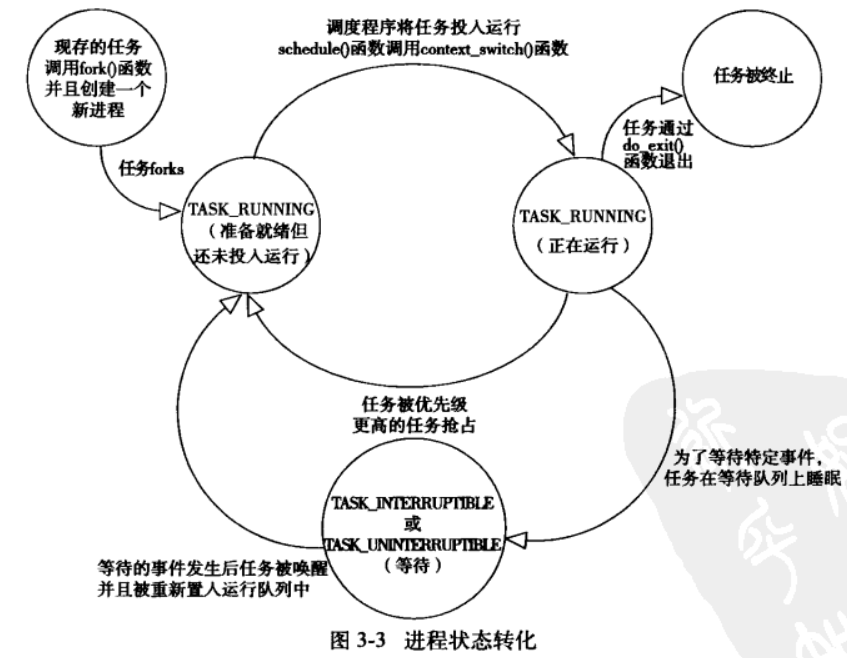

### 设置当前进程状态
- 内核经常需要调整某个进程的状态，使用set_task_state(task, state)函数：
```c
set_task_state(task, state); //将任务task的状态设置为state
```

### 进程上下文
- 一般程序在用户空间执行，一旦执行了某个系统调用或者触发了某个异常，就陷入了内核空间。此时称内核“代表进程执行”并处于进程上下文中
- 除非在此间隙有更高优先级的进程需要执行，否则在内核击退出的时候，程序恢复在用户空间继续执行

### 进程家族树
- 所有进程都是PID为1的init进程的后代
- 内核在系统启动的最后阶段启动init进程，该进程读取系统的初始化脚本并执行其他的相关程序，最终完成整个系统启动的整个过程
- 进程间的关系放在进程描述符中，每个task_struct都包含一个指向其父进程task_struct，叫做parent的指针，还包含一个称为children的子进程链表

## 进程创建
- UNIX将创建进程分解到两个单独的函数中执行：fork() 和 exec();
- fork通过拷贝当前进程创建一个子进程
- exec函数负责读取可执行文件并将其载入地址空间开始运行

### 写时拷贝
- COW：将复制操作推迟到第一次写的时候进行。内核会保留每个页面的引用计数，每次复制某个页面时，引用计数减一，当页面只有一个引用时，跳过复制，直接修改
- 传统的fork()系统调用直接把所有的资源给新创建的进程，这种实现过于简单 并且效率低下
- Linux的fork()使用*写时拷贝页*实现。写时拷贝时一种可以推迟甚至免除拷贝数据的技术；内核此时并不复制整个进程空间，而是让父进程和子进程共享同一个拷贝
- 只有在需要写入时，数据才会复制，从而使各种进程拥有各自的拷贝。也就是说，资源的复制只有在需要写入的时候才进行，在此之前，只是以只读方式共享
- 在页根本不会被写入的情况下，就无需复制了
- fork()的实际开销就是复制父进程的页表以及给子进程创建唯一的进程描述符
- 在一般情况下，进程创建后会马上运行一个可执行文件的程序，这种优化可以避免拷贝大量根本就不会被使用的数据
总结：fork之后，kernel会把父进程的内存页都设置成read-only，然后将子进程页指向父进程页。当父子进程都只读内存时，相安无事。当其中某个进程开始写内存时，CPU硬件检测到内存页时read-only的，触发页异常中断，陷入kernel的中断例程。中断例程中，kernel就会把触发异常的页复制一份，于是父子进程各自持有独有的一份。

- COW优缺点：
  1. 可减少分配和复制带来的瞬时延迟
  2. 减少不必要资源的复制。比如fork时，父进程的代码段和只读数据段都不允许修改，所以无需修改
  3. 如果在fork之后，父子进程都产生了大量的写操作，会产生大量的页错误

### fork()
- Linux通过clone()系统调用实现fork()
- fork()、vfork()、__clone()库函数都根据自己需要的参数调用clone()，然后由clone()调用do_fork()

### vfork()
- 除了**不拷贝父进程的页表**外，vfork()和fork()功能相同(fork支持COW后，已经一样了)
- 子进程作为父进程的一个单独的线程在它的地址空间里运行，父进程被阻塞，直到子进程退出或执行exec()

fork和vfork区别：
1. vfork主要是早期fork不支持COW时使用，目的就是在vfork后直接调用exec()
2. 两者现在主要的区别是前者生成的是进程，后者生成的是线程
3. vfork会导致父进程阻塞，fork使用时父子进程调度顺序未知
4. 在支持COW的情况下，fork相比vfork还是多拷贝了一些东西，如页表、mm struct(用于虚拟地址空间的描述)这两个结构

## 线程在Linux中的实现
- Linux内核角度来说，并没有线程的概念，Linux把所有的线程都当成进程来实现，每个线程都拥有唯一属于自己的task_struct
- 线程仅仅被视为一个与其他进程共享某些资源的进程
- 在Windows和SUN solaris等操作系统中差异非常大，是在内核中提供了专门支持线程的机制

### 创建线程
- 线程的创建和普通进程的创建类似，只不过在调用clone的时候需要传递一些参数标志来指明需要共享的资源
```c
clone(CLONE_VM | CLONE_FS | CLONE_FILES | CLONE_SIGHAND, 0) // 父子进程共享地址空间、文件系统信息、打开的文件、信号处理函数以及被阻断的信号
```
- clone 的参数标志：
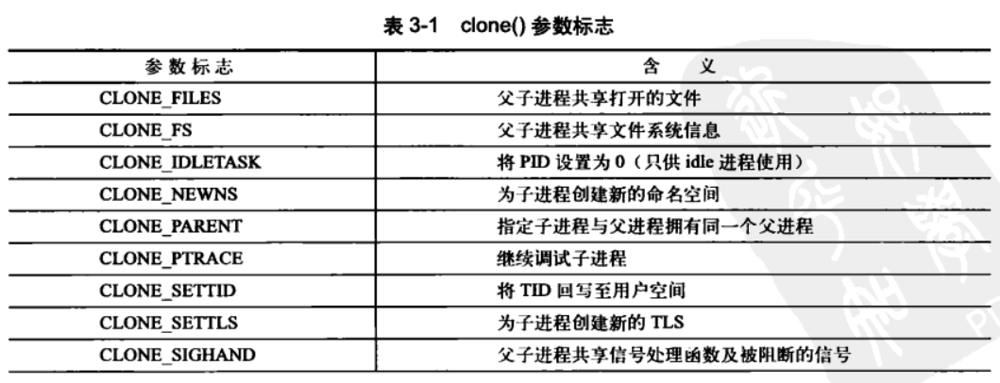
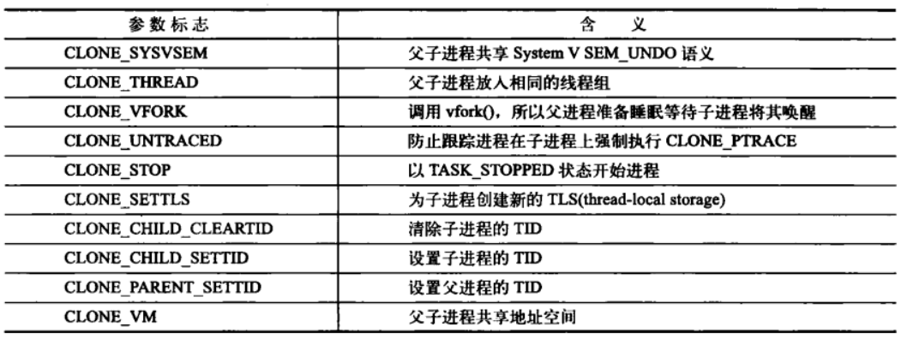

### 内核线程
- 独立运行在内核空间的标准进程
- 内核线程和普通进程进程之间的区别在于内核线程没有独立的地址空间（指向地址空间的mm指针被设置为NULL），它们只在内核空间运行
- 内核线程是通过kthread内核进程通过clone系统调用创建的

## 进程终结
- 僵尸进程：子进程已经结束，但是父进程没有来得及回收子进程，子进程的PID仍然保留在系统中
- 进程的总结大部分要靠do_exit()来完成
- 调用后与进程相关联的所有资源都被释放掉了并处于EXIT_ZOMBIE退出状态
- 进程占用的内存只有内核栈、thread_info、task_struct结构
- 此时进程存在的目的就是向他的父进程提供信息

### 删除进程描述符
- 前面可以看出，进程终结时所需要的清理工作和进程描述符删除被分开执行
- 在父进程**获得已终结的子进程的信息**后，或者**通知内核它并不关注那些信息**后，子进程的task_struct结构才被释放

### 孤儿进程造成的进退维谷
- 父进程在子进程之前退出
- 给当前子进程在当前线程组内找一个线程作为父亲，如果不行，就让init作为父进程


# 进程调度
- 自Linux2.6后，采用了RSDL(反转楼梯最后期限调度算法)算法替代O(1)算法，将公平调度的概念引入Linux调度程序；也被称为完全公平调度算法，或者称为CFS

## 策略
### I/O消耗型和处理器消耗型的进程
- 前者指进程的大部分时间用来提交I/O请求或是等待I/O请求，这样的进程常常只运行短短一会儿，由于在等待更多的I/O请求时最后总会阻塞
- 处理器耗费型进程把时间大多数用在执行代码上，除非被抢占，否则将不停的运行
- 调度策略通常要在两个矛盾的目标中间寻找平衡：响应时间和高吞吐量

### 进程优先级
- Linux采用了不同的优先级范围
- 一种时nice值，范围为-20到+19，默认值为0；nice值代表分配给进程的时间片比例；越大的nice值意味着更低的优先级，获得更少的处理器时间
- 第二种是实时优先级，其值是可配置的，变化范围为0-99；越高的实时优先级数值意味着进程优先级越高，任何实时进程的优先级都高于普通的进程
- 两者互不干涉

### 时间片
- Linux的CFS调度器并没有直接分配时间片到进程，它是将处理器的使用比划分给了进程；因此进程所获得的处理器时间是和系统负载密切相关的，这一比例还会受nice值影响（权重）

## Linux调度算法

### 调度器类
- Linux调度器是以模块方式提供的，这样做的目的是可以允许不同进程可以针对性的选择调度算法
- 这种模块化的结构被称为调度器类，每个调度器都有一个优先级，会按照优先级顺序遍历调度类，拥有一个可执行进程的最高优先级的调度器类胜出，去选择下面要执行哪一个程序
- CFS是一个针对普通进程的调度类

### Unix系统中的进程调度

### 公平调度
- 任何进程的处理器时间是由它自己和其他所有可运行进程nice值得**相对差值**决定的

## Linux调度得实现
### 时间记账
1. 调度器实体结构
   - 调度器实体结构作为一个名为se的成员变量，嵌入在进程描述符task_struct内
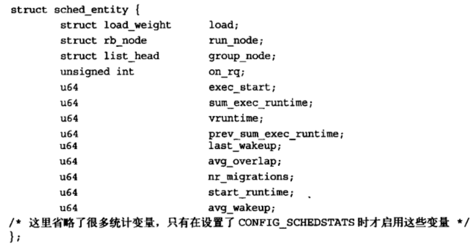

2. 虚拟实时
   - vruntime存放的是进程的虚拟运行时间，该运行时间是被加权后的

### 进程选择
- 当CFS需要选择下一个运行进程时，它会挑一个具有最小vruntime的进程
- CFS使用红黑树来组织可运行进程队列，并利用其找到最小vruntime值得进程

1. 挑选下一个任务
   - vruntime最小得进程对应树中最左边的叶子节点
   - 最左侧的叶子节点是缓存起来的，所以可以实现O(1)时间查找

2. 向树中加入进程
   - 发生在进程变为可运行状态或者fork()调用第一次创建进程时

3. 从树中删除进程
   - 发生在进程阻塞或者终止时

### 睡眠和唤醒
- 休眠的进程有两种状态：TASK_INTERRUPTIBLE（如果收到信号会提前唤醒响应信号）和TASK_UNINTERRUPTIBLE（进程会忽略信号）
1. 等待队列：由等待某些事件发生的进程组成的简单链表
   - 当与等待队列相关的事件发生的时候，队列上的进程会被唤醒
   - 如果状态被设置为TASK_INTERRUPTIBLE，则信号唤醒进程。这会导致虚假唤醒，因此检查并处理信号
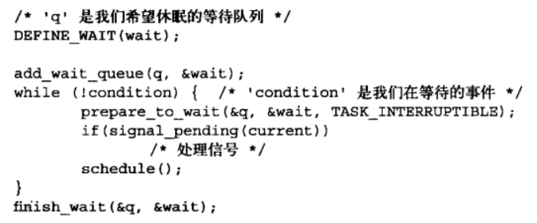

2. 唤醒
   - 唤醒操作通过函数wake_up进行，它会唤醒指定的等待队列上的所有进程
   - 该函数将进程设置为TASK_RUNNING状态，调用enqueue_task()将此进程放入红黑树中

## 抢占和上下文切换
- 从一个进程切换到另一个进程，有context_switch()函数负责处理，schedule()负责调用该函数，完成两项基本工作：
  1. 调用switch_mm()函数，负责把虚拟内存从上一个进程映射切换到新进程中
  2. 调用switch_to()，负责从上一个进程处理器状态切换到新进程的处理器状态；包括保存、恢复栈信息和寄存器信息等

- 内核提供了一个need_resched标志（task_struct中）来表明是否需要重新执行一次调度；当某个进程应该被抢占时，scheduler_tick()就会设置这个标志，内核检查该标志，确认其被设置，调用schedule()来切换到一个新的进程


### 用户抢占
- 内核即将返回用户空间时，如果need_resched标志被设置，会导致schedule()被调用，此时就会发生用户抢占
- 用户抢占在以下情况时发生：
  1. 从系统调用返回用户空间时
  2. 从中断处理程序返回用户空间时

### 内核抢占
- Linux完整的支持内核抢占；在不支持内核抢占的内核中，内核代码可以一直执行，到它完成为止
- 什么时候重新调度时安全的？
  - 只要没有持有锁，内核就可以进行抢占，锁时非抢占区域的标志
- 为了支持内核抢占，为每个进程的thread_info引入preempt_count计数器；该计数器每当使用锁的时候值加1，释放锁的时候值减一，当数值为0时，内核就可以执行抢占
- 从中断返回内核空间时，内核会检查need_resched和preempt_count的值，如果need_esched被设置，并且preempt_count为0的话，说明有一个更加重要的任务需要执行并且可以安全的抢占，此时调度程序就会被调用；如果preempt_count不为0，说明当前任务持有锁，抢占不安全，会直接从中断返回当前执行进程；如果当前进程持有的所有锁都被释放了，此时释放锁的代码会检查need_resched是否被设置；如果是，会调用调度程序
- 如果内核进程被阻塞了，或者显式的调用了schedule()，内核抢占也会显式的发生

- 内核抢占发生在：
  1. 中断处理程序正在执行，且返回内核空间前
  2. 内核代码再一次具有可抢占性的时候
  3. 内核中的任务显示调用schedule()
  4. 内核中的任务阻塞

## 实时调度策略
- Linux提供了两种实时调度策略：SCHED_FIFO和SCHED_RR；而普通的、非实时的策略是SCHED_NORMAL
- 借助调度类的框架，这些任务不被完全公平调度器管理，而是被一个特殊的实时调度器管理
- 都使用静态优先级，但是Linux地实时调度算法提供地是一种软实时工作方式

- SCHED_FIFO：不使用时间片，**处于SCHED_FIFO级的进程会比任何SCHED_NORMAL级的进程都先得到调度**（我的理解是，CFS的进程就是SCHED_NORMAL）；一旦一个SCHED_FIFO级的进程处于可执行状态，它会一直执行，直到自己受阻塞或显示地释放处理为止；只有更高优先级地SCHED_FIFO或者SCHED_RR任务才能抢占SCHED_FIFO任务才能抢占SCHED_FIFO任务
- SCHED_RR：在进程耗尽实现分配地时候后就不能继续执行了（带有时间片地 SCHED_FIFO）

## 与调度相关地系统调用
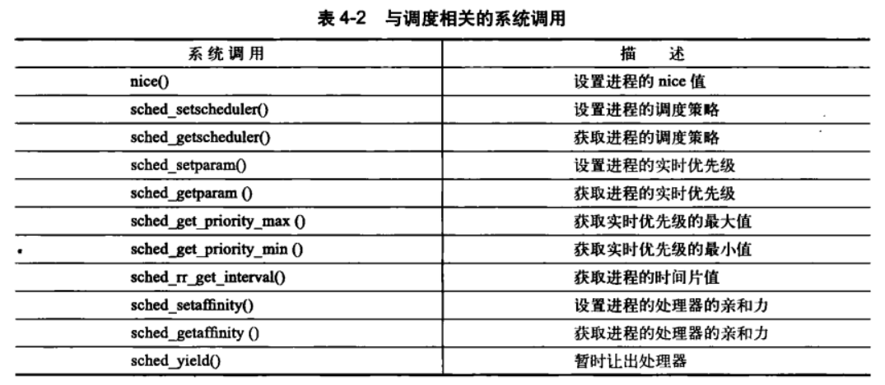

### 与处理器绑定有关的系统调用
- Linux调度程序提供强制的处理器绑定机制，允许用户指定进程一定在哪些处理器上运行（在task_struct的cpus_allowed位掩码中，默认情况下，所有的位都被设置）

### 放弃处理器时间
- Linux通过sched_yield系统调用，提供了让进程显示的将处理器时间让给其他等待执行进程的机制
- 通过从活动活动队列移到过期队列实现（确保一段时间都不会在执行）；实时进程不会过期，只被移动到优先级队列的最后面

# 系统调用
- 用户进程和内核进行交互的一组接口
- 系统调用在用户进程和硬件设备之间添加了一个中间层，主要作用：
  1. 为用户空间提供了一种硬件的抽象接口
  2. 系统调用保证了系统的稳定和安全：避免应用程序不正确地使用硬件设备
  3. 为每个进程运行在虚拟系统的一种考虑

### 系统调用号
- Linux中，每个系统调用被赋予一个系统调用号，一旦分配就不能有任何更改；如果一个系统调用被删除，它所占用的系统调用号也不允许回收利用
- 当用户空间的进程执行一个系统调用的时候，这个系统调用号就用来指明到底是要执行哪个系统调用，进程不会提及系统调用的名称
- Linux有一个"未实现"系统调用sys_ni_syscall()，返回-ENOSYS，这个错误号就是专门针对无效的系统调用而设的
- 内核记录了系统调用表中所有已注册过的系统调用的列表

### 系统调用的性能
- Linux系统调用比其他许多操作系统执行的要快：短的上下文切换和每个系统调用简洁高效

## 系统调用处理程序
- 用户空间无法直接执行内核代码
- 通知内核的机制是使用软中断实现的：通过引发一个异常来促使系统切换到内核态去执行异常处理程序，此时的异常处理程序就是系统调用程序
- 在X86系统上，预定义的软中断号是128，通常用int $0x80指令触发该中断（system_call()系统调用）

### 指定恰当的系统调用
- 陷入内核空间的时候需要把系统调用号一起传给内核
- 在X86上，系统调用号是通过eax寄存器传递给内核的，在陷入内核之前，用户空间就得把相应的系统调用号放入eax中

### 参数传递
- 除了系统调用号外，大部分系统调用都还需要将一些参数传入；所以在发生陷入时，还要把这些参数从用户空间传入内核
- 最简单的方法是把这些参数也放在寄存器里
- 给用户空间的返回值也通过寄存器传递，在X86上，放在eax寄存器中
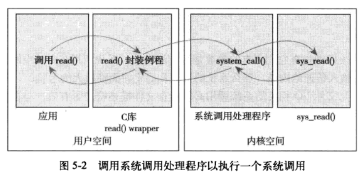

## 系统调用的实现

### 从用户空间访问系统调用
- 系统调用靠C库支持，用户程序通过包含标准库头文件和C库链接，就可以使用系统调用
- 但是如果仅仅写出系统调用，glibc库恐怕并不支持
- Linux提供了一组宏，用于直接对系统调用进行访问，这些宏是_syscalln()，其中n的范围从0-6，代表需要传递系统调用的参数个数
- 对于每个宏来说，都有2+2*n个参数，第一个是返回值的类型，第二个是系统调用的名称

# 中断和中断处理
- 每个中断都通过一个唯一的数字来标志

## 中断处理程序
- 一个设备的中断处理程序是它驱动程序的一部分，设备驱动程序是对设备进行管理的内核代码

## 注册中断处理程序
- 如果设备使用中断，那么相应的驱动程序就注册一个中断处理程序
- 驱动程序可以通过request_irq函数注册一个中断处理程序
- 第一个参数表示要分配的中断号，第二个指向处理这个中断的实际中断处理程序，第五个参数用于共享中断线
```c
// 申请一条给定的中断线
int request_irq(unsigned int irq, irq_hander_t handler, unsigned long flags, const char *name, void* dev);
```
## 释放中断处理程序
- 卸载驱动程序时，需要注销相应的中断处理程序，并释放中断线
```c
void free_irq(unsigned int irq, void* dev);
```
- 如果指定的中断线不是共享的，那么该函数删除处理程序的同时禁用这条中断线
- 如果中断线是共享的，则仅删除dev所对应的处理程序，而这条中断线本身只有在删除了最后一个处理程序时才会禁用

## 编写中断处理程序
- 当一个给定的中断处理程序正在执行时，相应的中断线在所有处理器上都会屏蔽掉，已防止在同一中断线上接收另一个新的中断

## 中断处理机制的实现
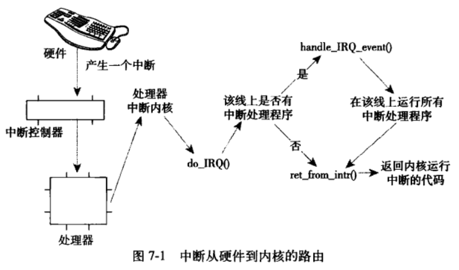
- do_IRQ()作用：
  - 提取中断号
  - 关中断
  - 调用中断处理程序

## 中断控制

### 禁止和激活中断
- 以前的内核中提供了一种能够禁止系统中所有处理器上中断的方法（cli()，sti()）
- 这些结构在2.5版本之后被取消，相应的现在所有中断同步必须结合使用本地中断控制和自旋锁

### 禁止指定中断线
- 禁止多个中断处理程序共享的中断线是不合适的（？？？？？？）
- 根据规范，PCI设备必须支持中断线共享

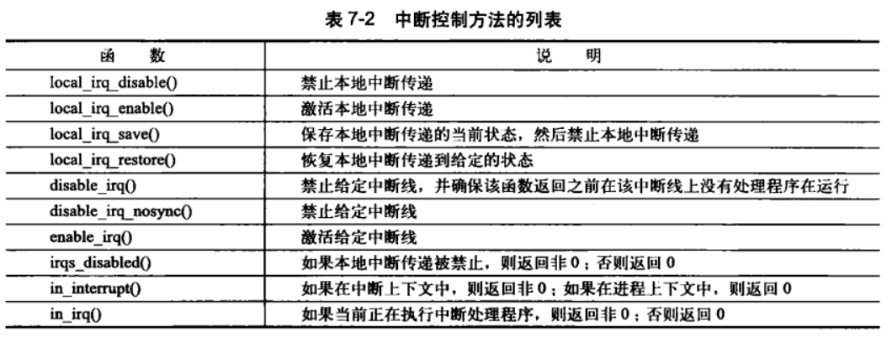

# 下半部和推后执行的工作

## 下半部
- 下半部的任务就是执行与中断处理密切相关但中断处理程序本身不执行的工作，用来指代中断处理流程中对实时性要求不那么高的程序
- 下半部实现机制：
  1. BH和任务队列：BH在Linux2.5后接口被抛弃，任务队列接口也被工作队列取代
  2. 软中断：一组静态定义的下半部接口，有32个，可以在所有处理器上同时执行
  3. tasklet：基于软中断实现的动态创建的下半部实现机制，两个不同类型的tasklet可以在不同的处理器上同时执行，但类型相同的tasklet不能同时执行

- tasklet是一种在性能和易用性之间寻求平衡的产物，对于大部分下半部处理来说，使用tasklet就足够了，像网络这样对性能要求高的才需要使用软中断
- 软中断必须在编译期间就进行静态注册；tasklet可以通过代码进行进行动态注册
- Linux2.6后下半部实现机制：
  1. 软中断
  2. tasklets
  3. 工作队列

## 软中断

### 软中断的实现
- 软中断由softirq_action结构表示
- kernel/softirq.c定义了一个包含32个该结构体的数组
```c
struct softirq_action{
  void (*action)(struct softirq_action*);
};

//kernel/softirq.c
static struct softirq_action softirq_vec(NR_SOFTIRQS);
```
- 因此最多可能有32个软中断

#### 软中断处理程序
- 软中断处理程序action的函数原型如下：
```c
void softirq_handler(struct softirq_action*)
```
- 当内核运行一个软中断处理函数的时候，就会执行这个action函数
```c
my_softirq -> action(my_softirq);
```
- 一个软中断不会抢占另一个软中断，唯一可以抢占软中断的是中断处理程序
#### 执行软中断
- 一个注册的软中断必须在被标记后才会执行，这叫做触发软中断
- 中断处理程序会在返回前标记它的软中断，使其在稍后被执行
- 在下列地方，待处理的软中断会被检查和执行：
  - 在一个硬件中断代码处返回时
  - 在ksoftirqd内核线程中
  - 在那些显示检查和执行待处理的软中断代码中

- 软中断都要在do_softirq()中执行，如果有待处理的软中断，该函数会循环遍历每一个，调用它们的处理程序 
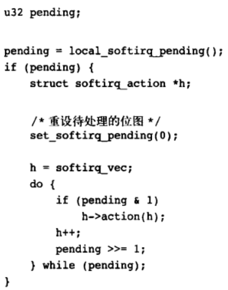

### 使用软中断
- 目前只有两个子系统直接使用软中断（网络和SCSI）
- 此外，内核定时器和tasklet都是建立在软中断上的

#### 分配索引
- 在编译期间，通过在linux/interrupt.h中定义的一个枚举类型来静态地声明软中断，索引号小的软中断在索引号大的软中断之前执行
- 建立一个新的软中断必须在此枚举类型中加入新的项，并且不能简单的将新的项加到末尾，必须考虑它的优先级

#### 注册你的处理程序
- 接着，在运行期间调用open_softirq()注册软中断处理程序，参数分别为软中断索引号和处理函数
```c
open_softirq(NET_TX_SOFTIRQ, net_tx_action);
open_softirq(NET_RX_SOFTIRQ, net_rx_action);
```
- 软中断处理程序执行的时候，允许响应中断，但它自己不能休眠
- 在一个处理程序运行的时候，当前处理器上的软中断被禁止

#### 触发你的软中断
- 通过在枚举类型的列表中添加新项以及调用open_softirq()进行注册以后，新的软中断处理程序就能够运行
- raise_softirq()函数可以将一个软中断设置为挂起状态，让它在下次调用do_softirq()函数时投入运行

## tasklet

### tasklet的实现
- 基于软中断实现，接口更简单，锁要求较低
- tasklet由两类软中断代表：HI_SOFTIRQ和TASKLET_SOFTIRQ，这两者之间唯一的实际区别在于，第一种类型的软中断先于第二种执行

#### tasklet结构体
- tasklet由tasklet_struct结构表示，每个结构体单独代表一个tasklet
```c
struct tasklet_struct
{
  struct tasklet_struct *next; /*链表中的下一个tasklet*/
  unsigned long state;         /*tasklet的状态，是否已被调度*/
  atomic_t count;              /*引用计数器*/
  void (*func)(unsigned long); /*tasklet 处理函数*/
  unsigned long data;          /*给tasklet处理函数的参数*/  
};
```

#### 调度tasklet
- 已调度的tasklet（等同于被触发的软中断）存放在两个单处理器数据结构：tasklet_vec和task_hi_vec
- tasklet由tasklet_schedule()和tasklet_hi_schedule()函数进行调度
- tasklet_schedule()执行步骤：
  1. 检查tasklet状态
  2. 调用_tasklet_schedule()
  3. 保存中断状态，然后禁用本地中断
  4. 把需要调度的tasklet加到每个处理器一个的tasklet_vec链表或tasklet_hi_vec链表的表头上
  5. 挂起软中断，这样在下一次调用so_softirq()时就会执行该tasklet
  6. 恢复中断到原状态并返回

### 使用tasklet
1. 声明自己的tasklet：使用DECLARE_TASKLET或者DECLARE_TTASKLET_DISABLED
2. 编写自己的tasklet处理程序：因为是靠软中断实现，所以tasklet不能睡眠
```c
void tasklet_handler(unsigned long data);
```
3. 调度你自己的tasklet
- 通过调用tasklet_schedule()函数并传递给它相应的tasklet_struct指针，该tasklet就会被调度以便执行
```c
tasklet_schedule(&my_tasklet); //将my_tasklet标记为挂起
```

#### ksoftirqd
- 当内核出现大量软中断的时候，辅助处理软中断的线程
- 这些线程在最低的优先级上运行
- 一旦该线程被初始化，就会执行下面的死循环：
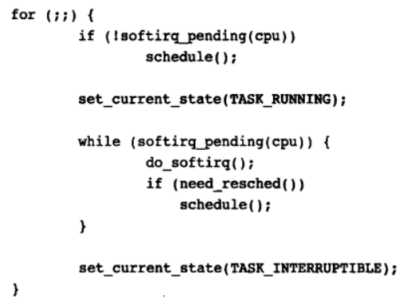
- 这种方案保证在软中断负担很重的时候，用户程序不会因为得不到时间而处于饥饿状态

## 工作队列
- 一种允许将工作推后的形式
- 工作队列可以把工作推后，交由另一个内核线程去处理
- 工作队列允许重新调度甚至是睡眠
- 如果推后的任务不需要睡眠，就选择软中断或者tasklet，否则就用工作队列

### 工作队列的实现
- 工作队列子系统是一个用于创建内核线程的接口，通过它创建的进程负责执行由内核其他部分排到队列里的任务，它创建的这些内核线程称作工作者线程
- 工作队列可以让驱动程序创建一个专门的工作者线程来处理需要推后的工作

#### 表示线程的数据结构
- 工作者线程用workqueue_struct结构表示：
```c
struct workqueue_struct
{
    struct cpu_workqueue_struct cpu_wq[NR_CPUS];
    struct list_head list;
    const char* name;
    int sinqlethread;
    int freezeable;
    int rt;
}

struct cpu_workqueue_struct
{
    spinlock_t lock; //锁

    struct list_head worklist; //工作队列
    wait_queue_head_t more_work;
    struct work_struct* current_struct;

    struct workqueue_struct* wq; //关联工作队列结构
    task_t* thread; //关联线程
}
```

### 使用工作队列

#### 创建推后的工作
```C
DECLARE_WORK(name, void (*func)(void *), void* data);
```

#### 工作队列处理函数
- 这个函数会由一个工作者线程执行，默认情况下，允许响应中断，并且不持有任何锁，如果需要可以睡眠
```c
void work_handler(void *data);
```

#### 对工作进行调度
- 把给定工作的处理函数提交给缺省的events工作线程：
```c
schedule_work(&word);
```
- 如果需要一段延迟后执行，使用：
```c
schedule_delayed_work(&work, delay);
```

#### 刷新操作
- 排入队列的工作会在工作者线程下一次被唤醒的时候执行
- 在进入下一步工作之前，需要保证一些操作已经执行完毕
- 内核准备了一个用于刷新指定工作队列的函数：
```c
void flush_scheduled_word(void);
```
- 函数会一直等待，知道队列中所有对象都被执行以后才返回，在等待所有待处理的工作执行的时候，该函数会进入休眠状态

## 下半部机制的选择
### 软中断
- 软中断提供的执行序列化的保障最少，这就要求软中断处理函数必须格外地采取一些步骤确保共享数据地安全

### tasklet
- 接口简单，两种同种类型地tasklet不能同时执行，所以不能并发运行

### 工作队列
- 如果需要把任务推后到进程上下文中完成，就需要选择工作队列
- 工作队列地开销最大，因为要牵扯到内核线程甚至是上下文切换

## 总结
- 编写驱动程序需要做两个选择
  1. 是否有休眠的需要 - 工作队列
  2. 是否需要高性能 - 软中断
  3. 否则直接使用tasklet

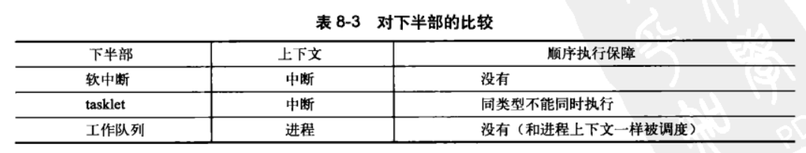

# 内核同步介绍

## 临界区和竞争条件
- 临界区：访问和操作共享数据的代码段
- 在中断处理程序中能避免并发访问的安全代码称作中断安全代码
- 在对称多处理器的机器中能避免并发访问的安全代码称为SMP代码
- 在内核抢占时能避免并发访问的安全代码称为抢占安全代码

# 内核同步方法
## 原子操作
- 保证指令执行过程不被打断
- Linux提供了两组原子操作接口：
  - 一组针对整数进行操作
  - 一组针对单独的位

## 自旋锁
- 等待的进程会一直忙循环-等待锁重新可用
- Linux内核实现的自旋锁不可递归

- 在中断处理程序中使用自旋时，一定要在获得锁之前，首先禁止本地中断，否则可能中断处理程序会打断正持有锁的代码，有可能去竞争这个锁（双重请求死锁）
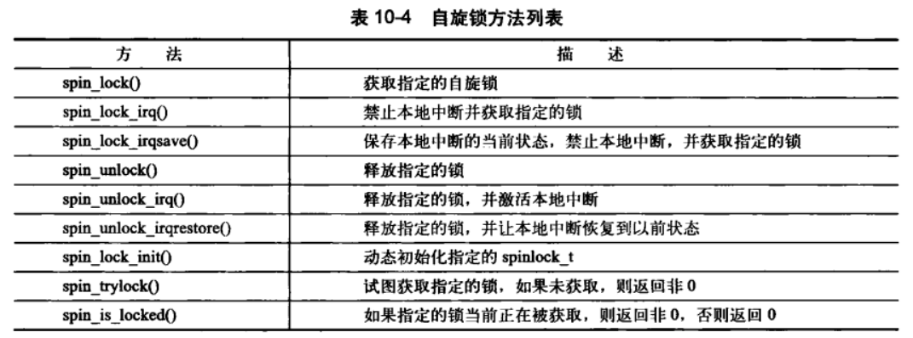

## 信号量
- Linux信号量是一种睡眠锁
- 计数信号量和二值信号量

## 互斥体
- 即mutex
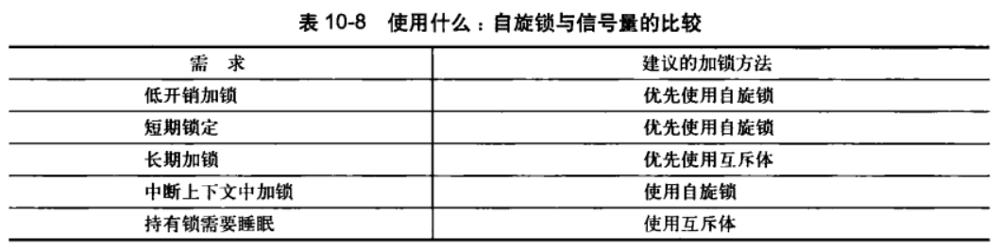

## 完成变量
- 如果内核中一个任务需要发出信号通知另一任务发生某个特定时间，利用完成变量就可以使两个任务完全同步
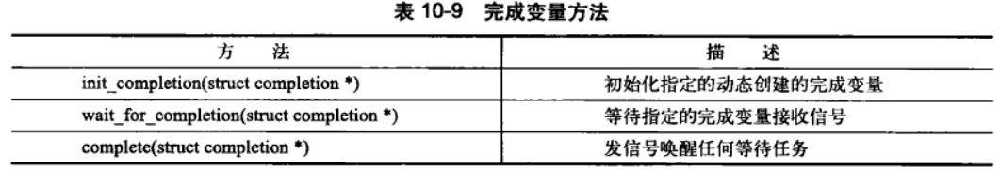

## BLK：大内核锁
- BKL是一个全局自旋锁
- 特性：
  - 持有BKL的任务仍然可以睡眠
  - BKL是一种递归锁，一个进程可以多次请求一个锁
  - 只可用于进程上下文中，不能再中断上下文中申请BLK
  - 新的用户不允许使用BLK

## 顺序锁
- 这种锁主要依靠一个序列计数器，当有异议的数据被写入时，会得到一个锁，并且序列值会增加（对共享数据读取时不加锁，写操作时加锁）
- 在读取数据之前和之后，序列号都被读取，如果读取序列号值相同，说明在读操作进行的过程中没有被写操作打断过，否则重新读取该值
- 如果读取的值是偶数，则代表写操作没有发生

- 特点：
  1. 对写者有利
  2. 适用于数据存在很多读者
  3. 希望写优先于读
  4. 数据简单

## 顺序和屏障
- 读内存屏障
- 写内存屏障
- 读写内存屏障

# 定时器和时间管理
### 高HZ的优势
- 内核定时器能以更高的频度和更高的准确度运行
- 依赖定时的系统调用，能够以更高的精度运行

### 高HZ的劣势
- 中断频率高

- Linux内核支持动态调度时钟中断（编译内核时开启）

## jiffies
- 全局变量jiffies用来纪律自系统启动来产生对的节拍的总数

## 硬时钟和定时器
- 系统结构提供了两种设备进行计时：系统定时器和实时时钟

### 实时时钟（RTC）
- 实时时钟是用来持久化存放系统时间的设备
- 内核通过读取RTC来初始化墙上时间，该时间存放在xtime变量中

### 系统定时器
- 提供一种周期性触发中断机制
- 在x86体系中，主要采用可编程中断时钟（PIT）
- 内核在启动时对PIT进行编程初始化，使其能够以HZ/s的频率产生时钟中断

## 时钟中断处理程序
- 时钟中断处理程序可划分为两个部分：体系结构相关部分和体系结构无关部分
- 与体系结构相关的例程作为系统定时器的中断处理程序而注册到内核中
- 中断服务程序主要通过调用与体系结构无关的例程，tick_periodic()执行下面更多的工作

## 延迟执行

### 忙等待
- 最简单的延迟方法是忙等待
- 该方法仅仅在延迟时间是节拍的整数倍，或者精确率要求不高的时候才可以使用
- 实现：在循环中不断循环直到希望的时钟节拍数耗尽

### 短延迟
- 内核提供了三个可以处理ms、ns、ms级别的延迟函数
```c
void udelay(unsigned long usecs);
void ndelay(unsigned long nsecs);
void mdelay(unsigned long msecs); 
```

### schedule_timeout()
- 该方法会让需要延迟执行的任务睡眠到指定的延迟时间耗尽后再重新运行（不能保证，只是尽量保证）

# 内存管理

## 页
- 内核把物理页作为内存管理的基本单位
- 内核用struct page结构表示系统中的每个物理页
  - flag域用来存放页的状态（是不是脏的、是不是再内存中等）
  - _count域存放页的引用计数（值为-1时，说明没有引用这一页）
  - virtual是页的虚拟地址
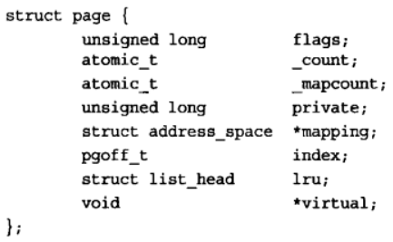

- page结构与物理页相关，而并非与虚拟页相关


## 区
- 有些页位于内存中特定的物理地址上，于是内核把页划分为不同的区
- Linux主要使用了四种区：
  1. ZONE_DMA：用于执行DMA
  2. ZONE_DMA32：用于执行DMA，但是这些页面只能被32位设备访问
  3. ZONE_NORMAL：这个区包含的都是能正常映射的页
  4. ZONE_HIGHEM：这个区包含高端内存，其中的页并不能永久映射到内核地址空间，内核不能直接使用

- 每个区都用struct zone表示
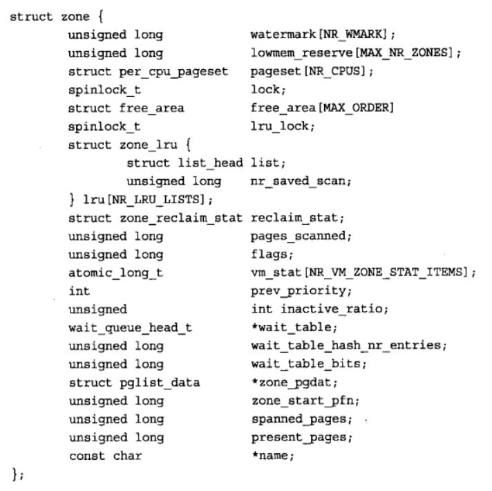

## 获得页
- 内核提供了一种请求内存的底层机制，并提供了对它进行访问的几个接口，这些接口以页为单位分配内存
```c
// 分配2^order个连续的物理页
struct page* alloc_pages(gfp_t gfp_mask, unsigned int order);
```
- 用下面的函数把给定的页转换成它的逻辑地址
```c
void* page_address(struct page* page);
```
- 如果无需用到struct page，可以调用__get_free_pages(...)，该函数直接返回第一个页的逻辑地址

### 获得填充为0的页
- 如果需要让返回的页的内容全为0，使用：
```c
unsigned long get_zeroed_page(unsigned int gfp_mask);
```
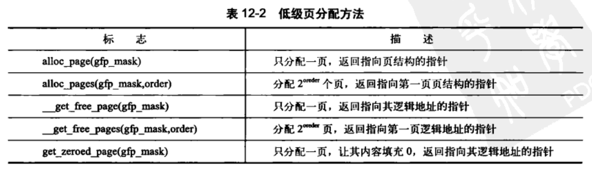

### 释放页
- 当不再需要页时，可以用提供的函数释放页

## kamlloc
- 用以获得以字节为单位的一块内核内存
- 虚拟地址空间连续，物理地址空间也是连续的（malloc不是）
- 用于申请小内存，申请的是**直接映射**的内存（虚拟地址和物理地址一对一）
- 
```c
void* kmalloc(size_t size, gfp_t flags);
```
- 使用kfree()释放

### gfp_mask标志
- 标志可分为三类
  - 行为修饰符：内核应当如何分配所需内存
  - 区修饰符：从何处分配内存
  - 类型标志：组合了行为修饰符和区修饰符

#### 行为修饰符
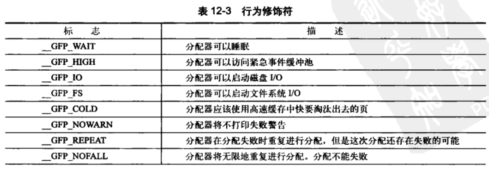
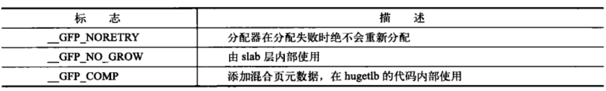

#### 区修饰符
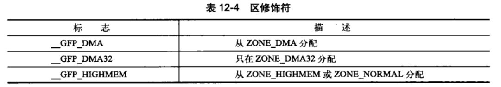

#### 类型标志
- 内核倾向于使用正确的类型标志
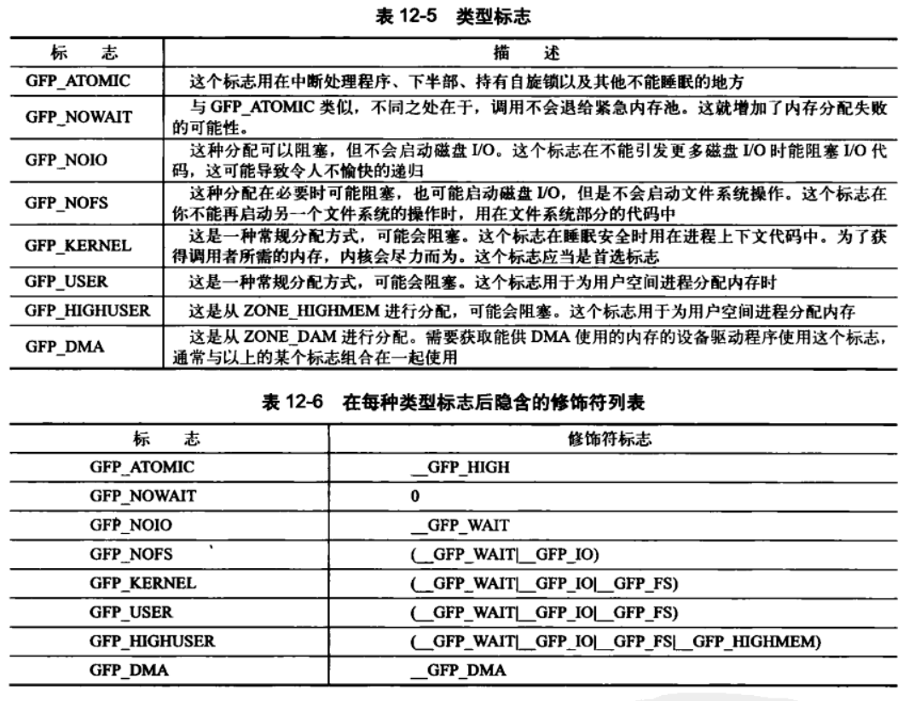

## vmalloc
- 页在虚拟地址空间内是连续，物理空间不一定连续
- 使用的是动态映射的内存

## slab层

### slab层的设计
- 设计思想是为了解决频繁申请和释放的对象
- slab层把不同的对象划分为高速缓存组，每个高速缓存组存放不同类型的对象
- 每种对象类型对应一个高速缓存，如一个高速缓存用于存放进程描述符、另一个高速缓存存放索引节点对象等
- slab层不是频繁地分配和释放内存，而是把事先分配好地对象存放到高速缓存中
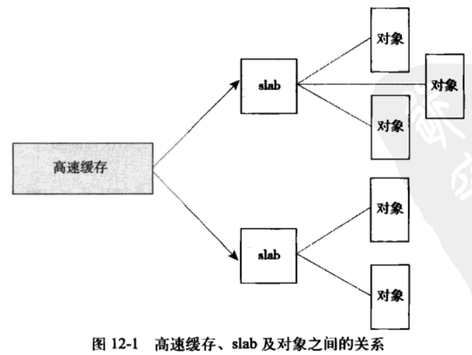
- 每个slab都包含一些对象成员，这里的对象指的是被缓存的数据结构
- 每个slab处于三种状态之一：满、部分满、空
- 每个高速缓存都使用kmem_cache结构来表示，这个结构包含三个链表：slabs_full、slabs_partial和slabs_empty
- slab是通过kmalloc分配的
```c
struct slab
{
    struct list_head list;     /*满、部分满或空链表*/
    unsigned long colouroff;   /*slab着色的偏移量*/ 
    void *s_mem; /*在slab中的第一个对象*/
    unsigned int inuse; /*slab中已分配的对象数*/
    kmem_bufctl_t free; /*第一个空闲对象*/
}
```

### slab分配器的接口
- 一个新的高速缓存通过以下函数创建：
```c
struct kmem_cache* kmem_cache_create(const char* name, size_t size, size_t align, unsigned long flags, void (*ctor)(void*));
```
- 第一个参数为高速缓存名字，第二个参数是高速缓存中每个元素的大小，第三个参数是slab内第一个对象的偏移，flag用来控制高速缓存的行为，最后一个参数是高速缓存的构造函数
- 要撤销一个高速缓存，可以使用kmem_cache_destroy


## 在栈上的静态分配
- 内核栈小而且固定
- 32位和64位体系结构的内核栈大小分别是8KB和16KB

### 单页内核栈
- 内核开发者实现了一个新功能：中断栈，位每个进程提供一个用于中断程序处理的栈


## 高端内存的映射
### 永久映射
- 使用**固定持久映射区**
- 要映射一个给定的page结构到内核地址空间，可以使用kmap
- 这个函数可以在高端内存和低端内存上都能用
- 允许永久映射的数量是有限的，当不再需要高端内存时，使用kunmap解除映射

### 临时映射
- 使用**固定映射区**
- 当需要创建一个映射而当前的上下文又不能睡眠时，使用临时映射（kmap_atomic）
- 临时映射可以用在不能睡眠的地方，如中断处理程序中


## 总结
1. kmalloc分配的是page_offset到high_offset之间的内存，属于直接映射
2. vmalloc分配的是vmalloc_start到vmalloc_end之间的内存，物理地址不一定连续
3. vmalloc之间的间隙是为了越界保护
4. 大于896M的都是高端内存
5. 固定映射区的虚拟地址是固定的，采用固定映射区的好处是，它相当于一个指针常量
6. 内核采用三种机制将页框映射到高端内存
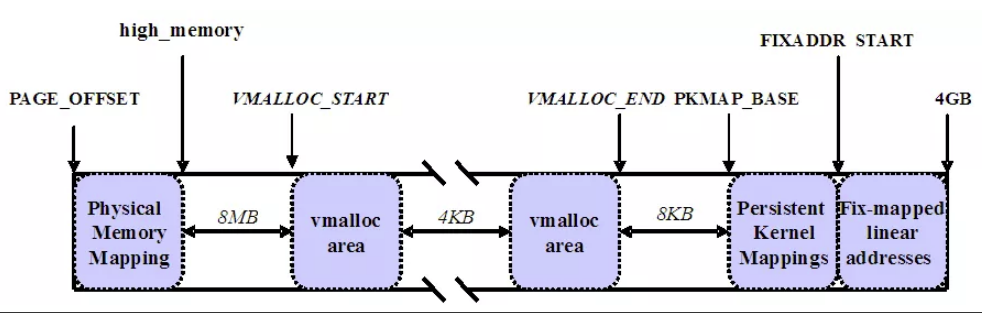
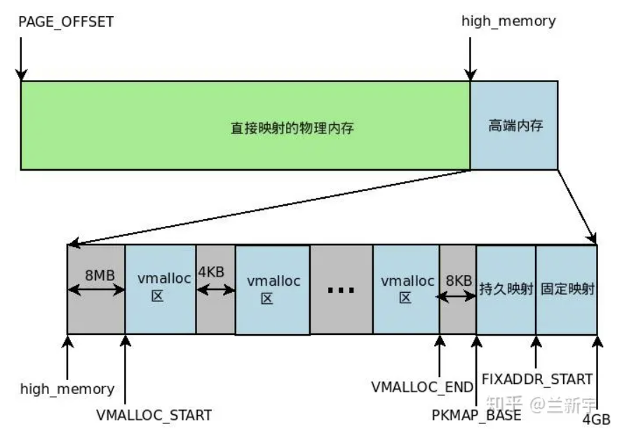

# 虚拟文件系统

## 文件系统抽象层
- Linux内核在它的底层文件系统接口上建立了一个抽象层，是其能够支持各种文件系统
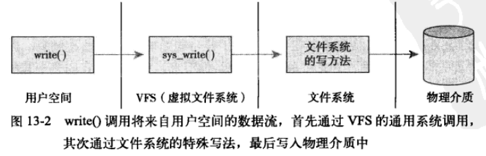

## VFS对象及其数据结构
- VFS采用面向对象的设计思路
- VFS中有四个主要的对象类型：
  1. 超级块对象：代表一个具体的已安装文件系统
  2. 索引节点对象：代表一个具体文件
  3. 目录项对象：代表一个目录项，是路径的一个组成部分
  4. 文件对象：代表由进程打开的文件

## 超级块对象
- 每种文件都必须实现超级块对象，该对象用于存储特定文件系统的信息
- 超级块对象由super_block结构体表示
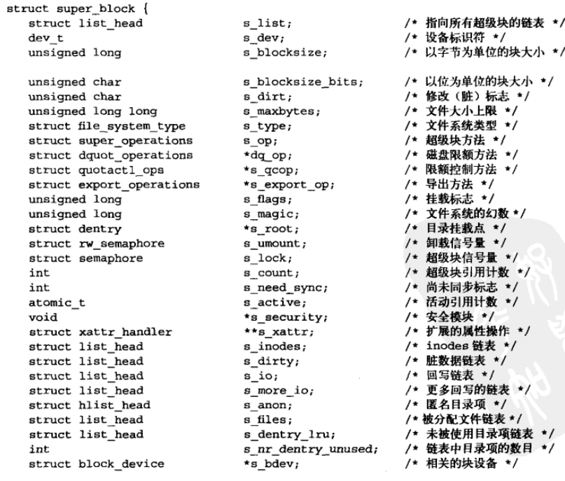
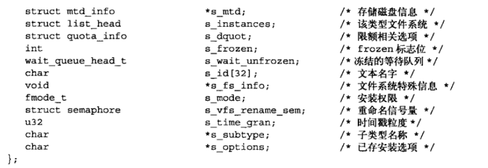

## 超级块操作
- 该结构体中的每一项都是一个指向超级块操作函数的指针
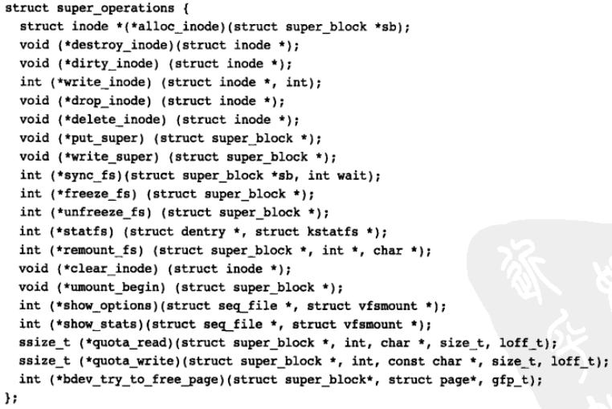


### 索引节点对象
- 包含了内核在操作文件或目录时需要的全部信息
- 一个索引节点代表文件系统中的一个文件
- 由inode结构体表示
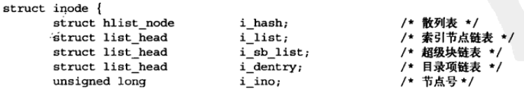
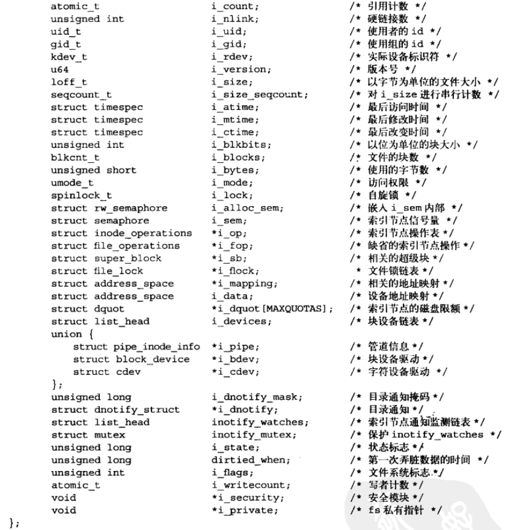

## 索引节点操作
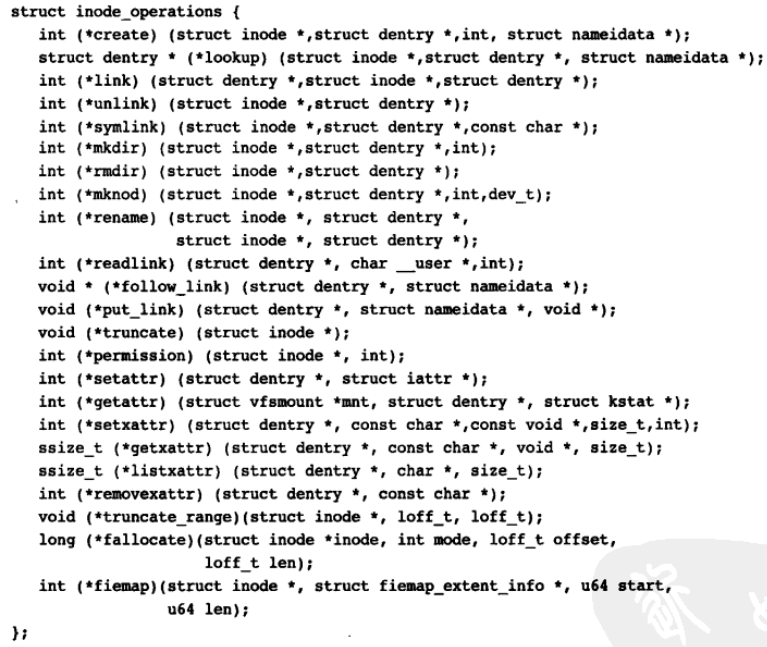

## 目录项对象
- VFS把目录当作文件对待
- 在路径中（包括普通文件在内），每一个部分都是目录项对象
- 目录项对象由dentry结构体表示
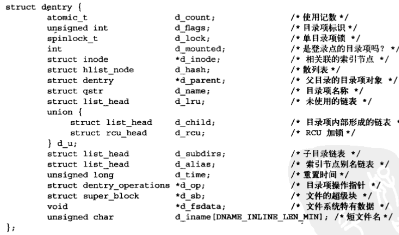
- 与前两个对象不同，目录项对象没有相应的磁盘数据结构
- VFS根据字符串形式的路径名现场创建

### 目录项状态
- 有三种有效状态：被使用、未被使用和负状态
- 一个负状态的目录项没有对应的有效的索引节点，因为索引节点已被删除了，但是目录项仍然保留、

### 目录项缓存
- 如果VFS层遍历路径名中所有元素并将它们逐个地解析成目录项对象，非常费时，所以内核将目录项对象缓存在目录项缓存（dcache）中

### 目录项操作
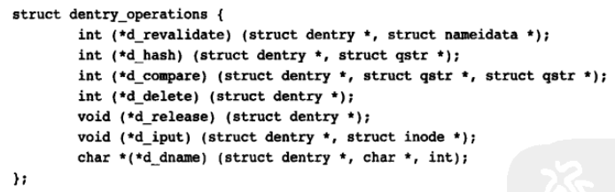

## 文件对象
- 文件对象表示进程已打开地文件
- 由file表示
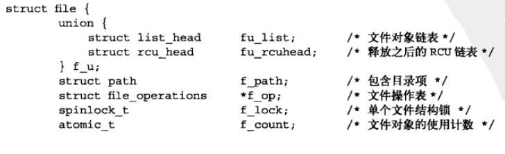
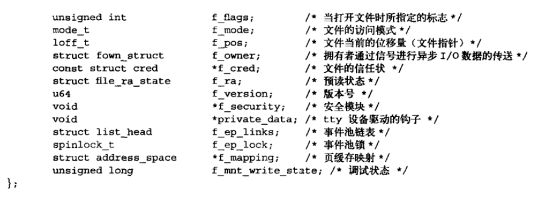

## 和进程相关的数据结构
- 系统中每一个进程都有自己一组打开的文件
- 有三个数据结构将VFS和系统的进程紧密联系在一起，分别是：file_struct、fs_struct、namespace

### file_struct
- 该结构体由进程描述符中的files目录项指向，所有与单个进程相关的信息都包含在其中（如单个文件及文件描述符）
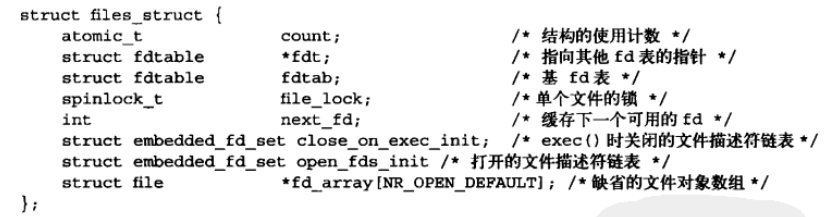
- fd_array数组指针指向已打开的文件对象

### fs_struct
- 该结构由进程描述符的fs域指向
- 包含文件系统和进程相关的信息
- 包含了当前进程的工作目录和根目录
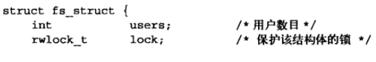
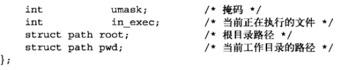

### namespace
- 由进程描述符中的mmt_namespace域指向
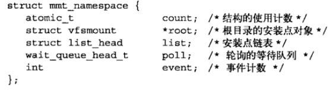

# 块I/O层
- 系统中能够**随机访问**固定大小数据片的硬件设备称为块设备，如硬盘等
- 字符设备：按照字符流的方式**有序**访问
- 两者的区别就是是否可以随机访问数据

## 剖析一个块设备
- 块设备中最小的可寻址单元是扇区，最常见的是512字节
- 内核执行的所有磁盘操作都是按照块进行操作的，块只能数倍于扇区大小，并且是2的整数倍
- 块：文件系统最小寻址单元

## 缓冲区和缓冲区头
- 当一个块被调入内存时，它要存储在一个缓冲区中，每个缓冲区与一个块对应
- 每一个缓冲区都有一个对应的描述符，用buffer_head结构体表示，称为缓冲区头
- 缓冲区头的目的在于描述磁盘块和物理内存缓冲区之间的映射关系
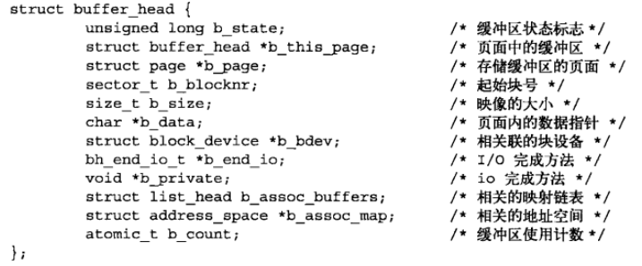

## bio结构体
- 当前内核中块I/O操作的基本容器由bio结构体表示
- 每一个块的I/O请求都是同一一个bio结构体表示

## 请求队列
- 块设备将它们挂起的块I/O请求保存在请求队列中
- 请求队列只要不为空，队列对应的块设备驱动程序就会从队列头获取请求，然后将其送入对应的块设备上去


## I/O调度程序
- 用于管理块设备的请求队列
- IO调度程序通过两种方法减少磁盘寻址时间：合并与排序
  - 合并：将两个或多个请求结合成一个新请求
  - 排序：缩短寻址时间

### Linus电梯
- 在2.4内核版本中，是默认的I/O调度程序，后来在2.6版本中被另外两种调度程序取代
- Linus电梯能执行合并与排序预处理
- 当一个请求加入到队列中，有可能发生四种操作，依次是：
  1. 如果队列中已存在一个对相邻磁盘扇区操作的请求，那么合并请求；
  2. 如果队列中存在一个驻留时间过长的请求，那么新请求被插入到队尾，防止其他旧的请求饥饿发生；
  3. 如果队列中以扇区方向为序存在合适的插入位置，那么新的请求被插入到该位置，保证队列中的请求是以被访问磁盘物理位置为序进行排序的；
  4. 如果队列中不存在合适的请求插入位置，请求将被插入到队列尾部；

### 最终期限I/O调度程序
- 最终期限I/O调度程序是为了解决Linus电梯所带来的饥饿问题
- 一个对磁盘同一位置操作的请求流可以造成较远位置其他请求永远得不到机会
- 在最后期限I/O调度程序中，每个请求都有一个超时时间
- 当一个新请求递交给排序队列是，最后期限I/O调度程序在执行合并和插入请求时类似于Linus电梯，但也会以请求类型为依据将它们插入到额外队列中
- 虽然普通队列以磁盘为序进行排序，但是这些队列时以FIFO形式组织的

### 预测I/O调度程序
- 最大的改进是加入了预测启发
- 请求提交后不直接返回处理其他请求，而是会有意空闲片刻

### 完全公正的排队I/O调度程序（CFQ）
- CFQ I/O调度程序把进入的I/O请求放入特定的队列中，这种队列是根据引起I/O请求的进程组织的
- 刚进入的请求与相邻请求合并在一起，并进行插入分类
- 以时间片轮转调度队列

### 空操作的I/O调度程序（NOOP）
- 只进行合并
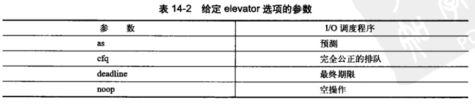

# 进程地址空间

## 地址空间
- 平坦地址空间：地址空间范围是一个独立的连续空间
- 现代采用虚拟内存的操作系统通常都使用平坦地址空间而不是分段式的内存模式
- 每个进程都有一个唯一的平坦地址空间

## 内存描述符
- 内核使用内存描述符结构体表示进程的地址空间，由mm_struct结构体表示
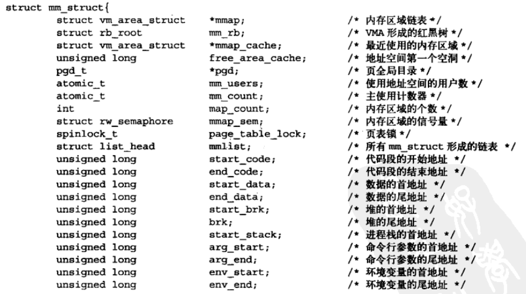
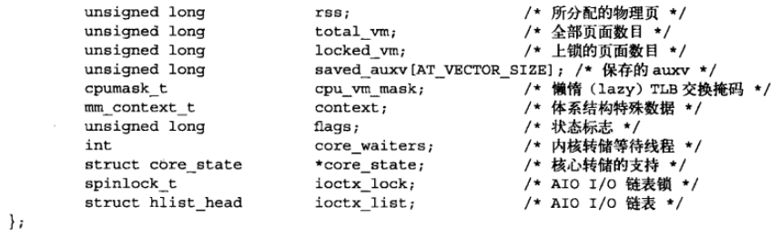

## mm_struct与内核线程
- 内核线程没有进程地址空间，也没有相关的内存描述符，所以内核线程对应的进程描述符mm域为空

## 虚拟内存区域
- 内存区域由vm_area_struct结构体描述
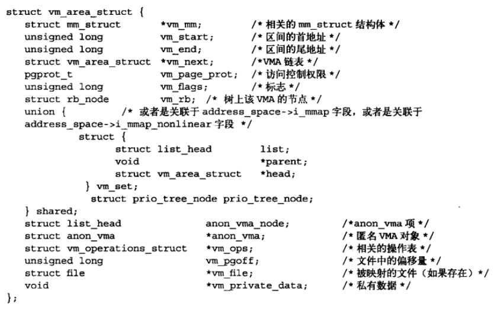
- 即使两个独立的进程将同一个文件映射到各自的地址空间，它们都会有一个vm_area_struct结构体来标识自己的内存区域

## VMA标志
- VMA标志是一种位标志，包含在vm_flags内，标志了内存区域所包含的页面行为和信息


### 内存区域的树形结构和内存区域的链表结构
- mmap和mm_rb域包含完全相同vm_area_struct结构体指针，只有组织方式不同
- mmap域使用单独链表链接所有内存区域对象，每一个vm_area_struct结构体通过自身的vm_next域被连入链表
- mm_rb域使用红-黑树连接所有的内存区域对象，地址空间中每一个vm_area_struct结构体通过自身的vm_rb域连接到树中

## 页表
- 每个进程都有自己的页表


# 页高速缓存和页回写
- 页高速缓存是Linux内核实现磁盘缓存

## 缓存手段
- 页高速缓存是由内存中的物理页面组成的

### 写缓存
- 不缓存
- 写透缓存：写操作自动更新内存缓存，同时也更新磁盘文件
- 回写：不会立即更新，由一个进程周期性的将脏页写回磁盘

### 缓存回收
- 最近最少使用（LRU）
- 双链策略：维护两个链表，活跃链表和非活跃链表，两个链表被伪LRU规则维护
- 当第1次访问时，将数据添加到FIFO队列，如果FIFO队列超过限制，淘汰FIFO里最旧的数据
- 当第2次访问时，将数据从FIFO队列移动到LRU队列的头节点，如果LRU队列超过限制，将LRU里最旧的数据移动到FIFO队列的头节点
- 当第3次以上访问时，按照LRU规则更新LRU队列

## Linux页高速缓存
- Linux高速缓存使用了一个新对象管理缓存页和页I/O操作，这个对象是address_space结构体
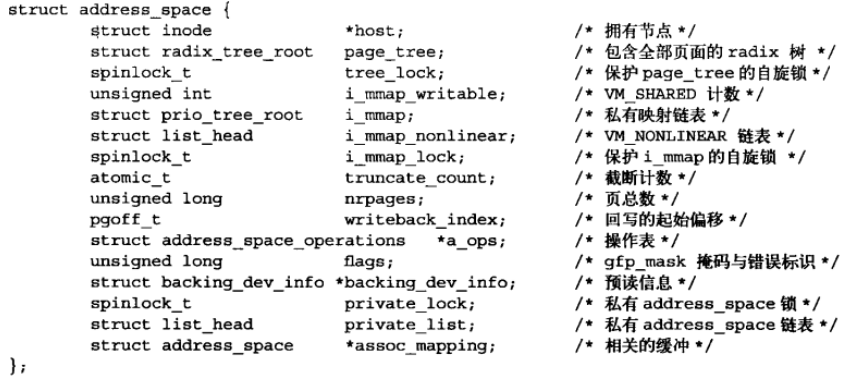

## flusher线程
- 以下3中情况发生时，脏页被写回磁盘
  1. 当空闲内存低于一个阈值时
  2. 当脏页在内存中驻留时间超过一个特定的阈值时
  3. 当用户进程调用sync()和fsync()系统调用时

# 设备与模块
- Linux中，设备被分为三种类型：
  - 块设备
  - 字符设备
  - 网络设备
- Linux还提供了杂项设备

## 模块
- 尽管Linux时单块内核，但是内核是模块化组成的，允许内核动态的向其中插入或者删除代码，这些代码被一并组合在一个单独的二进制镜像中，即所谓的可装载内核模块中
- module_intt()用于向内核注册，当内核装载时被调用
- module_exit()注册模块退出函数，在模块卸载时，内核调用
- 如果文件被静态编译到内核映像中，那么退出函数将不会包含

## 设备模型
- 设备模型提供了一个独立的机制专门来表示设备

### kobject
- 设备模型的核心时kobject，使用struct kobject结构体表示

### ktype
- kobject被关联到ktype
- ktype是为了描述一族kobject，如此一来，不再需要每个kobject都分别定义自己的特性，而是将这些普遍的特性在ktype结构中一次定义

### kset
- 对象的集合体

## sysfs
- sysfs文件系统是一个处于内存中的虚拟文件系统
- 提供了kobject对象层次结构的视图
- 可以在/sys下查看

### 内核事件层
- 实现了内核到用户的消息通知系统-建立在kobject基础上
- 在内核中认为事件都是从幕后kobject对象产生的
- 内核事件由内核空间传递到用户空间需要经过netlink，netlink是一个用于传送网络信息的多点传送套接字

# 调试
- 内核消息被保存在一个LOG_BUF_LEN大小的环形队列中，默认大小是16KB
- 在标准的Linux系统上，用户空间的守护进程klogd从记录缓冲区获得内核消息

## 通过打印来调试
- 内核提供打印函数printk()打印函数

### syslogd 和 klogd
- 在标准Linux的系统上，用户空间的守护进程klogd从记录缓冲区中获取内核消息，在通过syslogd守护进程将它们保存在系统的日志系统中

## oops
- oops是内核告知用户有不幸发生的最常用的方式
- oops过程包括向终端输出错误信息，输出寄存器保存的信息并输出可供跟踪的回溯线索

## 使用git进行二分搜索

# 可移植性性


