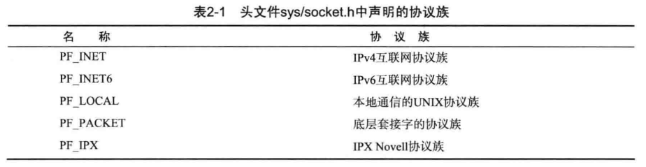
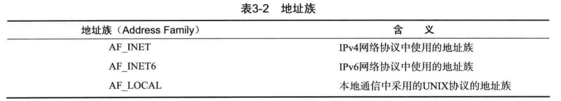
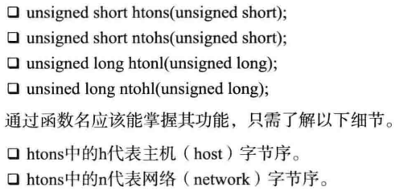
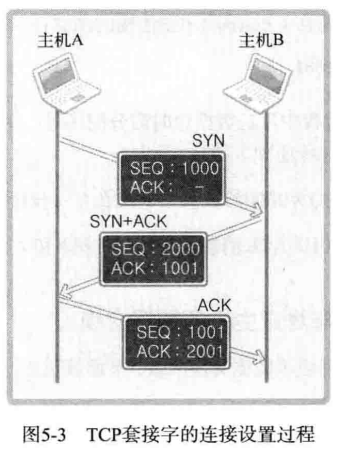
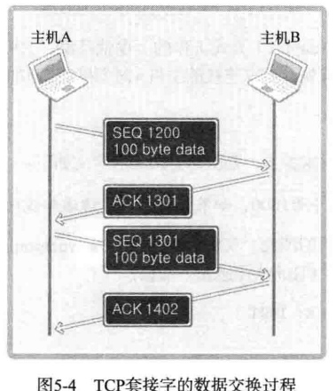
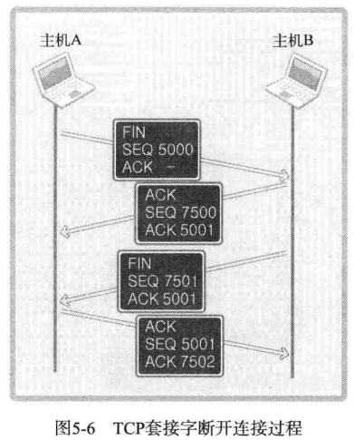

# 套接字类型和协议设置

## 协议族
- 计算机的通信规则


## 套接字类型
- 套接字的传输方式

1. 面向连接的套接字（SOCK_STREAM）
可靠的、按序传递的、基于字节的面向连接的数据传输方式的套接字
   - 按序传输数据
   - 不存在数据边界
   - 套接字连接必须一一对应

2. 面向消息的套接字（SOCK_DGRAM）
不可靠的、不按序传输的、以数据的高速传输为目的的套接字
   - 强调快速传输
   - 有数据边界

## 协议的最终选择
- socket函数指明协议族、套接字类型就可以了，第三个参数一般为0
- 除非同一协议族中存在多个数据传输方式相同的协议

# 地址族与数据序列

## 网络地址分类与主机地址边界
- A类地址的首字节范围：0-127（0开始）
- B类地址的首字节范围：128-191（10开始）
- C类地址的首字节范围：192-223（110开始）

## 地址信息的表示
- 表示IPv4地址的结构体
```c
struct sockaddr_in
{
    sa_family_t sin_family; //protocl
    uint16_t sin_port; //port
    struct in_addr sin_addr; //ip
    char sin_zero[8]; //不使用
}

struct in_addr
{
    In_addr_t s_addr;
}
```
### sockaddr_in
1. sin_family

2. sin_port：16位端口号
3. sin_addr：32位IP
4. sin_zero：为使sockaddr_in大小与sockaddr结构体大小保持一致 

## 网络字节序与地址变换
- 在通过网络传输数据时统一字节序为**网络字节序-即大端序**

- 字节序转换


- 理论上系统是大端序，就不需要转换成网络字节序了；但是为了代码可移植性，还是要写
- 传输的数据（buffer[]）会自动转换

## 网络地址的初始化与分配
### 将字符串信息转换为网络字节序的整数型
- 传递点分十进制，返回32位整数型数据
```c
in_addr_t inet_addr(const char* string);
int inet_aton(const char* string, struct in_addr* addr); //使用频率更高，结果自动写入结构体
```

- 将ip转成字符串
  - 这里要注意，返回的是char*，要及时复制出去；因为内部申请了内存，下一次调用时之前结果会被覆盖
```c
char* inet_ntoa(struct in_addr adr); 
```

## INADDR_ANY
- 使用INADDR_ANY可以自动获取服务器端的ip地址（只有一个NIC时，直接使用；有多个NIC时，会监听本机所有IP）


## Windows的转换函数
- Winsock2中增加了两个字符串转换函数：WSAStringToAddress和WSAAddressToString
- 功能与inet_ntoa和inet_addr相同
  - 优点：支持多种协议，在IPV4和IPV6中都使用
  - 缺点：依赖于Windows平台

# 基于TCP的服务器端/客户端

## TCP原理
- TCP不会出现传输的数据大于服务端缓冲区的情况，因为有TCP中有滑动窗口协议

## TCP内部工作原理
### 三次握手


### 与对方主机的数据交换

- ACK号 = SEQ号 + 传递的字节数 + 1
- 最后加1是为了高速对方下次要传递的SEQ号

### 四次分手



# 基于UDP的服务端/客户端


