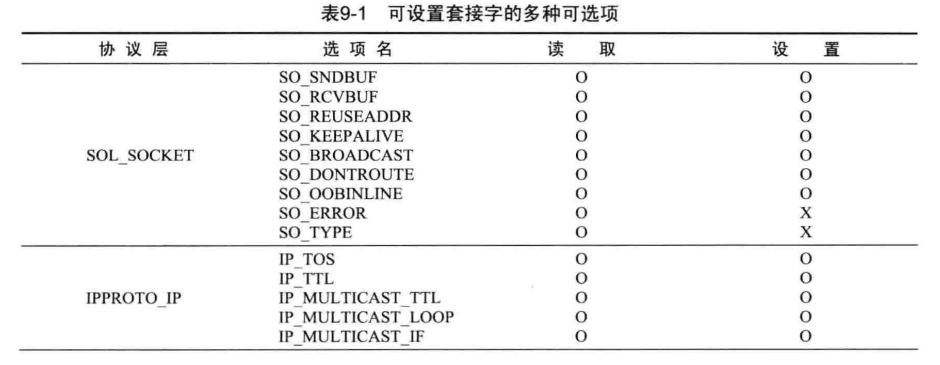
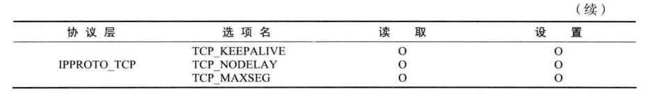
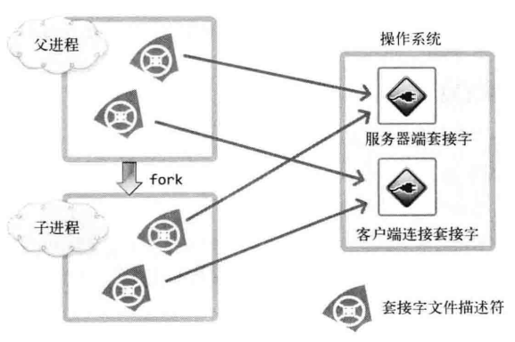

# 套接字类型和协议设置

## 协议族
- 计算机的通信规则


## 套接字类型
- 套接字的传输方式

1. 面向连接的套接字（SOCK_STREAM）
可靠的、按序传递的、基于字节的面向连接的数据传输方式的套接字
   - 按序传输数据
   - 不存在数据边界
   - 套接字连接必须一一对应

2. 面向消息的套接字（SOCK_DGRAM）
不可靠的、不按序传输的、以数据的高速传输为目的的套接字
   - 强调快速传输
   - 有数据边界

## 协议的最终选择
- socket函数指明协议族、套接字类型就可以了，第三个参数一般为0
- 除非同一协议族中存在多个数据传输方式相同的协议

# 地址族与数据序列

## 网络地址分类与主机地址边界
- A类地址的首字节范围：0-127（0开始）
- B类地址的首字节范围：128-191（10开始）
- C类地址的首字节范围：192-223（110开始）

## 地址信息的表示
- 表示IPv4地址的结构体
```c
struct sockaddr_in
{
    sa_family_t sin_family; //protocl
    uint16_t sin_port; //port
    struct in_addr sin_addr; //ip
    char sin_zero[8]; //不使用
}

struct in_addr
{
    In_addr_t s_addr;
}
```
### sockaddr_in
1. sin_family

2. sin_port：16位端口号
3. sin_addr：32位IP
4. sin_zero：为使sockaddr_in大小与sockaddr结构体大小保持一致 

## 网络字节序与地址变换
- 在通过网络传输数据时统一字节序为**网络字节序-即大端序**

- 字节序转换


- 理论上系统是大端序，就不需要转换成网络字节序了；但是为了代码可移植性，还是要写
- 传输的数据（buffer[]）会自动转换

## 网络地址的初始化与分配
### 将字符串信息转换为网络字节序的整数型
- 传递点分十进制，返回32位整数型数据
```c
in_addr_t inet_addr(const char* string);
int inet_aton(const char* string, struct in_addr* addr); //使用频率更高，结果自动写入结构体
```

- 将ip转成字符串
  - 这里要注意，返回的是char*，要及时复制出去；因为内部申请了内存，下一次调用时之前结果会被覆盖
```c
char* inet_ntoa(struct in_addr adr); 
```

## INADDR_ANY
- 使用INADDR_ANY可以自动获取服务器端的ip地址（只有一个NIC时，直接使用；有多个NIC时，会监听本机所有IP）


## Windows的转换函数
- Winsock2中增加了两个字符串转换函数：WSAStringToAddress和WSAAddressToString
- 功能与inet_ntoa和inet_addr相同
  - 优点：支持多种协议，在IPV4和IPV6中都使用
  - 缺点：依赖于Windows平台

# 基于TCP的服务器端/客户端

## TCP原理
- TCP不会出现传输的数据大于服务端缓冲区的情况，因为有TCP中有滑动窗口协议

## TCP内部工作原理
### 三次握手


### 与对方主机的数据交换

- ACK号 = SEQ号 + 传递的字节数 + 1
- 最后加1是为了高速对方下次要传递的SEQ号

### 四次分手


# 基于UDP的服务端/客户端
- TCP和UDP的差异主要在流控制

## 实现基于UDP的服务端/客户端
- UDP中只有创建套接字和数据交换过程
- 每次传输时都要添加目标地址信息
```
ssize_t sendto(int sock, void *buff, size_t nbytes, int flags, struct sockaddr *to, socklen_t addrlen);
```
- 由于UDP数据的发送端不固定，因此每次接收数据的时候都可以获取发送端的信息

### UDP客户端套接字的地址分配
- bind函数不区分UDP和TCP，可以使用，但是一般在客户端不使用
- 如果调用sendto函数时未分配地址信息，则在首次调用sendto函数时给相应套接字自动分配IP和端口，并且此时分配的地址一直保留到程序结束为止

## UDP的数据传输特性和调用connect函数

## 存在数据边界的UDP套接字
- UDP是具有数据边界的协议,传输中调用I/O函数的次数非常重要


## 已连接UDP套接字与未连接UDP套接字
- 通过sendto函数传输数据的过程大致分为以下3个阶段:
  1. 向UDP套接字注册目标IP和端口号
  2. 传输数据
  3. 删除UDP套接字中注册的目标地址信息

- 每次调用sendto函数时重复上述过程,每次都变更目标地址,这种未注册目标地址信息的套接字称为未连接套接字 
- 反之,注册了目标地址的套接字称为connected套接字,UDP默认属于未连接套接字

### 创建已连接UDP套接字
- 创建已连接UDP套接字的过程格外简单,只需要针对UDP套接字调用connect函数


# 优雅地断开套接字连接

## 基于TCP的半关闭

### 单方面断开连接带来的问题
- Linux的close函数和Windows的closesocket函数意味着完全断开连接;完全断开不仅指无法传输数据,而且也不能接收数据
- 双向通信时,一方断开连接就在也接收不到对方发送的消息
- 为了解决这类问题,只关闭一部分数据交换中使用的流的办法出现了

### 针对优雅断开的shutdown函数
```c
int shutdown(int sock, int howto);
howto:
  SHUT_RD:断开输入流
  SHUT_WR:断开输出流
  SHUT_RDWR:同时断开I/O流
```
- 调用上述函数时,第二个参数决定断开连接的方式,如果传入SHUT_RDWR相当于分两次调用showdown

- 为何需要半关闭?

# 域名及网络地址
- IP相对域名是更容易变化的,所以利用域名编写程序好一点

- 利用域名获取IP地址
```c
struct hostent *gethostbyname(const char *hostname);
```
- 利用IP地址获取域名
```c
struct hostent *gethostbyaddr(const char *addr, socklen_t len, int family);
```

# 套接字的多种可选项



- 可选项的读取和设置通过两个函数完成
```c
int getsockopt(int sock, int level, int optname, void *optval, socklen_t *oplen);
int setsockopt(int sock, int level, int optname, const void *optval, socklen_t optlen);
```

## SO_SNDBUF & SO_RCVBUF
- 两者是输入输出缓冲大小相关的可选项,用这两个可选项可以读取和更改当前IO缓冲大小

## SO_REUSEADDR
- 如果是服务端向客户端发送FIN消息,那服务端重新运行时将产生问题,因为可能处于Time-wait状态
- 如果时客户端先断开,也会经历Time-wait过程,但是因为客户端的端口号是任意的,所以无需关注time-wait

### 地址再分配
- 如果系统发生故障而停止,这时候需要尽快重启服务器,但可能因time-wait需要等待几分钟,所以Time-wait并非只有优点
- 解决方法就是将套接字可选项更改为SO_REUSEADDR状态,可将Time-wait状态下的套接字重新分配给新的套接字

## TCP_NODELAY

### Nagle算法
- TCP套接字默认使用Nagle算法发送字符串
- **只有收到前一数据的ACK消息时,才发送下一条数据,最大限度进行缓冲**
- 不使用Nagle算法将对网络流量产生负面影响,即使是传输一个字节的数据,头信息都有可能是几十个字节,因此为了提高网络传输效率,必须使用Nagle算法
- Nagle算法并不是什么时候都适用,比如传输大文件时,不使用Nagle算法也会在装满输出缓冲时传输数据包,这样会在无需等待ACK的前提下连续传输

- 可以使用TCP_NODELAY选项禁用Nagle算法

# 多进程服务器端

## 并发服务器端的实现方法
- 多进程服务器：通过创建多个进程提供服务
- 多路复用服务器：通过捆绑并统一管理I/O对象提供服务
- 多线程服务器：通过生成与客户端等量的线程提供服务

### 进程
- 核的个数与同时运行的进程数相同
- 僵尸进程
  - 产生原因：向exit函数传递的参数值和main函数的return都会传递给操作系统，而操作系统不会销毁子程序，直到把这些值传递给产生该子进程的父进程，处在这种状态下的进程就是僵尸进程
  - 操作系统不会主动将这些值传递给父进程，只有父进程主动发起函数调用时，操作系统才会传递该值

#### 销毁僵尸进程
父进程获取子进程返回值的方法
1. 利用wait函数：调用此函数时如果已经有子进程终止，那么子进程终止时传递的返回值将保存到函数的参数所指的内存空间
```c
pid_t wait(int *statloc); // 成功时返回终止进程的子进程ID，失败返回-1
```
- 函数参数所指向的单元中还包含其他信息，需要通过宏进行分离
```c
/*
WIFEXITED; //子进程正常终止时返回真
WEXITSTATUS; //获得子进程的返回值
*/
if (WIFEXITED(status)) //在wait函数后调用
{
  .....
}

```
2. 利用waitpid函数：使用该函数，程序不会阻塞
```c
// pid: 等待终止的目标子进程ID，若传递-1，则可以等待任意子进程终止

pid_t waitpid(pid_t pid, int *statloc, int options);
```

## 信号处理
- 父进程往往与子进程一样繁忙，因此不能只调用waitpid函数以等待子进程终止
- 注册信号函数：signal
```c
void (*singal(int signo, void (*func(int))))(int);
```
- 调用上述函数时，第一个参数为特殊具体情况，第二个参数为特殊情况下将要调用的函数的地址值
- 可以在signal函数中注册的部分特殊情况和对应的常数：
  1. SIGALRM：已到通过alarm函数注册等待的时间
  2. SIGINT：输入CTRL+C
  3. SIGCHLD：子进程终止

- alarm函数：
```c
// 调用该函数后，相应时间后将产生SIGALRM信号，如果传递0，之前的预约将取消
unsigned int alarm(unsigned int seconds);
```

- 利用sigaction函数进行信号处理：完全可以替代signal函数，更加稳定，并且不同的操作系统没有区别
```c
/*
signo: 传递信号信息
act: 对应于第一个参数的信号处理函数信息
oldact: 通过此参数获取之前注册的信号处理函数，若不需要传递0
*/
struct sigaction
{
  void (*sa_handler)(int);
  sigset_t sa_mask;
  int sa_flags;
};
int sigaction(int signo, const struct sigaction *act, struct sigaction *oldact);
```

- 利用信号处理技术消灭僵尸进程：注册信号处理函数，在子进程退出时调用

## 基于多任务的并发服务器
- 套接字并非进程所有，套接字属于操作系统

- 如图所示，调用fork函数后，2个文件描述符指向同一套接字，所以只有2个文件描述符都终止后，才能销毁套接字
- 因此，调用fork函数后，要将无关的套接字文件描述符关掉


# 进程间通信

## 通过管道实现进程间通信
- 管道并非进程的资源，而是属于操作系统，因此两个进程通过操作系统提供的内存空间进行通信
```c
int pipe(int filedes[2]);
```
- 父进程在调用该函数时创建管道，同时获取对应于出入口的文件描述符，此时父进程可以读写同一管道，但是父进程的目的是与子进程进行数据交换，因此需要将入口或者出口中的一个文件描述符传递给子进程（通过fork函数进行传递）

### 通过管道进行进程将的双向通信
- 通过创建两个管道实现

# I/O复用

## 理解select函数并实现服务器端
- select用来监视3种监视项的变化情况
  - readset: 是否存在待读取数据
  - writeset: 是否可传输无阻塞数据
  - exceptset：是否发生异常

# 多种I/O函数

## 检查输入缓冲
- 同时设置MSG_PEEK选项和MSG_DONTWAIT选项以验证输入缓冲中是否存在接收的数据
  - MSG_PEEK: 即使读取了输入缓冲的数据也不会删除
  - MSG_DONTWAIT:非阻塞方式

## readv和writev函数
- 对数据进行整合传输及发送的函数，适当使用这两个函数可以减少I/O函数的次数

# 多播与广播

## 多播
- 基于UDP完成的，采用多播的方式，可以同时向多个主机传递数据
- 多播特点：
  1. 多播针对特定多播组，只发送一次数据
  2. 即使只发送一次数，组内的所有客户端都会接收数据
  3. 多播组数可以在IP地址范围内任意增加
  4. 加入特定组即可接收发往该多播组的数据
  5. 多播组是D类地址

## 广播
- 多播即使在跨越不同网络的情况下，只要加入多播组就能接收数据，相反广播只能在同一网络中
- 广播也是基于UDP的，分为两种：
  - 直接广播
  - 本地广播
- 两者在代码的实现上差别主要在于IP地址，直接广播的IP地址除了网络地址外，其余主机地址全部设置为1；本地广播中使用的IP地址限定为255.255.255.255

# 套接字和标准I/O
- 标准I/O函数的两个优点：
  1. 好的移植性
  2. 可以利用缓冲提高性能
- 低级IO每一次都相当于一次系统调用，所以开销大

# 关于I/O流分离的其他内容
- 分离流的好处：
  1. 降低实现难度
  2. 提高速度
  3. 区分读模式和写模式

## 文件描述符的复制
- dup和dup2函数
``` c
int dup(int fildes);
int dup2(int fildes, int fildes2); //可以指定复制的描述符的整数值
```

# 优于select的epoll

- 基于select的I/O复用技术速度慢原因
  - 针对所有文件描述符的循环语句
  - 需要传递监视对象信息

- select优点：
  - epoll方式不具有兼容性，但是大部分操作系统都支持select函数


## 条件触发和边缘触发
- 条件触发：只要有输入缓冲，就会一直通知该事件
- 边缘触发：输入缓冲收到数据时仅注册一次该事件

- 边缘触发方式下，以阻塞方式工作的read和write函数可能引起服务器长时间停顿，因此边缘触发方式一定要采用非阻塞的read和write函数
- 边缘触发可以**分离接收数据和处理数据的时间点**


# 多线程服务器端的实现
- 引入线程的背景
  - 多进程服务器创建进程会带来一定的开销
  - 需要特殊IPC技术
  - 上下文切换开销

## 线程与进程的差异
1. 上下文切换的时候不需要切换数据区和堆
2. 可以利用数据区和堆交换数据

# Windows平台下线程的使用
- 调用main函数的主体是线程
- windows中线程的句柄相当于linux中的描述符

# IOCP
- windows的I/O模型，没怎么看，感觉还是挺厉害的
- 
