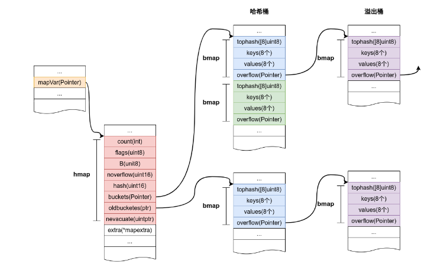
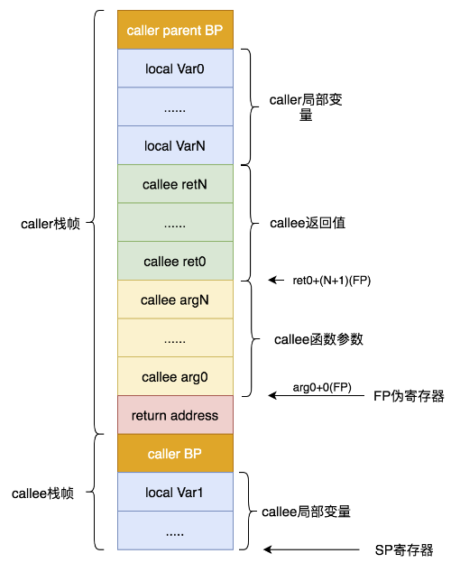

<!--
 * @Author: wxb 1763567512@qq.com
 * @Date: 2024-07-08 22:30:37
 * @LastEditors: wxb 1763567512@qq.com
 * @LastEditTime: 2024-09-17 23:31:02
 * @FilePath: \go语言设计与实现\go语言设计与实现.md
 * @Description: 这是默认设置,请设置`customMade`, 打开koroFileHeader查看配置 进行设置: https://github.com/OBKoro1/koro1FileHeader/wiki/%E9%85%8D%E7%BD%AE
-->
# 编译原理

## 编译
- 词法分析：将字符串转换为Token
- 语法分析：将Token转化成语法树(结构体表示)
- 类型检查：通过遍历语法树检查每个节点
- 中间代码生成（SSA）：高级编程语言直接翻译成机器码比较困难，所有有中间代码
- 机器码生成

### 强类型和弱类型
- 强类型：编译期间发现变量赋值、返回值和函数调用时的类型错误
- 弱类型：出现类型错误时进行隐式类型转换，可能造成运行错误

### 静态类型检查和动态类型检查
- 在编译时进行类型检查和运行时进行类型检查的区别（比如数组的越界）
- 两者不是对立的
- go的interface{}是动态类型检查，如果无法转换，运行时就会崩溃

# 数据结构

## 数组
- 当元素<=4个时，元素放在栈上，多于4个时放在静态区

### 切片
- 内部数据结构：指向数组的指针、size、cap
- 切片即动态数组，在声明时不指定数据大小
- 创建切片的方式
  1. 使用下标获得数组或者切片的一部分
  2. 字面量初始化
  3. make
```go
arr := [...]int{1, 2, 3}
slice := arr[: 2]
slice2 := []int{1, 2, 3}
slice3 := make([]int, 10)
```

#### 扩容
- 当使用追加或者扩容时，这个切片的地址可能会变(参考c++ vector)
- 扩容机制：
  1. 期望容量大于当前容量两倍，就会使用期望容量
  2. 当前切片长度小于1024，就会将容量翻倍
  3. 大于1024，每次增加25%，直到大于期望容量

#### 切片复制
- 底层使用的是memmove

## 哈希表
- 内部数据结构：
  - count：元素数量
  - B：桶数量，一个桶里面最多装8个key
  - hash0：哈希表种子
  - oldbuckets: 扩容时保存之前的buckets字段，大小是buckets的一半
  - top_hash: 存储key哈希值高8位；当top_hash对应的kv没有使用，存储的是对应位置的状态
    - 当top_hash值小于5时，存储的是状态：所以当存储值得时候，如果计算出来得哈希值小于5，就会加5
```go
func tophash(hash uintptr) uint8 {
	top := uint8(hash >> (sys.PtrSize*8 - 8))
	if top < minTopHash {
		top += minTopHash
	}
	return top
}

```
[](assets.assets/2024-07-10-23-03-40.png)

### 扩容
- 扩容场景：
  - 装载因子超过6.5：每次扩容两倍(B + 1)
    - 双倍扩容
  - 使用了太多溢出桶（桶存不下时会创建溢出桶，相当于拉链法；和B的大小有关）：
    - 当 B 小于 15，如果 overflow 的 bucket 数量超过 2^B；当 B >= 15，如果 overflow 的 bucket 数量超过 2^15；对第一点的补充，造成原因是不断的插入和删除
    - 等量扩容，老的bucket移动到新的里面
- 扩容方式使用渐进式哈希，每次最多搬运两个桶：第一条线从第一个桶开始搬运；第二条线从定位到的key所在的桶进行搬运


## 字符串

### 数据结构
- 支持单引号和双引号
- string转byte[]不一定会发生内存拷贝
```go
type StringHeader struct {
  Data uintptr
  Len int
}

```

# 语言特性

## 函数调用
- 参数入栈顺序从右到左
- 函数参数和返回值的存储空间是caller栈帧提供的，这也是为什么go支持多返回值
  - c++使用寄存器传递返回值(%eax)，所以没法返回多个返回值
  - c++参数小于等于6个时使用寄存器传递参数，以上一般使用栈传递
- 由callee完成栈平衡


### 比较
- C：访问栈的开销比访问寄存器高几十倍，但是需要哦单独处理参数过多的情况
- GO：支持多参数返回；不需要考虑不同架构寄存器的差异；编译器更容易维护

### 参数传递
- GO语言和c一样是传值

## 接口
- go语言接口的实现是隐式的，即不需要类似继承的关键字
- go中含有两种接口

- interface{}的类型不是任意类型，nil转成interface{}不是nil


### 数据结构
```go
type eface struct {
  _type *type
  data unsafe.Pointer
}

type iface struct {
  tab *itab
  data unsafe.Pointer
}
```

### 动态派发
- 运行期间选择具体多态操作的过程
- 通过eface中的type实现的
```go
var c Duck = &Cat{}
c.Quack() // 运行时动态派发
c.(*Cat).Quack() //编译期确定
```

## 反射
- reflect.TypeOf、reflect.ValueOf
- 三大法则：
  - interface{}可以转换成反射对象
  - 从反射对象可以获取interface{}变量：通过reflect.Value.Interface
  - 要修改反射对象，其值必须可设置: Go本身是值传递，直接设置无法改变原变量

# 常用关键字
- map遍历两次可能会有不同的结果
- 对于range循环，Go语言会在编译期将原切片或者数据赋值给一个新的ha，又通过len获取了长度
- map遍历原理：随机选一个桶，之后遍历溢出桶，再按照索引遍历其他区桶
- string遍历：遍历时拿到的数据类型是rune(type int32 rune)

## select
- 当不存在可以收发的channel时，执行default
- 遇到多种情况会随机执行一种

### 原理
- select语句在编译期间会被转换成oselect节点

## defer
- 用于关闭描述符、数据库以及解锁资源
- 只会在函数结束时调用，不会在作用域结束时调用
- 在声明处参数就传过去了
- 每个runtime._defer都是延迟调用链表上的一个元素
```go
type _defer struct {
	siz       int32 // 参数和结果的内存大小
	started   bool
	openDefer bool
	sp        uintptr
	pc        uintptr
	fn        *funcval // 传入的函数
	_panic    *_panic
	link      *_defer
}
```


## panic和recover
- panic只会触发当前goroutine的defer
- recover只有在defer中调用才会生效
- panic允许在defer中嵌套多次调用
- 在执行过程中遇到panic方法，会从Goroutine的链表依次取出runtime._defer结构体并执行
- 如果遇到recover，就会执行
- 当所有defer执行完毕，就会返回错误码2

## make 和 new
- make用于初始化内置数据结构，如slice、map、channel
- new用于根据类型分配一块内存空间，并返回这个内存空间的指针

# 并发编程

## 上下文
- context.Context主要实现了4个所需要的方法：
  - Deadline：返回上下文被取消的时间
  - Done：返回一个Channel
  - Err：返回上下文结束的原因
  - Value：获取键对应的值

### 设计原理
- 每个context都会从顶部的goroutine传递到最底层

# Other
- go中的引用类型：slice、map、interface{}、func、channel