# 内核是如何接受网络包的

- ksoftirqd内核线程：用于执行软中断
- 

## 数据是如何从网卡到协议栈的
- 内核接受包路径


## Linux启动
- 在接受网卡数据包之前，需要做好准备工作
  1. 创建ksoftirqd内核线程
     - 通过执行spawn_ksoftirqd（位于kernel/softirq.c）来创建出softirqd线程
     - 当ksoftirqd被创建出来后，会进入自己的线程循环函数ksoftirqd_should_run和run_ksoftirqd
     - 判断有无软中断需要处理，不仅有网络软中断，还有其他软中断

      ```
      //file: kernel/softirq.c

      static struct smp_hotplug_thread softirq_threads = {

          .store          = &ksoftirqd,
          .thread_should_run  = ksoftirqd_should_run,
          .thread_fn      = run_ksoftirqd,
          .thread_comm        = "ksoftirqd/%u",
      };
      static __init int spawn_ksoftirqd(void)
      {
          register_cpu_notifier(&cpu_nfb);

          //创建线程
          BUG_ON(smpboot_register_percpu_thread(&softirq_threads));
          return 0;
      }

      early_initcall(spawn_ksoftirqd);
      ```
  
  2. 网络子系统初始化
     - 为每个CPU初始化softnet_data，也会为PX_SOFTIRQ和TX_SOFTIRQ注册处理函数
     - Linux内核通过subsys_initcall来初始化各个子系统，这里使用net_dev_init函数进行网络子系统初始化
    ```
    //file: net/core/dev.c

    static int __init net_dev_init(void)
    {
        ......

        for_each_possible_cpu(i) {
            struct softnet_data *sd = &per_cpu(softnet_data, i);

            memset(sd, 0, sizeof(*sd));
            skb_queue_head_init(&sd->input_pkt_queue);
            skb_queue_head_init(&sd->process_queue);
            sd->completion_queue = NULL;
            INIT_LIST_HEAD(&sd->poll_list);
            ......
        }
        ......
        //为每个软中断注册处理函数
        open_softirq(NET_TX_SOFTIRQ, net_tx_action);
        open_softirq(NET_RX_SOFTIRQ, net_rx_action);

    }
    //初始化网络子系统
    subsys_initcall(net_dev_init);
    ```
     - 会为每个CPU都申请一个softnet_data数据结构，这个数据结构中的poll_list用于等待驱动程序将其poll函数注册进来 
  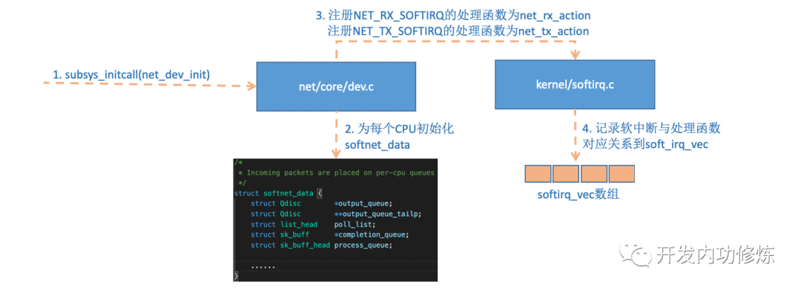

  3. 协议栈注册
     1. 内核实现了网络层的ip协议，也实现了传输层的TCP和UDP协议，这些协议对应的函数分别为ip_rcv、tcp_v4_rcv、udp_rcv
     2. 内核中的fs_initcall调用inet_init后开始协议栈注册，将这些函数注册到inet_protos和ptype_base数据结构中
      ```
      //file: net/ipv4/af_inet.c

      static struct packet_type ip_packet_type _read_mostly = {
          .type = cpu_to_be16(ETH_P_IP),
          .func = ip_rcv,
      }
      static const struct net_protocol udp_protocol = {
          .handler = udp_rcv,
          .err_handler = udp_err,
          .no_policy = 1,
          .netns_ok = 1,
      }
      ......
      static int __init inet_init(void)
      {

          ......
          if (inet_add_protocol(&icmp_protocol, IPPROTO_ICMP) < 0)
              pr_crit("%s: Cannot add ICMP protocol\n", __func__);
          if (inet_add_protocol(&udp_protocol, IPPROTO_UDP) < 0)
              pr_crit("%s: Cannot add UDP protocol\n", __func__);
          if (inet_add_protocol(&tcp_protocol, IPPROTO_TCP) < 0)
              pr_crit("%s: Cannot add TCP protocol\n", __func__);
          ......
          dev_add_pack(&ip_packet_type);

      }
      ```
  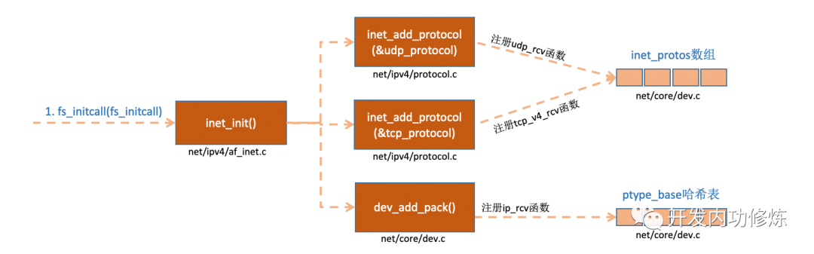

  4. 网卡驱动初始化
     1. 每一个驱动程序会使用module_init向内核注册一个初始化函数，当驱动程序被加载时，内核会调用这个函数。如igb网卡驱动程序的代码：
      ```
      //file: drivers/net/ethernet/intel/igb/igb_main.c

      static struct pci_driver igb_driver = {

          .name     = igb_driver_name,
          .id_table = igb_pci_tbl,
          .probe    = igb_probe,
          .remove   = igb_remove,
          ......

      };

      static int __init igb_init_module(void){

          ......
          ret = pci_register_driver(&igb_driver);
          return ret;

      }
      ```
     2. 当pci_register_dirver调用完成后，Linux内核就知道了该驱动的相关信息，如igb_dirver_name和igb_probe函数地址
     3. 当网卡设备被识别后，内核调用其驱动的probe方法，目的是为了让设备处于ready状态
     4. 在第5步中，网卡驱动设置了ethtool所需要的接口。故当ethtool发起一个系统调用后，内核会找到对应的回调函数；所以之所以这个命令能查看网卡收发包统计、修改网卡自适应模式等，是因为调用了相应的网卡驱动的相应方法
     5. 第6步注册的变量，在网卡被启动时调用
  
  5. 启动网卡
     1. 向内核注册的struct net_device_ops变量，包含着网卡启用、设置MAC地址等回调函数，当启用一个网卡时，net_device_ops变量中定义的ndo_open方法会被调用
      ```
      //file: drivers/net/ethernet/intel/igb/igb_main.c

      static int __igb_open(struct net_device *netdev, bool resuming)
      {

        /* 分配Tx内存，使用RingBuffer实现 */
        err = igb_setup_all_tx_resources(adapter);

        /* 分配Rx内存 */
        err = igb_setup_all_rx_resources(adapter);

        /* 注册中断处理函数 */
        err = igb_request_irq(adapter);
        if (err)
            goto err_req_irq;

        /* 启用NAPI */
        for (i = 0; i < adapter->num_q_vectors; i++)
            napi_enable(&(adapter->q_vector[i]->napi));
        ......

      }
      ```
  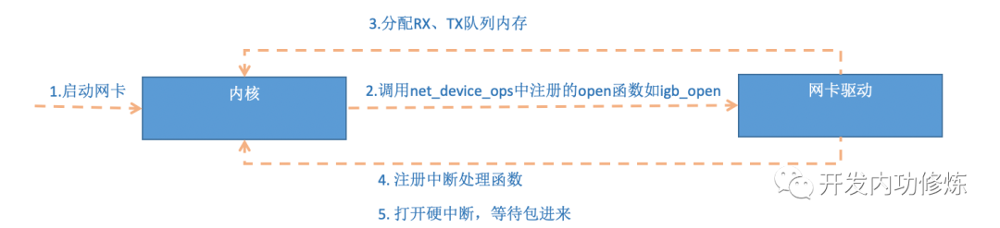
  - RingBuffer的内部不是仅有一个环形队列数组，而是有两个
    - igb_rx_buffer: 供内核使用
    - e1000_adv_rx_desc数组：供网卡硬件使用
  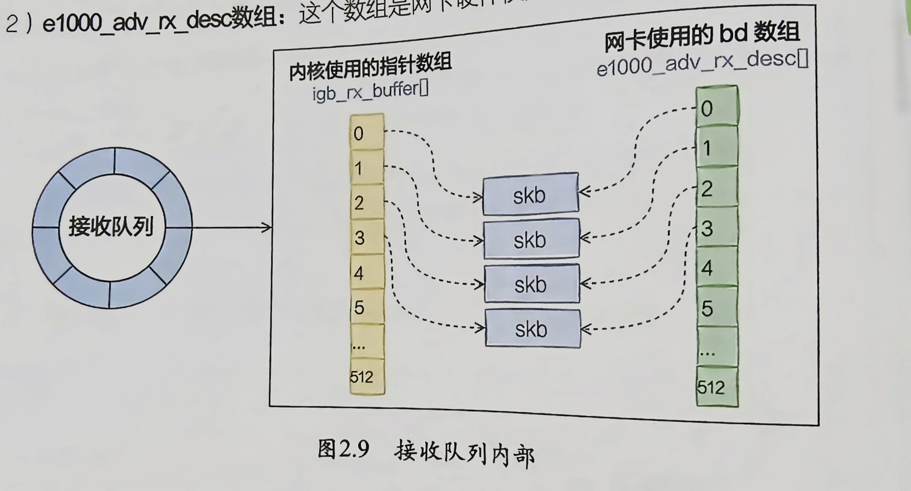

## 迎接数据的到来
### 硬中断处理
1. 当数据包从网线到达网卡的时候，第一站是网卡的接收队列
2. 网卡在分配给自己的RingBuffer中寻找可用的内存位置
3. 找到后DMA引擎会把数据DMA到网卡之前关联的内存里
4. DMA操作完成后，网卡向CPU发起一个硬中断，通知有数据到达
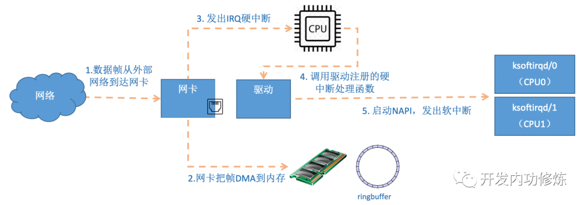
- 当RingBuffer满的时候，新来的数据包将丢弃（使用ifconfig命令查看时，里面有个overturns，可以使用ethtool命令加大环形队列的长度）
- 硬中断只完成简单必要的工作，剩下的全部交给软中断

### ksoftirqd内核线程处理软中断
- 网络包的接收过程主要都在ksoftirqd内核线程中完成
1. 进入内核线程处理函数,在_do_softirq中，根据当前的CPU软中断类型，调用其注册的action方法 
```
static void run_ksoftirqd(unsigned int cpu)
{
    local_irq_disable();
    if (local_softirq_pending()) {
        __do_softirq();
        rcu_note_context_switch(cpu);
        local_irq_enable();
        cond_resched();
        return;
    }
    local_irq_enable();

}
asmlinkage void __do_softirq(void)
{
    do {
        if (pending & 1) {
            unsigned int vec_nr = h - softirq_vec;
            int prev_count = preempt_count();
            ...
            trace_softirq_entry(vec_nr);
            h->action(h);
            trace_softirq_exit(vec_nr);
            ...
        }
        h++;
        pending >>= 1;
    } while (pending);

}
```
2. 硬中断中设置软中断标记，核ksoftirqd中的判断是否有软中断到达，都是基于smp_processor_id()的。这意味着只要硬中断在哪个CPU上被响应，那么软中断也是在这个CPU上的
```
static void net_rx_action(struct softirq_action *h)
{
    struct softnet_data *sd = &__get_cpu_var(softnet_data);
    unsigned long time_limit = jiffies + 2;
    int budget = netdev_budget;
    void *have;

    //关闭硬中断,防止设备重复添加
    local_irq_disable();
    while (!list_empty(&sd->poll_list)) {
        ......
        n = list_first_entry(&sd->poll_list, struct napi_struct, poll_list);

        work = 0;
        if (test_bit(NAPI_STATE_SCHED, &n->state)) {
            work = n->poll(n, weight);
            trace_napi_poll(n);
        }
        budget -= work;
    }

}
```
3. 获取当前CPU变量softnet_data，对其poll_list进行遍历，然后执行网卡驱动注册到的poll函数
```
static int igb_poll(struct napi_struct *napi, int budget)
{
    ...
    if (q_vector->tx.ring)
        clean_complete = igb_clean_tx_irq(q_vector);

    if (q_vector->rx.ring)
        clean_complete &= igb_clean_rx_irq(q_vector, budget);
    ...

}
```
4. igb_fetch_rx_buffer和igb_is_non_eop的作用就是把数据从RingBuffer取下来
```
static bool igb_clean_rx_irq(struct igb_q_vector *q_vector, const int budget)
{
    ...
    do {
        /* retrieve a buffer from the ring */
        skb = igb_fetch_rx_buffer(rx_ring, rx_desc, skb);

        /* fetch next buffer in frame if non-eop */
        if (igb_is_non_eop(rx_ring, rx_desc))
            continue;
        }

        /* verify the packet layout is correct */
        if (igb_cleanup_headers(rx_ring, rx_desc, skb)) {
            skb = NULL;
            continue;
        }

        /* populate checksum, timestamp, VLAN, and protocol */
        igb_process_skb_fields(rx_ring, rx_desc, skb);

        napi_gro_receive(&q_vector->napi, skb);
}
```
5. 在netif_receive_skb中，数据包将被送到协议栈中
```
//file: net/core/dev.c

gro_result_t napi_gro_receive(struct napi_struct *napi, struct sk_buff *skb)
{
    skb_gro_reset_offset(skb);
    return napi_skb_finish(dev_gro_receive(napi, skb), skb);

}
//file: net/core/dev.c

static gro_result_t napi_skb_finish(gro_result_t ret, struct sk_buff *skb)
{

    switch (ret) {
    case GRO_NORMAL:
        if (netif_receive_skb(skb))
            ret = GRO_DROP;
        break;
    ......

    }

}
```
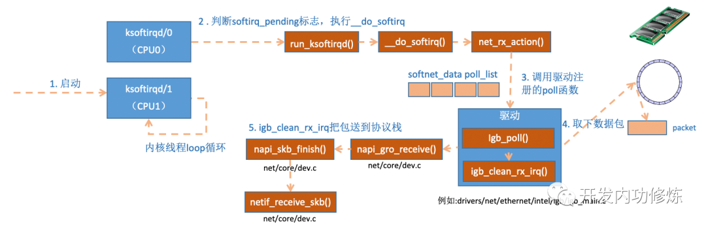

### 网络协议栈处理
- netif_receive_skb函数会根据包的协议进行处理
```
//file: net/core/dev.c

int netif_receive_skb(struct sk_buff *skb)
{

    //RPS处理逻辑，先忽略    ......
    return __netif_receive_skb(skb);

}

static int __netif_receive_skb(struct sk_buff *skb)
{

    ......  
    ret = __netif_receive_skb_core(skb, false);}static int __netif_receive_skb_core(struct sk_buff *skb, bool pfmemalloc){
    ......

    //pcap逻辑，这里会将数据送入抓包点。tcpdump就是从这个入口获取包的    list_for_each_entry_rcu(ptype, &ptype_all, list) {
        if (!ptype->dev || ptype->dev == skb->dev) {
            if (pt_prev)
                ret = deliver_skb(skb, pt_prev, orig_dev);
            pt_prev = ptype;
        }
    }
    ......
    list_for_each_entry_rcu(ptype,
            &ptype_base[ntohs(type) & PTYPE_HASH_MASK], list) {
        if (ptype->type == type &&
            (ptype->dev == null_or_dev || ptype->dev == skb->dev ||
             ptype->dev == orig_dev)) {
            if (pt_prev)
                ret = deliver_skb(skb, pt_prev, orig_dev);
            pt_prev = ptype;
        }
    }

}
```
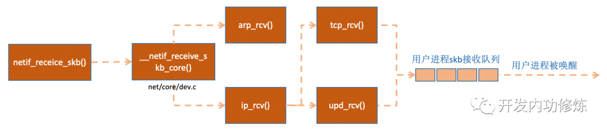

### IP层处理
- IP层接收网络包处理：
```
//file: net/ipv4/ip_input.c

int ip_rcv(struct sk_buff *skb, struct net_device *dev, struct packet_type *pt, struct net_device *orig_dev){

    ......
    return NF_HOOK(NFPROTO_IPV4, NF_INET_PRE_ROUTING, skb, dev, NULL,ip_rcv_finish);

}
```
- 当执行完注册的hook后就会执行最后一个参数ip_rcv_finish
```
static int ip_rcv_finish(struct sk_buff *skb)
{
    ......
    if (!skb_dst(skb)) {
        int err = ip_route_input_noref(skb, iph->daddr, iph->saddr, ph->tos, skb->dev);
        ...
    }
    ......
    return dst_input(skb);

}
......
static int ip_local_deliver_finish(struct sk_buff *skb){

    ......
    int protocol = ip_hdr(skb)->protocol;
    const struct net_protocol *ipprot;

    ipprot = rcu_dereference(inet_protos[protocol]);
    if (ipprot != NULL) {
        ret = ipprot->handler(skb);
    }

}
```
- 之后skb包会进一步到更上层的协议

### 收包小结
- 在开始收包之前，Linux的准备工作：
  1. 创建ksoftirq线程，用于处理软中断
  2. 协议栈注册
  3. 网卡驱动初始化
  4. 启动网卡：分配RX、TX队列，注册中断对应的处理函数 

- 当数据到来后：
  1. 网卡将数据帧DMA到内存的RingBuffer中，然后向CPU发起中断
  2. CPU响应中断请求，调用网卡启动时注册的中断处理函数
  3. 中断处理函数几乎没干什么，发起软中断请求
  4. 内核线程发现有软中断请求到来，先关闭硬中断
  5. 内核线程调用驱动的poll函数接收包
  6. poll函数将收到的包送到协议栈的ip_rcv函数中
  7. ip_rcv函数将数据包送入到udp_rcv函数中
  
# 内核是如何与用户进程协作的

## socket的直接创建
1. 创建一个socket，用户层面看到的返回的是一个整数型的句柄，但其实在内核内部创建了一系列的socket相关内核对象
```
//file:net/socket.c
SYSCALL_DEFINE3(socket, int, family, int, type, int, protocol)
{
    ......
    retval = sock_create(family, type, protocol, &sock);
}
```
2. 在__sock_create中，先分配一个socket对象，接着获取协议族的操作函数表，并调用其create方法
```
//file:net/socket.c
int __sock_create(struct net *net, int family, int type, int protocol,
    struct socket **res, int kern)
{
    struct socket *sock;
    const struct net_proto_family *pf;

    ......

    //分配 socket 对象
    sock = sock_alloc();

    //获得每个协议族的操作表
    pf = rcu_dereference(net_families[family]);

    //调用每个协议族的创建函数， 对于 AF_INET 对应的是
    err = pf->create(net, sock, protocol, kern);
}
```
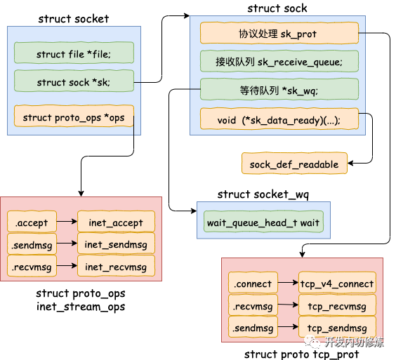

3. 以ipv4为例，执行的是inet_create方法。根据SOCK_STREAM查找到对于TCP定义的操作方法实现集合inet_stream_ops和tcp_port，并把它们分别设置
```
//file:net/ipv4/af_inet.c
tatic int inet_create(struct net *net, struct socket *sock, int protocol,
         int kern)
{
    struct sock *sk;

    //查找对应的协议，对于TCP SOCK_STREAM 就是获取到了
    //static struct inet_protosw inetsw_array[] =
        //{
    //    {
    //     .type =       SOCK_STREAM,
    //     .protocol =   IPPROTO_TCP,
    //     .prot =       &tcp_prot,
    //     .ops =        &inet_stream_ops,
    //     .no_check =   0,
    //     .flags =      INET_PROTOSW_PERMANENT |
    //            INET_PROTOSW_ICSK,
    //    },
    //}
        list_for_each_entry_rcu(answer, &inetsw[sock->type], list) {

    //将 inet_stream_ops 赋到 socket->ops 上 
    sock->ops = answer->ops;

    //获得 tcp_prot
    answer_prot = answer->prot;

    //分配 sock 对象， 并把 tcp_prot 赋到 sock->sk_prot 上
    sk = sk_alloc(net, PF_INET, GFP_KERNEL, answer_prot);

    //对 sock 对象进行初始化
    sock_init_data(sock, sk);
}
```
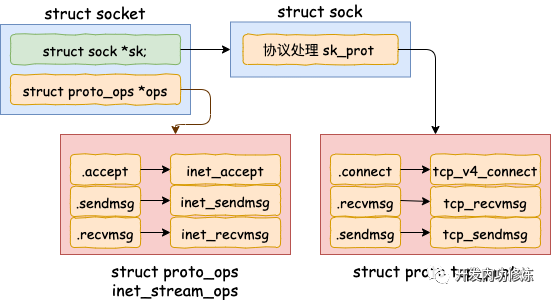

4. sock_init_data方法将sock中的sk_data_ready函数指针进行了初始化;当软中断上收到数据包时会通过调用sk_data_ready函数指针来唤醒sock上等待的进程


## 内核和用户进程协作之阻塞方式
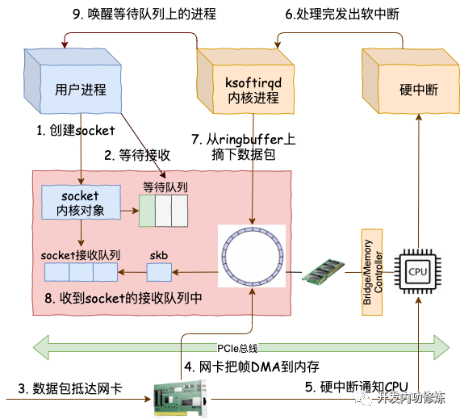

### 等待接收消息
1. 根据用户传入的fd找到对应的socket对象
```
//file: net/socket.c
SYSCALL_DEFINE6(recvfrom, int, fd, void __user *, ubuf, size_t, size,
  unsigned int, flags, struct sockaddr __user *, addr,
  int __user *, addr_len)
{
    struct socket *sock;

    //根据用户传入的 fd 找到 socket 对象
    sock = sockfd_lookup_light(fd, &err, &fput_needed);
    ......
    err = sock_recvmsg(sock, &msg, size, flags);
    ......
}

static inline int __sock_recvmsg_nosec(struct kiocb *iocb, struct socket *sock,
           struct msghdr *msg, size_t size, int flags)
{
    ......
    return sock->ops->recvmsg(iocb, sock, msg, size, flags);
}
```
2. 调用socket里的ops里的recvmsg，其指向inet_recvmsg方法
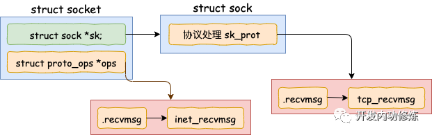
3. 接着调用socket对象里的sk_prot下的recvmsg方法
```
//file: net/ipv4/tcp.c
int tcp_recvmsg(struct kiocb *iocb, struct sock *sk, struct msghdr *msg,
  size_t len, int nonblock, int flags, int *addr_len)
{
    int copied = 0;
    ...
    do {
        //遍历接收队列接收数据
        skb_queue_walk(&sk->sk_receive_queue, skb) {
        ...
    }
    ...
    }

    if (copied >= target) {
        release_sock(sk);
        lock_sock(sk);
    } else //没有收到足够数据，启用 sk_wait_data 阻塞当前进程
        sk_wait_data(sk, &timeo);
}
```
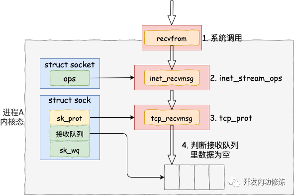
4. skb_queue_walk在访问sock对象下的接收队列，如果为空，调用sk_wait_data把当前进程设置为阻塞帧
5. sk_wait_data是怎么将当前进程阻塞掉的：
   1. 在DEFINE_WAIT宏下，定义了一个等待队列wait
   2. 在这个新的等待队列上，注册了回调函数autoremove_wake_function，并把当前进程描述符current关联到其.private成员上
   3. 紧接着在sk_wait_data中调用sk_sleep获取sock对象下的等待队列表头wait_queue_head_t
6. 这样后面当内核收完数据产生就绪事件的事件，就可以查找socket等待队列上的等待项，进而可以找到回调函数和在等待该socket就绪事件的进程了
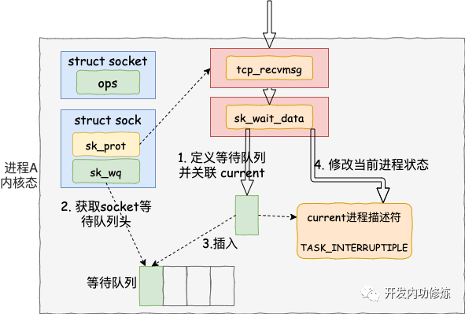
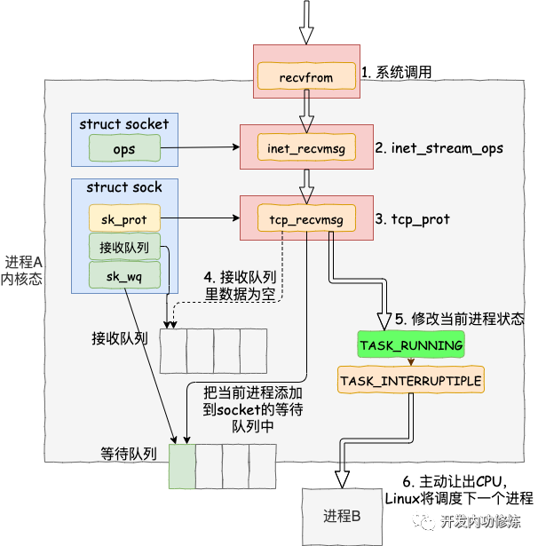 


### 软中断模块
- Linux里ksoftirqd线程收到数据包，如发现是TCP包就会执行tcp_v4_rcv
- 在tcp_v4_rcv中，首先根据收到的网络包的header里的source和dest信息在本机上查询对应的socket，之后进入主体函数tcp_v4_do_rcv
```
// file: net/ipv4/tcp_ipv4.c
int tcp_v4_rcv(struct sk_buff *skb)
{
    ......
    th = tcp_hdr(skb); //获取tcp header
    iph = ip_hdr(skb); //获取ip header

    //根据数据包 header 中的 ip、端口信息查找到对应的socket
    sk = __inet_lookup_skb(&tcp_hashinfo, skb, th->source, th->dest);
    ......

    //socket 未被用户锁定
    if (!sock_owned_by_user(sk)) {
    {
    if (!tcp_prequeue(sk, skb))
    ret = tcp_v4_do_rcv(sk, skb);
    }
    }
}

//file: net/ipv4/tcp_ipv4.c
int tcp_v4_do_rcv(struct sock *sk, struct sk_buff *skb)
{
    if (sk->sk_state == TCP_ESTABLISHED) { 

    //执行连接状态下的数据处理
    if (tcp_rcv_established(sk, skb, tcp_hdr(skb), skb->len)) 
    {
        rsk = sk;
        goto reset;
    }
        return 0;
    }

    //其它非 ESTABLISH 状态的数据包处理
    ......
}
```
- 假设处理的是TSTABLISH状态下的包
```
//file: net/ipv4/tcp_input.c
int tcp_rcv_established(struct sock *sk, struct sk_buff *skb,
   const struct tcphdr *th, unsigned int len)
{
    ......

    //接收数据到队列中
    eaten = tcp_queue_rcv(sk, skb, tcp_header_len,
                &fragstolen);

    //数据 ready，唤醒 socket 上阻塞掉的进程
    sk->sk_data_ready(sk, 0);
}
```


- 调用tcp_queue_rcv接收完成后，接着调用sk_data_ready（初始化时设置成了sock_def_ready）来唤醒socket上等待的用户进程，这是一个函数指针，唤醒等待的进程
```
//file: net/core/sock.c
static void sock_def_readable(struct sock *sk, int len)
{
    struct socket_wq *wq;

    rcu_read_lock();
    wq = rcu_dereference(sk->sk_wq);

    //有进程在此 socket 的等待队列
    if (wq_has_sleeper(wq))
    //唤醒等待队列上的进程
    wake_up_interruptible_sync_poll(&wq->wait, POLLIN | POLLPRI |
        POLLRDNORM | POLLRDBAND);
    sk_wake_async(sk, SOCK_WAKE_WAITD, POLL_IN);
    rcu_read_unlock();
}
```
- 最终函数跳转到__wake_up_common实现唤醒，为了不惊群，这里的nx_exclusive传入的是1
```cpp
//file: kernel/sched/core.c
static void __wake_up_common(wait_queue_head_t *q, unsigned int mode,
   int nr_exclusive, int wake_flags, void *key)
{
    wait_queue_t *curr, *next;

    list_for_each_entry_safe(curr, next, &q->task_list, task_list) {
    unsigned flags = curr->flags;

    //调用进程curr的回调函数唤醒进程，nr_exclusive为0时，break
    if (curr->func(curr, mode, wake_flags, key) &&
        (flags & WQ_FLAG_EXCLUSIVE) && !--nr_exclusive)
    break;
 }
}
```

### 同步阻塞总结
- 第一部分是我们自己代码所在的进程
  1. 调用socket()函数会进入内核态创建必要的内核对象
  2. recv()函数进入内核态以后负责查看接收队列，以及在没有数据可以处理的时候把当前进程阻塞掉
- 第二部分是硬中断、软中断上下文
  1. 将包处理完后会放在socket的接收队列中
  2. 根据socket内核对象找到其等待队列中正在因为等待而被阻塞的进程，将其唤醒


## 内核和用户进程协作之epoll
- 在Linux上多路复用的方案select、poll、epoll

### epoll内核对象的创建
- 当用户进程调用epoll_create时，内核会创建一个struct eventpoll的内核对象，并把它关联到当前进程的已打开文件列表中
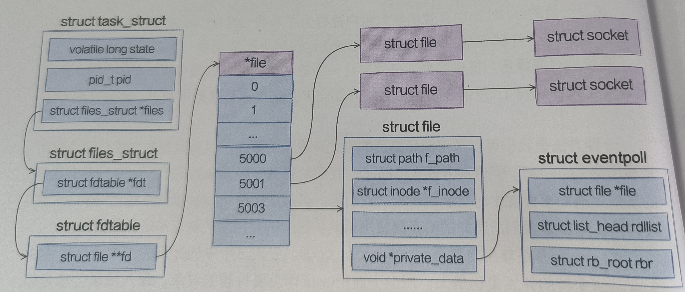
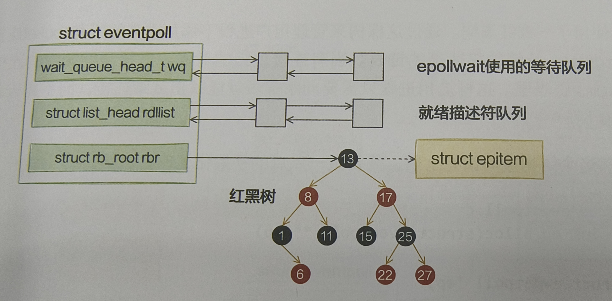
```
//file: fs/eventpoll.c
SYSCALL_DEFINE1(epoll_creat1, int, flags)
{
    struct eventpoll *ep = NULL;

    //创建一个eventpoll对象
    error = ep_alloc(&ep);
}

struct eventpoll
{
    //sys_epoll_wait用的等待队列
    wait_queue_head_t wq;
    
    //接收就绪的描述符
    struct list_head rdlist;

    //每个epoll对象中都有一个红黑树
    struct rb_root rbr;

    ......
}
```
- eventpoll 结构体中的几个成员的含义如下：
  - wq: 等待队列链表；软中断数据就绪的时候会通过wq来找到阻塞在epoll对象上的用户进程
  - rbr: 红黑树；为了支持连接的高效查找、插入和删除，通过这颗树来管理用户进程下添加进来的所有socket连接
  - rdllist: 就绪的描述符的链表

- 在这个结构申请完后，在ep_alloc中完成初始化：
```cpp
static int ep_alloc(struct eventpoll **pep)
{
    struct eventpoll *ep;

    //申请eventpoll内存
    ep = kzalloc(sizeof(*ep), GFP_KERNEL);

    //初始化等待队列头
    init_waitqueue_head(&ep->wq);

    //初始化就绪列表
    INIT_LIST_HEAD(&ep->rdllist);

    //初始化红黑树指针
    ep->rbr = RB_ROOT;
}
```

### 为epoll添加socket
- 在epoll_ctl注册每一个socket的时候，内核会做三件事：
  1. 分配一个红黑树结点对象epitem
  2. 将等待事件添加到socket的等待队列中，回调函数为ep_poll_callback
  3. 将epitem插入epoll对象的红黑树

- 通过epoll_ctl添加两个socket以后，这些内核数据结构最终在进程中的关系：
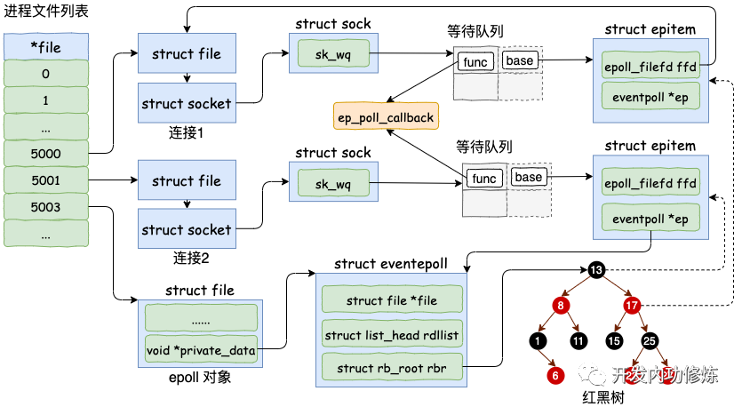

- 详细解析socket是如何添加到epoll对象里的
```cpp
// file：fs/eventpoll.c
SYSCALL_DEFINE4(epoll_ctl, int, epfd, int, op, int, fd,
        struct epoll_event __user *, event)
{
    struct eventpoll *ep;
    struct file *file, *tfile;

    //根据 epfd 找到 eventpoll 内核对象
    file = fget(epfd);
    ep = file->private_data;

    //根据 socket 句柄号， 找到其 file 内核对象
    tfile = fget(fd);

    switch (op) {
    case EPOLL_CTL_ADD:
        if (!epi) {
            epds.events |= POLLERR | POLLHUP;
            error = ep_insert(ep, &epds, tfile, fd);
        } else
            error = -EEXIST;
        clear_tfile_check_list();
        break;
        ......
    }
    ......
}
```
- 对于ep_insert函数，所有注册都是这个函数中完成的
```cpp
//file: fs/eventpoll.c
static int ep_insert(struct eventpoll *ep, 
                struct epoll_event *event,
                struct file *tfile, int fd)
{
    //3.1 分配并初始化 epitem
    //分配一个epi对象
    struct epitem *epi;
    if (!(epi = kmem_cache_alloc(epi_cache, GFP_KERNEL)))
        return -ENOMEM;

    //对分配的epi进行初始化
    //epi->ffd中存了句柄号和struct file对象地址
    INIT_LIST_HEAD(&epi->pwqlist);
    epi->ep = ep;
    ep_set_ffd(&epi->ffd, tfile, fd);

    //3.2 设置 socket 等待队列
    //定义并初始化 ep_pqueue 对象
    struct ep_pqueue epq;
    epq.epi = epi;
    init_poll_funcptr(&epq.pt, ep_ptable_queue_proc);

    //调用 ep_ptable_queue_proc 注册回调函数 
    //实际注入的函数为 ep_poll_callback
    revents = ep_item_poll(epi, &epq.pt);

    ......
    //3.3 将epi插入到 eventpoll 对象中的红黑树中
    ep_rbtree_insert(ep, epi);
    ......
}
```
  1. 分配并初始化epitem
```
//file: fs/eventpoll.c
struct epitem {

    //红黑树节点
    struct rb_node rbn;

    //socket文件描述符信息
    struct epoll_filefd ffd;

    //所归属的 eventpoll 对象
    struct eventpoll *ep;

    //等待队列
    struct list_head pwqlist;
}
```

  2. 设置socket等待队列：建立一个表项设置回调函数ep_poll_callback,这里是为了唤醒等待epoll的进程，所以private设置为**NULL**
  3. 将epitem插入红黑树

### epoll_wait之等待接收
- epoll_wait做的事情并不复杂，当被调用时观察eventpoll->rdllist链表里有没有数据。有数据就返回，没有数据就创建一个等待队列项，将其（当前进程）添加到eventpoll的等待队列上，然后将自己阻塞掉
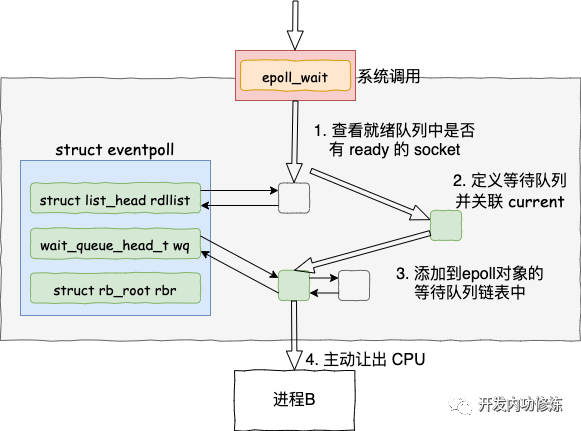
```cpp
//file: fs/eventpoll.c
SYSCALL_DEFINE4(epoll_wait, int, epfd, struct epoll_event __user *, events,
        int, maxevents, int, timeout)
{
    ...
    error = ep_poll(ep, events, maxevents, timeout);
}

static int ep_poll(struct eventpoll *ep, struct epoll_event __user *events,
             int maxevents, long timeout)
{
    wait_queue_t wait;
    ......

fetch_events:
    //4.1 判断就绪队列上有没有事件就绪
    if (!ep_events_available(ep)) {

        //4.2 定义等待事件并关联当前进程
        init_waitqueue_entry(&wait, current);

        //4.3 把新 waitqueue 添加到 epoll->wq 链表里
        __add_wait_queue_exclusive(&ep->wq, &wait);
    
        for (;;) {
            ...
            //4.4 让出CPU 主动进入睡眠状态
            if (!schedule_hrtimeout_range(to, slack, HRTIMER_MODE_ABS))
                timed_out = 1;
            ... 
}
```
1. 判断就绪队列上有没有事件就绪：通过调用ep_events_available
2. 定义等待事件并关联当前进程
   - 若没有就绪的连接，并把当前进程挂到wq上
3. 添加到等待队列
4. 让出CPU主动进入睡眠状态

### 数据来了
- 在epoll_ctl执行的时候，内核为每一个socket都添加了一个等待队列项（阻塞在当前socket上的进程）；在epoll_wait运行完的时候，又在event_poll对象上添加了等待队列元素（rdlist没有事件）
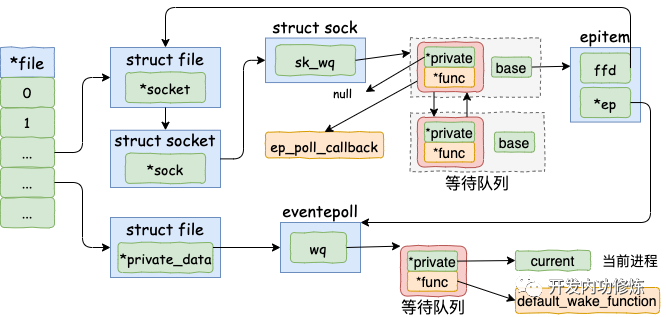

1. 将数据接收到任务队列
   1. 软中断处理网络帧
   2. TCP协议栈处理，将接收的数据放入socket的接收队列上
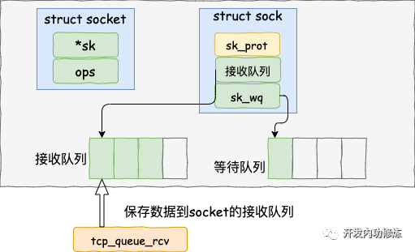
```cpp
//file: net/ipv4/tcp_input.c
static int __must_check tcp_queue_rcv(struct sock *sk, struct sk_buff *skb, int hdrlen,
            bool *fragstolen)
{
    //把接收到的数据放到 socket 的接收队列的尾部
    if (!eaten) {
        __skb_queue_tail(&sk->sk_receive_queue, skb);
        skb_set_owner_r(skb, sk);
    }
    return eaten;
}
```
2. 查找就绪回调函数
   1. 调用完tcp_queue_rcv完成接收之后，接着在调用sk_data_ready来唤醒在socket上等待的用户进程
   2. 当socket上的数据就绪时，内核找到epoll_ctl添加socket时在其上设置的回调函数ep_poll_callback(3.4.2)
   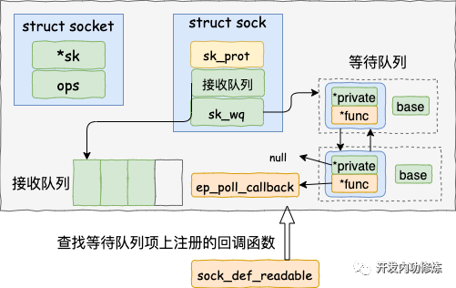
    ```cpp
    //file: net/core/sock.c
    static void sock_def_readable(struct sock *sk, int len)
    {
        struct socket_wq *wq;

        rcu_read_lock();
        wq = rcu_dereference(sk->sk_wq);

        //这个名字起的不好，并不是有阻塞的进程，
        //而是判断等待队列不为空
        if (wq_has_sleeper(wq))
            wake_up_interruptible_sync_poll(&wq->wait, POLLIN | POLLPRI |
                            POLLRDNORM | POLLRDBAND);
        sk_wake_async(sk, SOCK_WAKE_WAITD, POLL_IN);
        rcu_read_unlock();
    }
    ```
   3. 执行socket就绪回调函数：软中断会调用ep_poll_callback
   ```cpp
    //file: fs/eventpoll.c
    static int ep_poll_callback(wait_queue_t *wait, unsigned mode, int sync, void *key)
    {
        //获取 wait 对应的 epitem
        struct epitem *epi = ep_item_from_wait(wait);

        //获取 epitem 对应的 eventpoll 结构体
        struct eventpoll *ep = epi->ep;

        //1. 将当前epitem 添加到 eventpoll 的就绪队列中
        list_add_tail(&epi->rdllink, &ep->rdllist);

        //2. 查看 eventpoll 的等待队列上是否有在等待,有就唤醒
        if (waitqueue_active(&ep->wq))
            //最终调用的是__wake_up_common
            wake_up_locked(&ep->wq);
        ......
    }

    static void __wake_up_common(wait_queue_head_t *q, unsigned int mode,
            int nr_exclusive, int wake_flags, void *key)
    {
        wait_queue_t *curr, *next;

        list_for_each_entry_safe(curr, next, &q->task_list, task_list) {
            unsigned flags = curr->flags;

            if (curr->func(curr, mode, wake_flags, key) &&
                    (flags & WQ_FLAG_EXCLUSIVE) && !--nr_exclusive)
                break;
        }
    }
   ``` 
   4. 执行epoll就绪通知：在default_wake_function中找到等待队列(在epoll对象上等待而阻塞掉的进程)里的进程描述符，然后唤醒
   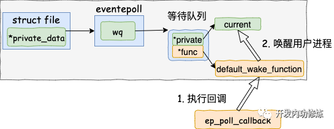
   5. 将epoll_wait进程推入可运行队列，当这个进程重新运行后，从epoll_wait阻塞时暂停的代码处继续进行，将rdlist中就绪的事件返回给用户
   ```cpp
    //file: fs/eventpoll.c
    static int ep_poll(struct eventpoll *ep, struct epoll_event __user *events,
                int maxevents, long timeout)
    {
        ......
        //从等待队列移除
        __remove_wait_queue(&ep->wq, &wait);

        //设置进程状态
        set_current_state(TASK_RUNNING);
        }
    check_events:
        //返回就绪事件给用户进程
        ep_send_events(ep, events, maxevents))
    }
   ```

### 小结

- 其中软中断回调函数关系：
sock_def_readable(sock对象初始化时设置的，用于有数据到达时唤醒进程)
    => ep_poll_callback(调用epoll_ctl时添加到socket等待队列上的)
        => default_wake_function(调用epoll_wait时设置到epoll上的) 

- 同步阻塞模型和epoll异同：
  1. 同步阻塞和epoll在socket等待队列中注册的回调函数不一样，同步阻塞模型是为了回调而唤醒当前等待此socket的进程（.prvate为当前进程），epoll是为了调用ep_poll_callback回调函数（.private为NULL）跳转到挂在epoll上的等待队列做之后的处理，之后继续调用回调函数 default_wake_function

## epoll惊群问题
- 情况1：只适用于多个线程/进程拥有各自的epfd,然后监听同一listen_fd
  - Linux4.5以后得到部分解决：
    - 通过设置WQ_FLAG_EXCLUSIVE关键字，具体见__wake_up_common函数（在epoll_ctl函数中使用EPOLLEXCLUSIVE设置）。
    - 依然可能惊群，如唤醒的进程忙（没有处于等待队列），没有及时去解决这个请求，就会唤醒其他进程

- 情况2：多个进程监听同一个epfd，在LT模式下，会遍历rdlist表，知道唤醒所有epoll等待队列中的进程，其实不算是惊群问题（加锁可以解决）
```
ep_scan_ready_list()
{
    // 遍历“就绪链表”
    ready_list_for_each() {
        list_del_init(&epi->rdllink);
        revents = ep_item_poll(epi, &pt);
        // 保证1:有事件到达
        if (revents) {
            __put_user(revents, &uevent->events);
            if (!(epi->event.events & EPOLLET)) {
                list_add_tail(&epi->rdllink, &ep->rdllist);
            }
        }
    }
    // 保证2：rdlist不为空
    if (!list_empty(&ep->rdllist)) {
        if (waitqueue_active(&ep->wq))
            wake_up_locked(&ep->wq);
    }
}
```
## 服务器编程模型

### Reactor 模型
- 该模型主要处理三种事件：连接事件、（读时间）、写事件；
- 三种关键角色：reactor、acceptor、handler

#### Reactor线程模型
- 单Reactor单线程：三种事件以及后续的处理都是由一个线程完成
  1. reactor负责监听客户端事件与事件分发
  2. 一旦有连接事件，就会分发给acceptor
  3. 如果是读写事件，就会给handler处理（handler负责处理客户端请求，进行业务处理以及最终返回结果）
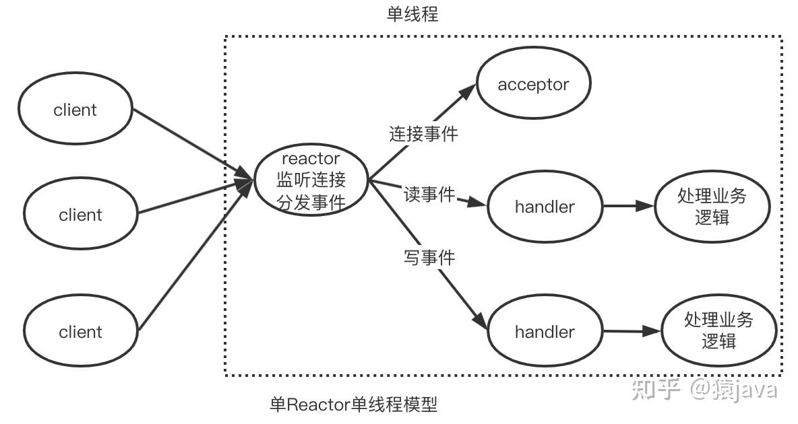

- 单Reactor多线程：acceptor、handler的功能由线程执行，外加一个线程池
  - 在单Reactor多线程中，handler只负责处理读取请求和写回结果，具体的业务逻辑由worker线程执行
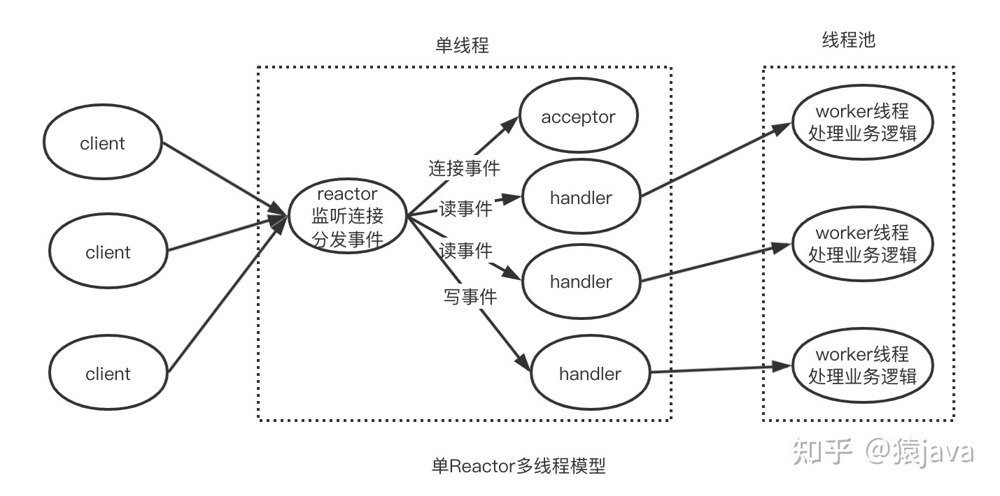

- 主从Reactor多线程：一个主Reactor线程，多个子Reactor线程，线程池
  1. 主Reactor监听事件，在同一个Reactor线程中由acceptor处理连接事件
  2. 连接建立后，主Reactor会将连接分发给子Reactor线程，让子Reactor处理后续事件，具体业务逻辑依然是worker线程处理
  3. **由从Reactor返回结果**
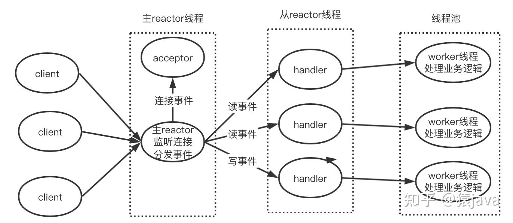

## 本章总结
- 同步阻塞开销（两次进程上下文切换开销）：
  1. 进程通过recv系统调用接收一个socket上的数据时，如果没有数据到达，进程就被从CPU上拿下来，切换到另一个进程，导致一次上下文切换
  2. 当连接上数据就绪的时候，睡眠的进程又会被唤醒，导致一次进程切换开销
  3. 一个进程只能等待一条连接，如果又很多并发，则需要很多进程

- 多路复用epoll为什么能提高网络性能：
  - 根本原因是减少了无用的进程上下文切换（高并发场景，一直会有事件到达）

# 内核时如何发送网络包的
## 网卡启动准备
- 调用__igb_open函数，RingBuffer在这里分配
```
//file: drivers/net/ethernet/intel/igb/igb_main.c
static int __igb_open(struct net_device *netdev, bool resuming)
{
    struct igb_adapter *adapter = netdev_priv(netdev);

    //分配传输描述符数组
    err = igb_setup_all_tx_resources(adapter);

    //分配接收描述符数组
    err = igb_setup_all_rx_resources(adapter);

    //开启全部Ringbuffer
    netif_tx_start_all_queues(netdev);
}
```

## 数据从用户进程到网卡的详细过程
### send系统调用实现
主要干了两件事：
1. 在内核中找出socket，记录着各种协议栈的函数地址
2. 构造struct msghdr对象，把用户传入的数据，如buffer地址、数据长度等，装进去

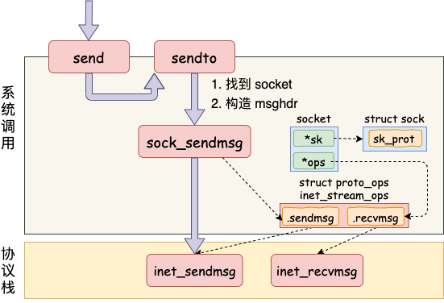

### 传输层处理

#### 传输层拷贝
1. 进入协议栈inet_sendmsg后，会通过socket找到具体协议的发送函数，对于TCP协议来说，就是tcp_sendmsg
```
//file: net/ipv4/tcp.c
int tcp_sendmsg(...)
{
    while(...){
        while(...){
            //获取发送队列
            skb = tcp_write_queue_tail(sk);

            //申请skb 并拷贝
            ......
        }
    }
}
```
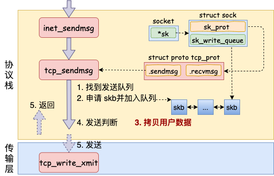
2. 在内核态申请内存，并把用户内存里的数据拷贝到内核态内存，涉及一次或者几次内存拷贝的开销
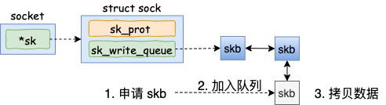
3. 满足条件时发送
```
//file: net/ipv4/tcp.c
int tcp_sendmsg(...)
{
    while(...){
    while(...){
    //申请内核内存并进行拷贝

    //发送判断(未发送的数据是否已经超过最大窗口一半)
    if (forced_push(tp)) {
        tcp_mark_push(tp, skb);
        __tcp_push_pending_frames(sk, mss_now, TCP_NAGLE_PUSH);
    } else if (skb == tcp_send_head(sk))
        tcp_push_one(sk, mss_now);  
    }
    continue;
    }
    }
}
```

#### 传输层发送
1. 假设内核条件已经满足，最终都会实际调用到tcp_write_xmit；这个函数处理了传输层的拥塞控制、滑动窗口等工作。
```
//file: net/ipv4/tcp_output.c
static bool tcp_write_xmit(struct sock *sk, unsigned int mss_now, int nonagle,
      int push_one, gfp_t gfp)
{
    //循环获取待发送 skb
    while ((skb = tcp_send_head(sk))) 
    {
        //滑动窗口相关
        cwnd_quota = tcp_cwnd_test(tp, skb);
        tcp_snd_wnd_test(tp, skb, mss_now);
        tcp_mss_split_point(...);
        tso_fragment(sk, skb, ...);
        ......

        //真正开启发送
        tcp_transmit_skb(sk, skb, 1, gfp);
    }
}
```
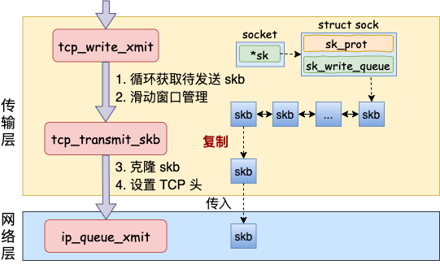
2. 发送主过程
   1. 克隆新的skb：用于重传，最后到达网卡发送完成时，会被释放
   2. 封装TCP头
   3. 发送到网络层
```
//file: net/ipv4/tcp_output.c
static int tcp_transmit_skb(struct sock *sk, struct sk_buff *skb, int clone_it,
    gfp_t gfp_mask)
{
    //1.克隆新 skb 出来
    if (likely(clone_it)) {
    skb = skb_clone(skb, gfp_mask);
    ......
    }

    //2.封装 TCP 头
    th = tcp_hdr(skb);
    th->source  = inet->inet_sport;
    th->dest  = inet->inet_dport;
    th->window  = ...;
    th->urg   = ...;
    ......

    //3.调用网络层发送接口
    err = icsk->icsk_af_ops->queue_xmit(skb, &inet->cork.fl);
}
```

### 网络层发送处理
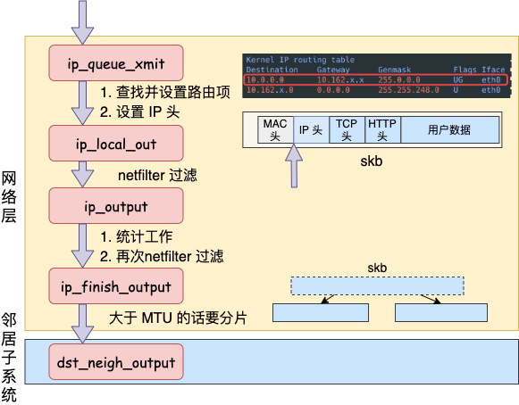
1. 网络层入口函数
   1. 查找并设置路由项
   2. 设置IP头
```
//file: net/ipv4/ip_output.c
int ip_queue_xmit(struct sk_buff *skb, struct flowi *fl)
{
    //检查 socket 中是否有缓存的路由表
    rt = (struct rtable *)__sk_dst_check(sk, 0);
    if (rt == NULL) {
    //没有缓存则展开查找
    //则查找路由项， 并缓存到 socket 中
    rt = ip_route_output_ports(...);
    sk_setup_caps(sk, &rt->dst);
    }

    //为 skb 设置路由表
    skb_dst_set_noref(skb, &rt->dst);

    //设置 IP header
    iph = ip_hdr(skb);
    iph->protocol = sk->sk_protocol;
    iph->ttl      = ip_select_ttl(inet, &rt->dst);
    iph->frag_off = ...;

    //发送
    ip_local_out(skb);
}
```
2. ip_local_out:主要根据iptables配置的一些规则，进行过滤
```cpp
//file: net/ipv4/ip_output.c  
int ip_local_out(struct sk_buff *skb)
{
    //执行 netfilter 过滤
    err = __ip_local_out(skb);

    //开始发送数据
    if (likely(err == 1))
    err = dst_output(skb);
    ......
```
.......

4. 在ip_finish_output总，如果数据大于MTU，执行分片（可以通过控制数据包尺寸小于MTU来优化网络性能）

5. 最后发给ip_finish_output2，向下传递，进入邻居子系统
```
//file: net/ipv4/ip_output.c
static inline int ip_finish_output2(struct sk_buff *skb)
{
    //根据下一跳 IP 地址查找邻居项，找不到就创建一个
    nexthop = (__force u32) rt_nexthop(rt, ip_hdr(skb)->daddr);  
    neigh = __ipv4_neigh_lookup_noref(dev, nexthop);
    if (unlikely(!neigh))
    neigh = __neigh_create(&arp_tbl, &nexthop, dev, false);

    //继续向下层传递
    int res = dst_neigh_output(dst, neigh, skb);
}
```

### 邻居子系统
- 邻居子系统式位于网络层和数据链路层中间的一个系统，作用是为网络层提供一个下层的封装
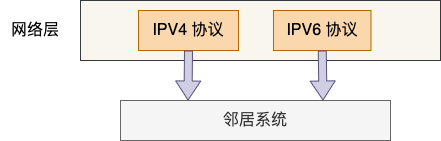
