# 内核是如何接受网络包的

- ksoftirqd内核线程：用于执行软中断
- 

## 数据是如何从网卡到协议栈的
- 内核接受包路径


## Linux启动
- 在接受网卡数据包之前，需要做好准备工作
  1. 创建ksoftirqd内核线程
     - 通过执行spawn_ksoftirqd（位于kernel/softirq.c）来创建出softirqd线程
     - 当ksoftirqd被创建出来后，会进入自己的线程循环函数ksoftirqd_should_run和run_ksoftirqd
     - 判断有无软中断需要处理，不仅有网络软中断，还有其他软中断

      ```
      //file: kernel/softirq.c

      static struct smp_hotplug_thread softirq_threads = {

          .store          = &ksoftirqd,
          .thread_should_run  = ksoftirqd_should_run,
          .thread_fn      = run_ksoftirqd,
          .thread_comm        = "ksoftirqd/%u",
      };
      static __init int spawn_ksoftirqd(void)
      {
          register_cpu_notifier(&cpu_nfb);

          //创建线程
          BUG_ON(smpboot_register_percpu_thread(&softirq_threads));
          return 0;
      }

      early_initcall(spawn_ksoftirqd);
      ```
  
  2. 网络子系统初始化
     - 为每个CPU初始化softnet_data，也会为PX_SOFTIRQ和TX_SOFTIRQ注册处理函数
     - Linux内核通过subsys_initcall来初始化各个子系统，这里使用net_dev_init函数进行网络子系统初始化
    ```
    //file: net/core/dev.c

    static int __init net_dev_init(void)
    {
        ......

        for_each_possible_cpu(i) {
            struct softnet_data *sd = &per_cpu(softnet_data, i);

            memset(sd, 0, sizeof(*sd));
            skb_queue_head_init(&sd->input_pkt_queue);
            skb_queue_head_init(&sd->process_queue);
            sd->completion_queue = NULL;
            INIT_LIST_HEAD(&sd->poll_list);
            ......
        }
        ......
        //为每个软中断注册处理函数
        open_softirq(NET_TX_SOFTIRQ, net_tx_action);
        open_softirq(NET_RX_SOFTIRQ, net_rx_action);

    }
    //初始化网络子系统
    subsys_initcall(net_dev_init);
    ```
     - 会为每个CPU都申请一个softnet_data数据结构，这个数据结构中的poll_list用于等待驱动程序将其poll函数注册进来 
  

  3. 协议栈注册
     1. 内核实现了网络层的ip协议，也实现了传输层的TCP和UDP协议，这些协议对应的函数分别为ip_rcv、tcp_v4_rcv、udp_rcv
     2. 内核中的fs_initcall调用inet_init后开始协议栈注册，将这些函数注册到inet_protos和ptype_base数据结构中
      ```
      //file: net/ipv4/af_inet.c

      static struct packet_type ip_packet_type _read_mostly = {
          .type = cpu_to_be16(ETH_P_IP),
          .func = ip_rcv,
      }
      static const struct net_protocol udp_protocol = {
          .handler = udp_rcv,
          .err_handler = udp_err,
          .no_policy = 1,
          .netns_ok = 1,
      }
      ......
      static int __init inet_init(void)
      {

          ......
          if (inet_add_protocol(&icmp_protocol, IPPROTO_ICMP) < 0)
              pr_crit("%s: Cannot add ICMP protocol\n", __func__);
          if (inet_add_protocol(&udp_protocol, IPPROTO_UDP) < 0)
              pr_crit("%s: Cannot add UDP protocol\n", __func__);
          if (inet_add_protocol(&tcp_protocol, IPPROTO_TCP) < 0)
              pr_crit("%s: Cannot add TCP protocol\n", __func__);
          ......
          dev_add_pack(&ip_packet_type);

      }
      ```
  

  4. 网卡驱动初始化
     1. 每一个驱动程序会使用module_init向内核注册一个初始化函数，当驱动程序被加载时，内核会调用这个函数。如igb网卡驱动程序的代码：
      ```
      //file: drivers/net/ethernet/intel/igb/igb_main.c

      static struct pci_driver igb_driver = {

          .name     = igb_driver_name,
          .id_table = igb_pci_tbl,
          .probe    = igb_probe,
          .remove   = igb_remove,
          ......

      };

      static int __init igb_init_module(void){

          ......
          ret = pci_register_driver(&igb_driver);
          return ret;

      }
      ```
     2. 当pci_register_dirver调用完成后，Linux内核就知道了该驱动的相关信息，如igb_dirver_name和igb_probe函数地址
     3. 当网卡设备被识别后，内核调用其驱动的probe方法，目的是为了让设备处于ready状态
     4. 在第5步中，网卡驱动设置了ethtool所需要的接口。故当ethtool发起一个系统调用后，内核会找到对应的回调函数；所以之所以这个命令能查看网卡收发包统计、修改网卡自适应模式等，是因为调用了相应的网卡驱动的相应方法
     5. 第6步注册的变量，在网卡被启动时调用
  
  5. 启动网卡
     1. 向内核注册的struct net_device_ops变量，包含着网卡启用、设置MAC地址等回调函数，当启用一个网卡时，net_device_ops变量中定义的ndo_open方法会被调用
      ```
      //file: drivers/net/ethernet/intel/igb/igb_main.c

      static int __igb_open(struct net_device *netdev, bool resuming)
      {

        /* 分配Tx内存，使用RingBuffer实现 */
        err = igb_setup_all_tx_resources(adapter);

        /* 分配Rx内存 */
        err = igb_setup_all_rx_resources(adapter);

        /* 注册中断处理函数 */
        err = igb_request_irq(adapter);
        if (err)
            goto err_req_irq;

        /* 启用NAPI */
        for (i = 0; i < adapter->num_q_vectors; i++)
            napi_enable(&(adapter->q_vector[i]->napi));
        ......

      }
      ```
  
  - RingBuffer的内部不是仅有一个环形队列数组，而是有两个
    - igb_rx_buffer: 供内核使用
    - e1000_adv_rx_desc数组：供网卡硬件使用
  

## 迎接数据的到来
### 硬中断处理
1. 当数据包从网线到达网卡的时候，第一站是网卡的接收队列
2. 网卡在分配给自己的RingBuffer中寻找可用的内存位置
3. 找到后DMA引擎会把数据DMA到网卡之前关联的内存里
4. DMA操作完成后，网卡向CPU发起一个硬中断，通知有数据到达

- 当RingBuffer满的时候，新来的数据包将丢弃（使用ifconfig命令查看时，里面有个overturns，可以使用ethtool命令加大环形队列的长度）
- 硬中断只完成简单必要的工作，剩下的全部交给软中断

### ksoftirqd内核线程处理软中断
- 网络包的接收过程主要都在ksoftirqd内核线程中完成
1. 进入内核线程处理函数,在_do_softirq中，根据当前的CPU软中断类型，调用其注册的action方法 
```
static void run_ksoftirqd(unsigned int cpu)
{
    local_irq_disable();
    if (local_softirq_pending()) {
        __do_softirq();
        rcu_note_context_switch(cpu);
        local_irq_enable();
        cond_resched();
        return;
    }
    local_irq_enable();

}
asmlinkage void __do_softirq(void)
{
    do {
        if (pending & 1) {
            unsigned int vec_nr = h - softirq_vec;
            int prev_count = preempt_count();
            ...
            trace_softirq_entry(vec_nr);
            h->action(h);
            trace_softirq_exit(vec_nr);
            ...
        }
        h++;
        pending >>= 1;
    } while (pending);

}
```
2. 硬中断中设置软中断标记，核ksoftirqd中的判断是否有软中断到达，都是基于smp_processor_id()的。这意味着只要硬中断在哪个CPU上被响应，那么软中断也是在这个CPU上的
```
static void net_rx_action(struct softirq_action *h)
{
    struct softnet_data *sd = &__get_cpu_var(softnet_data);
    unsigned long time_limit = jiffies + 2;
    int budget = netdev_budget;
    void *have;

    //关闭硬中断,防止设备重复添加
    local_irq_disable();
    while (!list_empty(&sd->poll_list)) {
        ......
        n = list_first_entry(&sd->poll_list, struct napi_struct, poll_list);

        work = 0;
        if (test_bit(NAPI_STATE_SCHED, &n->state)) {
            work = n->poll(n, weight);
            trace_napi_poll(n);
        }
        budget -= work;
    }

}
```
3. 获取当前CPU变量softnet_data，对其poll_list进行遍历，然后执行网卡驱动注册到的poll函数
```
static int igb_poll(struct napi_struct *napi, int budget)
{
    ...
    if (q_vector->tx.ring)
        clean_complete = igb_clean_tx_irq(q_vector);

    if (q_vector->rx.ring)
        clean_complete &= igb_clean_rx_irq(q_vector, budget);
    ...

}
```
4. igb_fetch_rx_buffer和igb_is_non_eop的作用就是把数据从RingBuffer取下来
```
static bool igb_clean_rx_irq(struct igb_q_vector *q_vector, const int budget)
{
    ...
    do {
        /* retrieve a buffer from the ring */
        skb = igb_fetch_rx_buffer(rx_ring, rx_desc, skb);

        /* fetch next buffer in frame if non-eop */
        if (igb_is_non_eop(rx_ring, rx_desc))
            continue;
        }

        /* verify the packet layout is correct */
        if (igb_cleanup_headers(rx_ring, rx_desc, skb)) {
            skb = NULL;
            continue;
        }

        /* populate checksum, timestamp, VLAN, and protocol */
        igb_process_skb_fields(rx_ring, rx_desc, skb);

        napi_gro_receive(&q_vector->napi, skb);
}
```
5. 在netif_receive_skb中，数据包将被送到协议栈中
```
//file: net/core/dev.c

gro_result_t napi_gro_receive(struct napi_struct *napi, struct sk_buff *skb)
{
    skb_gro_reset_offset(skb);
    return napi_skb_finish(dev_gro_receive(napi, skb), skb);

}
//file: net/core/dev.c

static gro_result_t napi_skb_finish(gro_result_t ret, struct sk_buff *skb)
{

    switch (ret) {
    case GRO_NORMAL:
        if (netif_receive_skb(skb))
            ret = GRO_DROP;
        break;
    ......

    }

}
```


### 网络协议栈处理
- netif_receive_skb函数会根据包的协议进行处理
```
//file: net/core/dev.c

int netif_receive_skb(struct sk_buff *skb)
{

    //RPS处理逻辑，先忽略    ......
    return __netif_receive_skb(skb);

}

static int __netif_receive_skb(struct sk_buff *skb)
{

    ......  
    ret = __netif_receive_skb_core(skb, false);}static int __netif_receive_skb_core(struct sk_buff *skb, bool pfmemalloc){
    ......

    //pcap逻辑，这里会将数据送入抓包点。tcpdump就是从这个入口获取包的    list_for_each_entry_rcu(ptype, &ptype_all, list) {
        if (!ptype->dev || ptype->dev == skb->dev) {
            if (pt_prev)
                ret = deliver_skb(skb, pt_prev, orig_dev);
            pt_prev = ptype;
        }
    }
    ......
    list_for_each_entry_rcu(ptype,
            &ptype_base[ntohs(type) & PTYPE_HASH_MASK], list) {
        if (ptype->type == type &&
            (ptype->dev == null_or_dev || ptype->dev == skb->dev ||
             ptype->dev == orig_dev)) {
            if (pt_prev)
                ret = deliver_skb(skb, pt_prev, orig_dev);
            pt_prev = ptype;
        }
    }

}
```


### IP层处理
- IP层接收网络包处理：
```
//file: net/ipv4/ip_input.c

int ip_rcv(struct sk_buff *skb, struct net_device *dev, struct packet_type *pt, struct net_device *orig_dev){

    ......
    return NF_HOOK(NFPROTO_IPV4, NF_INET_PRE_ROUTING, skb, dev, NULL,ip_rcv_finish);

}
```
- 当执行完注册的hook后就会执行最后一个参数ip_rcv_finish
```
static int ip_rcv_finish(struct sk_buff *skb)
{
    ......
    if (!skb_dst(skb)) {
        int err = ip_route_input_noref(skb, iph->daddr, iph->saddr, ph->tos, skb->dev);
        ...
    }
    ......
    return dst_input(skb);

}
......
static int ip_local_deliver_finish(struct sk_buff *skb){

    ......
    int protocol = ip_hdr(skb)->protocol;
    const struct net_protocol *ipprot;

    ipprot = rcu_dereference(inet_protos[protocol]);
    if (ipprot != NULL) {
        ret = ipprot->handler(skb);
    }

}
```
- 之后skb包会进一步到更上层的协议

### 收包小结
- 在开始收包之前，Linux的准备工作：
  1. 创建ksoftirq线程，用于处理软中断
  2. 协议栈注册
  3. 网卡驱动初始化
  4. 启动网卡：分配RX、TX队列，注册中断对应的处理函数 

- 当数据到来后：
  1. 网卡将数据帧DMA到内存的RingBuffer中，然后向CPU发起中断
  2. CPU响应中断请求，调用网卡启动时注册的中断处理函数
  3. 中断处理函数几乎没干什么，发起软中断请求
  4. 内核线程发现有软中断请求到来，先关闭硬中断
  5. 内核线程调用驱动的poll函数接收包
  6. poll函数将收到的包送到协议栈的ip_rcv函数中
  7. ip_rcv函数将数据包送入到udp_rcv函数中
  
# 内核是如何与用户进程协作的

## socket的直接创建
1. 创建一个socket，用户层面看到的返回的是一个整数型的句柄，但其实在内核内部创建了一系列的socket相关内核对象
```
//file:net/socket.c
SYSCALL_DEFINE3(socket, int, family, int, type, int, protocol)
{
    ......
    retval = sock_create(family, type, protocol, &sock);
}
```
2. 在__sock_create中，先分配一个socket对象，接着获取协议族的操作函数表，并调用其create方法
```
//file:net/socket.c
int __sock_create(struct net *net, int family, int type, int protocol,
    struct socket **res, int kern)
{
    struct socket *sock;
    const struct net_proto_family *pf;

    ......

    //分配 socket 对象
    sock = sock_alloc();

    //获得每个协议族的操作表
    pf = rcu_dereference(net_families[family]);

    //调用每个协议族的创建函数， 对于 AF_INET 对应的是
    err = pf->create(net, sock, protocol, kern);
}
```


3. 以ipv4为例，执行的是inet_create方法。根据SOCK_STREAM查找到对于TCP定义的操作方法实现集合inet_stream_ops和tcp_port，并把它们分别设置
```
//file:net/ipv4/af_inet.c
tatic int inet_create(struct net *net, struct socket *sock, int protocol,
         int kern)
{
    struct sock *sk;

    //查找对应的协议，对于TCP SOCK_STREAM 就是获取到了
    //static struct inet_protosw inetsw_array[] =
        //{
    //    {
    //     .type =       SOCK_STREAM,
    //     .protocol =   IPPROTO_TCP,
    //     .prot =       &tcp_prot,
    //     .ops =        &inet_stream_ops,
    //     .no_check =   0,
    //     .flags =      INET_PROTOSW_PERMANENT |
    //            INET_PROTOSW_ICSK,
    //    },
    //}
        list_for_each_entry_rcu(answer, &inetsw[sock->type], list) {

    //将 inet_stream_ops 赋到 socket->ops 上 
    sock->ops = answer->ops;

    //获得 tcp_prot
    answer_prot = answer->prot;

    //分配 sock 对象， 并把 tcp_prot 赋到 sock->sk_prot 上
    sk = sk_alloc(net, PF_INET, GFP_KERNEL, answer_prot);

    //对 sock 对象进行初始化
    sock_init_data(sock, sk);
}
```


4. sock_init_data方法将sock中的sk_data_ready函数指针进行了初始化;当软中断上收到数据包时会通过调用sk_data_ready函数指针来唤醒sock上等待的进程


## 内核和用户进程协作之阻塞方式


### 等待接收消息
1. 根据用户传入的fd找到对应的socket对象
```
//file: net/socket.c
SYSCALL_DEFINE6(recvfrom, int, fd, void __user *, ubuf, size_t, size,
  unsigned int, flags, struct sockaddr __user *, addr,
  int __user *, addr_len)
{
    struct socket *sock;

    //根据用户传入的 fd 找到 socket 对象
    sock = sockfd_lookup_light(fd, &err, &fput_needed);
    ......
    err = sock_recvmsg(sock, &msg, size, flags);
    ......
}

static inline int __sock_recvmsg_nosec(struct kiocb *iocb, struct socket *sock,
           struct msghdr *msg, size_t size, int flags)
{
    ......
    return sock->ops->recvmsg(iocb, sock, msg, size, flags);
}
```
2. 调用socket里的ops里的recvmsg，其指向inet_recvmsg方法

3. 接着调用socket对象里的sk_prot下的recvmsg方法
```
//file: net/ipv4/tcp.c
int tcp_recvmsg(struct kiocb *iocb, struct sock *sk, struct msghdr *msg,
  size_t len, int nonblock, int flags, int *addr_len)
{
    int copied = 0;
    ...
    do {
        //遍历接收队列接收数据
        skb_queue_walk(&sk->sk_receive_queue, skb) {
        ...
    }
    ...
    }

    if (copied >= target) {
        release_sock(sk);
        lock_sock(sk);
    } else //没有收到足够数据，启用 sk_wait_data 阻塞当前进程
        sk_wait_data(sk, &timeo);
}
```

4. skb_queue_walk在访问sock对象下的接收队列，如果为空，调用sk_wait_data把当前进程设置为阻塞帧
5. sk_wait_data是怎么将当前进程阻塞掉的：
   1. 在DEFINE_WAIT宏下，定义了一个等待队列wait
   2. 在这个新的等待队列上，注册了回调函数autoremove_wake_function，并把当前进程描述符current关联到其.private成员上
   3. 紧接着在sk_wait_data中调用sk_sleep获取sock对象下的等待队列表头wait_queue_head_t
6. 这样后面当内核收完数据产生就绪事件的事件，就可以查找socket等待队列上的等待项，进而可以找到回调函数和在等待该socket就绪事件的进程了

 


### 软中断模块
- Linux里ksoftirqd线程收到数据包，如发现是TCP包就会执行tcp_v4_rcv
- 在tcp_v4_rcv中，首先根据收到的网络包的header里的source和dest信息在本机上查询对应的socket，之后进入主体函数tcp_v4_do_rcv
```
// file: net/ipv4/tcp_ipv4.c
int tcp_v4_rcv(struct sk_buff *skb)
{
    ......
    th = tcp_hdr(skb); //获取tcp header
    iph = ip_hdr(skb); //获取ip header

    //根据数据包 header 中的 ip、端口信息查找到对应的socket
    sk = __inet_lookup_skb(&tcp_hashinfo, skb, th->source, th->dest);
    ......

    //socket 未被用户锁定
    if (!sock_owned_by_user(sk)) {
    {
    if (!tcp_prequeue(sk, skb))
    ret = tcp_v4_do_rcv(sk, skb);
    }
    }
}

//file: net/ipv4/tcp_ipv4.c
int tcp_v4_do_rcv(struct sock *sk, struct sk_buff *skb)
{
    if (sk->sk_state == TCP_ESTABLISHED) { 

    //执行连接状态下的数据处理
    if (tcp_rcv_established(sk, skb, tcp_hdr(skb), skb->len)) 
    {
        rsk = sk;
        goto reset;
    }
        return 0;
    }

    //其它非 ESTABLISH 状态的数据包处理
    ......
}
```
- 假设处理的是TSTABLISH状态下的包
```
//file: net/ipv4/tcp_input.c
int tcp_rcv_established(struct sock *sk, struct sk_buff *skb,
   const struct tcphdr *th, unsigned int len)
{
    ......

    //接收数据到队列中
    eaten = tcp_queue_rcv(sk, skb, tcp_header_len,
                &fragstolen);

    //数据 ready，唤醒 socket 上阻塞掉的进程
    sk->sk_data_ready(sk, 0);
}
```


- 调用tcp_queue_rcv接收完成后，接着调用sk_data_ready（初始化时设置成了sock_def_ready）来唤醒socket上等待的用户进程，这是一个函数指针，唤醒等待的进程
```
//file: net/core/sock.c
static void sock_def_readable(struct sock *sk, int len)
{
    struct socket_wq *wq;

    rcu_read_lock();
    wq = rcu_dereference(sk->sk_wq);

    //有进程在此 socket 的等待队列
    if (wq_has_sleeper(wq))
    //唤醒等待队列上的进程
    wake_up_interruptible_sync_poll(&wq->wait, POLLIN | POLLPRI |
        POLLRDNORM | POLLRDBAND);
    sk_wake_async(sk, SOCK_WAKE_WAITD, POLL_IN);
    rcu_read_unlock();
}
```
- 最终函数跳转到__wake_up_common实现唤醒，为了不惊群，这里的nx_exclusive传入的是1
```cpp
//file: kernel/sched/core.c
static void __wake_up_common(wait_queue_head_t *q, unsigned int mode,
   int nr_exclusive, int wake_flags, void *key)
{
    wait_queue_t *curr, *next;

    list_for_each_entry_safe(curr, next, &q->task_list, task_list) {
    unsigned flags = curr->flags;

    //调用进程curr的回调函数唤醒进程，nr_exclusive为0时，break
    if (curr->func(curr, mode, wake_flags, key) &&
        (flags & WQ_FLAG_EXCLUSIVE) && !--nr_exclusive)
    break;
 }
}
```

### 同步阻塞总结
- 第一部分是我们自己代码所在的进程
  1. 调用socket()函数会进入内核态创建必要的内核对象
  2. recv()函数进入内核态以后负责查看接收队列，以及在没有数据可以处理的时候把当前进程阻塞掉
- 第二部分是硬中断、软中断上下文
  1. 将包处理完后会放在socket的接收队列中
  2. 根据socket内核对象找到其等待队列中正在因为等待而被阻塞的进程，将其唤醒


## 内核和用户进程协作之epoll
- 在Linux上多路复用的方案select、poll、epoll

### epoll内核对象的创建
- 当用户进程调用epoll_create时，内核会创建一个struct eventpoll的内核对象，并把它关联到当前进程的已打开文件列表中


```
//file: fs/eventpoll.c
SYSCALL_DEFINE1(epoll_creat1, int, flags)
{
    struct eventpoll *ep = NULL;

    //创建一个eventpoll对象
    error = ep_alloc(&ep);
}

struct eventpoll
{
    //sys_epoll_wait用的等待队列
    wait_queue_head_t wq;
    
    //接收就绪的描述符
    struct list_head rdlist;

    //每个epoll对象中都有一个红黑树
    struct rb_root rbr;

    ......
}
```
- eventpoll 结构体中的几个成员的含义如下：
  - wq: 等待队列链表；软中断数据就绪的时候会通过wq来找到阻塞在epoll对象上的用户进程
  - rbr: 红黑树；为了支持连接的高效查找、插入和删除，通过这颗树来管理用户进程下添加进来的所有socket连接
  - rdllist: 就绪的描述符的链表

- 在这个结构申请完后，在ep_alloc中完成初始化：
```cpp
static int ep_alloc(struct eventpoll **pep)
{
    struct eventpoll *ep;

    //申请eventpoll内存
    ep = kzalloc(sizeof(*ep), GFP_KERNEL);

    //初始化等待队列头
    init_waitqueue_head(&ep->wq);

    //初始化就绪列表
    INIT_LIST_HEAD(&ep->rdllist);

    //初始化红黑树指针
    ep->rbr = RB_ROOT;
}
```

### 为epoll添加socket
- 在epoll_ctl注册每一个socket的时候，内核会做三件事：
  1. 分配一个红黑树结点对象epitem
  2. 将等待事件添加到socket的等待队列中，回调函数为ep_poll_callback
  3. 将epitem插入epoll对象的红黑树

- 通过epoll_ctl添加两个socket以后，这些内核数据结构最终在进程中的关系：


- 详细解析socket是如何添加到epoll对象里的
```cpp
// file：fs/eventpoll.c
SYSCALL_DEFINE4(epoll_ctl, int, epfd, int, op, int, fd,
        struct epoll_event __user *, event)
{
    struct eventpoll *ep;
    struct file *file, *tfile;

    //根据 epfd 找到 eventpoll 内核对象
    file = fget(epfd);
    ep = file->private_data;

    //根据 socket 句柄号， 找到其 file 内核对象
    tfile = fget(fd);

    switch (op) {
    case EPOLL_CTL_ADD:
        if (!epi) {
            epds.events |= POLLERR | POLLHUP;
            error = ep_insert(ep, &epds, tfile, fd);
        } else
            error = -EEXIST;
        clear_tfile_check_list();
        break;
        ......
    }
    ......
}
```
- 对于ep_insert函数，所有注册都是这个函数中完成的
```cpp
//file: fs/eventpoll.c
static int ep_insert(struct eventpoll *ep, 
                struct epoll_event *event,
                struct file *tfile, int fd)
{
    //3.1 分配并初始化 epitem
    //分配一个epi对象
    struct epitem *epi;
    if (!(epi = kmem_cache_alloc(epi_cache, GFP_KERNEL)))
        return -ENOMEM;

    //对分配的epi进行初始化
    //epi->ffd中存了句柄号和struct file对象地址
    INIT_LIST_HEAD(&epi->pwqlist);
    epi->ep = ep;
    ep_set_ffd(&epi->ffd, tfile, fd);

    //3.2 设置 socket 等待队列
    //定义并初始化 ep_pqueue 对象
    struct ep_pqueue epq;
    epq.epi = epi;
    init_poll_funcptr(&epq.pt, ep_ptable_queue_proc);

    //调用 ep_ptable_queue_proc 注册回调函数 
    //实际注入的函数为 ep_poll_callback
    revents = ep_item_poll(epi, &epq.pt);

    ......
    //3.3 将epi插入到 eventpoll 对象中的红黑树中
    ep_rbtree_insert(ep, epi);
    ......
}
```
  1. 分配并初始化epitem
```
//file: fs/eventpoll.c
struct epitem {

    //红黑树节点
    struct rb_node rbn;

    //socket文件描述符信息
    struct epoll_filefd ffd;

    //所归属的 eventpoll 对象
    struct eventpoll *ep;

    //等待队列
    struct list_head pwqlist;
}
```

  2. 设置socket等待队列：建立一个表项设置回调函数ep_poll_callback,这里是为了唤醒等待epoll的进程，所以private设置为**NULL**
  3. 将epitem插入红黑树

### epoll_wait之等待接收
- epoll_wait做的事情并不复杂，当被调用时观察eventpoll->rdllist链表里有没有数据。有数据就返回，没有数据就创建一个等待队列项，将其（当前进程）添加到eventpoll的等待队列上，然后将自己阻塞掉

```cpp
//file: fs/eventpoll.c
SYSCALL_DEFINE4(epoll_wait, int, epfd, struct epoll_event __user *, events,
        int, maxevents, int, timeout)
{
    ...
    error = ep_poll(ep, events, maxevents, timeout);
}

static int ep_poll(struct eventpoll *ep, struct epoll_event __user *events,
             int maxevents, long timeout)
{
    wait_queue_t wait;
    ......

fetch_events:
    //4.1 判断就绪队列上有没有事件就绪
    if (!ep_events_available(ep)) {

        //4.2 定义等待事件并关联当前进程
        init_waitqueue_entry(&wait, current);

        //4.3 把新 waitqueue 添加到 epoll->wq 链表里
        __add_wait_queue_exclusive(&ep->wq, &wait);
    
        for (;;) {
            ...
            //4.4 让出CPU 主动进入睡眠状态
            if (!schedule_hrtimeout_range(to, slack, HRTIMER_MODE_ABS))
                timed_out = 1;
            ... 
}
```
1. 判断就绪队列上有没有事件就绪：通过调用ep_events_available
2. 定义等待事件并关联当前进程
   - 若没有就绪的连接，并把当前进程挂到wq上
3. 添加到等待队列
4. 让出CPU主动进入睡眠状态

### 数据来了
- 在epoll_ctl执行的时候，内核为每一个socket都添加了一个等待队列项（阻塞在当前socket上的进程）；在epoll_wait运行完的时候，又在event_poll对象上添加了等待队列元素（rdlist没有事件）


1. 将数据接收到任务队列
   1. 软中断处理网络帧
   2. TCP协议栈处理，将接收的数据放入socket的接收队列上

```cpp
//file: net/ipv4/tcp_input.c
static int __must_check tcp_queue_rcv(struct sock *sk, struct sk_buff *skb, int hdrlen,
            bool *fragstolen)
{
    //把接收到的数据放到 socket 的接收队列的尾部
    if (!eaten) {
        __skb_queue_tail(&sk->sk_receive_queue, skb);
        skb_set_owner_r(skb, sk);
    }
    return eaten;
}
```
2. 查找就绪回调函数
   1. 调用完tcp_queue_rcv完成接收之后，接着在调用sk_data_ready来唤醒在socket上等待的用户进程
   2. 当socket上的数据就绪时，内核找到epoll_ctl添加socket时在其上设置的回调函数ep_poll_callback(3.4.2)
   
    ```cpp
    //file: net/core/sock.c
    static void sock_def_readable(struct sock *sk, int len)
    {
        struct socket_wq *wq;

        rcu_read_lock();
        wq = rcu_dereference(sk->sk_wq);

        //这个名字起的不好，并不是有阻塞的进程，
        //而是判断等待队列不为空
        if (wq_has_sleeper(wq))
            wake_up_interruptible_sync_poll(&wq->wait, POLLIN | POLLPRI |
                            POLLRDNORM | POLLRDBAND);
        sk_wake_async(sk, SOCK_WAKE_WAITD, POLL_IN);
        rcu_read_unlock();
    }
    ```
   3. 执行socket就绪回调函数：软中断会调用ep_poll_callback
   ```cpp
    //file: fs/eventpoll.c
    static int ep_poll_callback(wait_queue_t *wait, unsigned mode, int sync, void *key)
    {
        //获取 wait 对应的 epitem
        struct epitem *epi = ep_item_from_wait(wait);

        //获取 epitem 对应的 eventpoll 结构体
        struct eventpoll *ep = epi->ep;

        //1. 将当前epitem 添加到 eventpoll 的就绪队列中
        list_add_tail(&epi->rdllink, &ep->rdllist);

        //2. 查看 eventpoll 的等待队列上是否有在等待,有就唤醒
        if (waitqueue_active(&ep->wq))
            //最终调用的是__wake_up_common
            wake_up_locked(&ep->wq);
        ......
    }

    static void __wake_up_common(wait_queue_head_t *q, unsigned int mode,
            int nr_exclusive, int wake_flags, void *key)
    {
        wait_queue_t *curr, *next;

        list_for_each_entry_safe(curr, next, &q->task_list, task_list) {
            unsigned flags = curr->flags;

            if (curr->func(curr, mode, wake_flags, key) &&
                    (flags & WQ_FLAG_EXCLUSIVE) && !--nr_exclusive)
                break;
        }
    }
   ``` 
   4. 执行epoll就绪通知：在default_wake_function中找到等待队列(在epoll对象上等待而阻塞掉的进程)里的进程描述符，然后唤醒
   
   5. 将epoll_wait进程推入可运行队列，当这个进程重新运行后，从epoll_wait阻塞时暂停的代码处继续进行，将rdlist中就绪的事件返回给用户
   ```cpp
    //file: fs/eventpoll.c
    static int ep_poll(struct eventpoll *ep, struct epoll_event __user *events,
                int maxevents, long timeout)
    {
        ......
        //从等待队列移除
        __remove_wait_queue(&ep->wq, &wait);

        //设置进程状态
        set_current_state(TASK_RUNNING);
        }
    check_events:
        //返回就绪事件给用户进程
        ep_send_events(ep, events, maxevents))
    }
   ```

### 小结

- 其中软中断回调函数关系：
sock_def_readable(sock对象初始化时设置的，用于有数据到达时唤醒进程)
    => ep_poll_callback(调用epoll_ctl时添加到socket等待队列上的)
        => default_wake_function(调用epoll_wait时设置到epoll上的) 

- 同步阻塞模型和epoll异同：
  1. 同步阻塞和epoll在socket等待队列中注册的回调函数不一样，同步阻塞模型是为了回调而唤醒当前等待此socket的进程（.prvate为当前进程），epoll是为了调用ep_poll_callback回调函数（.private为NULL）跳转到挂在epoll上的等待队列做之后的处理，之后继续调用回调函数 default_wake_function

## epoll惊群问题
- 情况1：只适用于多个线程/进程拥有各自的epfd,然后监听同一listen_fd
  - Linux4.5以后得到部分解决：
    - 通过设置WQ_FLAG_EXCLUSIVE关键字，具体见__wake_up_common函数（在epoll_ctl函数中使用EPOLLEXCLUSIVE设置）。
    - 依然可能惊群，如唤醒的进程忙（没有处于等待队列），没有及时去解决这个请求，就会唤醒其他进程

- 情况2：多个进程监听同一个epfd，在LT模式下，会遍历rdlist表，知道唤醒所有epoll等待队列中的进程，其实不算是惊群问题（加锁可以解决）
```
ep_scan_ready_list()
{
    // 遍历“就绪链表”
    ready_list_for_each() {
        list_del_init(&epi->rdllink);
        revents = ep_item_poll(epi, &pt);
        // 保证1:有事件到达
        if (revents) {
            __put_user(revents, &uevent->events);
            if (!(epi->event.events & EPOLLET)) {
                list_add_tail(&epi->rdllink, &ep->rdllist);
            }
        }
    }
    // 保证2：rdlist不为空
    if (!list_empty(&ep->rdllist)) {
        if (waitqueue_active(&ep->wq))
            wake_up_locked(&ep->wq);
    }
}
```
## 服务器编程模型

### Reactor 模型
- 该模型主要处理三种事件：连接事件、（读时间）、写事件；
- 三种关键角色：reactor、acceptor、handler

#### Reactor线程模型
- 单Reactor单线程：三种事件以及后续的处理都是由一个线程完成
  1. reactor负责监听客户端事件与事件分发
  2. 一旦有连接事件，就会分发给acceptor
  3. 如果是读写事件，就会给handler处理（handler负责处理客户端请求，进行业务处理以及最终返回结果）


- 单Reactor多线程：acceptor、handler的功能由线程执行，外加一个线程池
  - 在单Reactor多线程中，handler只负责处理读取请求和写回结果，具体的业务逻辑由worker线程执行


- 主从Reactor多线程：一个主Reactor线程，多个子Reactor线程，线程池
  1. 主Reactor监听事件，在同一个Reactor线程中由acceptor处理连接事件
  2. 连接建立后，主Reactor会将连接分发给子Reactor线程，让子Reactor处理后续事件，具体业务逻辑依然是worker线程处理
  3. **由从Reactor返回结果**


## 本章总结
- 同步阻塞开销（两次进程上下文切换开销）：
  1. 进程通过recv系统调用接收一个socket上的数据时，如果没有数据到达，进程就被从CPU上拿下来，切换到另一个进程，导致一次上下文切换
  2. 当连接上数据就绪的时候，睡眠的进程又会被唤醒，导致一次进程切换开销
  3. 一个进程只能等待一条连接，如果又很多并发，则需要很多进程

- 多路复用epoll为什么能提高网络性能：
  - 根本原因是减少了无用的进程上下文切换（高并发场景，一直会有事件到达）

# 内核时如何发送网络包的
## 网络包发送过程总览

- 当数据发送完毕后，还没有释放缓存队列
- 网卡在发送完毕后，会给CPU发送一个硬中断通知CPU
- 这里硬中断最终触发的是**NET_RX_SOFTIRQ**(NET_RX比NET_TX大的多的一部分原因)
## 网卡启动准备
- 调用__igb_open函数，RingBuffer在这里分配
```
//file: drivers/net/ethernet/intel/igb/igb_main.c
static int __igb_open(struct net_device *netdev, bool resuming)
{
    struct igb_adapter *adapter = netdev_priv(netdev);

    //分配传输描述符数组
    err = igb_setup_all_tx_resources(adapter);

    //分配接收描述符数组
    err = igb_setup_all_rx_resources(adapter);

    //开启全部Ringbuffer
    netif_tx_start_all_queues(netdev);
}
```

## 数据从用户进程到网卡的详细过程
### send系统调用实现
主要干了两件事：
1. 在内核中找出socket，记录着各种协议栈的函数地址
2. 构造struct msghdr对象，把用户传入的数据，如buffer地址、数据长度等，装进去


### 传输层处理

#### 传输层拷贝
1. 进入协议栈inet_sendmsg后，会通过socket找到具体协议的发送函数，对于TCP协议来说，就是tcp_sendmsg
```
//file: net/ipv4/tcp.c
int tcp_sendmsg(...)
{
    while(...){
        while(...){
            //获取发送队列
            skb = tcp_write_queue_tail(sk);

            //申请skb 并拷贝
            ......
        }
    }
}
```

2. 在内核态申请内存，并把用户内存里的数据拷贝到内核态内存，涉及一次或者几次内存拷贝的开销

3. 满足条件时发送
```
//file: net/ipv4/tcp.c
int tcp_sendmsg(...)
{
    while(...){
    while(...){
    //申请内核内存并进行拷贝

    //发送判断(未发送的数据是否已经超过最大窗口一半)
    if (forced_push(tp)) {
        tcp_mark_push(tp, skb);
        __tcp_push_pending_frames(sk, mss_now, TCP_NAGLE_PUSH);
    } else if (skb == tcp_send_head(sk))
        tcp_push_one(sk, mss_now);  
    }
    continue;
    }
    }
}
```

#### 传输层发送
1. 假设内核条件已经满足，最终都会实际调用到tcp_write_xmit；这个函数处理了传输层的拥塞控制、滑动窗口等工作。
```
//file: net/ipv4/tcp_output.c
static bool tcp_write_xmit(struct sock *sk, unsigned int mss_now, int nonagle,
      int push_one, gfp_t gfp)
{
    //循环获取待发送 skb
    while ((skb = tcp_send_head(sk))) 
    {
        //滑动窗口相关
        cwnd_quota = tcp_cwnd_test(tp, skb);
        tcp_snd_wnd_test(tp, skb, mss_now);
        tcp_mss_split_point(...);
        tso_fragment(sk, skb, ...);
        ......

        //真正开启发送
        tcp_transmit_skb(sk, skb, 1, gfp);
    }
}
```

2. 发送主过程
   1. 克隆新的skb：用于重传，最后到达网卡发送完成时，会被释放
   2. 封装TCP头
   3. 发送到网络层
```
//file: net/ipv4/tcp_output.c
static int tcp_transmit_skb(struct sock *sk, struct sk_buff *skb, int clone_it,
    gfp_t gfp_mask)
{
    //1.克隆新 skb 出来
    if (likely(clone_it)) {
    skb = skb_clone(skb, gfp_mask);
    ......
    }

    //2.封装 TCP 头
    th = tcp_hdr(skb);
    th->source  = inet->inet_sport;
    th->dest  = inet->inet_dport;
    th->window  = ...;
    th->urg   = ...;
    ......

    //3.调用网络层发送接口
    err = icsk->icsk_af_ops->queue_xmit(skb, &inet->cork.fl);
}
```

### 网络层发送处理

1. 网络层入口函数
   1. 查找并设置路由项
   2. 设置IP头
```
//file: net/ipv4/ip_output.c
int ip_queue_xmit(struct sk_buff *skb, struct flowi *fl)
{
    //检查 socket 中是否有缓存的路由表
    rt = (struct rtable *)__sk_dst_check(sk, 0);
    if (rt == NULL) {
    //没有缓存则展开查找
    //则查找路由项， 并缓存到 socket 中
    rt = ip_route_output_ports(...);
    sk_setup_caps(sk, &rt->dst);
    }

    //为 skb 设置路由表
    skb_dst_set_noref(skb, &rt->dst);

    //设置 IP header
    iph = ip_hdr(skb);
    iph->protocol = sk->sk_protocol;
    iph->ttl      = ip_select_ttl(inet, &rt->dst);
    iph->frag_off = ...;

    //发送
    ip_local_out(skb);
}
```
2. ip_local_out:主要根据iptables配置的一些规则，进行过滤
```cpp
//file: net/ipv4/ip_output.c  
int ip_local_out(struct sk_buff *skb)
{
    //执行 netfilter 过滤
    err = __ip_local_out(skb);

    //开始发送数据
    if (likely(err == 1))
    err = dst_output(skb);
    ......
```
.......

4. 在ip_finish_output总，如果数据大于MTU，执行分片（可以通过控制数据包尺寸小于MTU来优化网络性能）

5. 最后发给ip_finish_output2，向下传递，进入邻居子系统
```
//file: net/ipv4/ip_output.c
static inline int ip_finish_output2(struct sk_buff *skb)
{
    //根据下一跳 IP 地址查找邻居项，找不到就创建一个
    nexthop = (__force u32) rt_nexthop(rt, ip_hdr(skb)->daddr);  
    neigh = __ipv4_neigh_lookup_noref(dev, nexthop);
    if (unlikely(!neigh))
    neigh = __neigh_create(&arp_tbl, &nexthop, dev, false);

    //继续向下层传递
    int res = dst_neigh_output(dst, neigh, skb);
}
```

### 邻居子系统
- 功能：
  - 邻居子系统式位于**网络层和数据链路层中间**的一个系统，作用是为网络层提供一个下层的封装
  - 提供三层到二层的地址映射
  - arp协议触发
  
- 邻居子系统主要查找或者创建邻居项；在创建邻居项的时候，有可能发出实际的arp请求
- 然后封装MAC头，将发送过程传递给下层的网络设备子系统
```cpp
//file: net/core/neighbour.c
int neigh_resolve_output(){

    //触发 arp 请求
    if (!neigh_event_send(neigh, skb)) {

    //neigh->ha 是 MAC 地址
    dev_hard_header(skb, dev, ntohs(skb->protocol),
            neigh->ha, NULL, skb->len);
    //发送
    dev_queue_xmit(skb);
    }
}
```
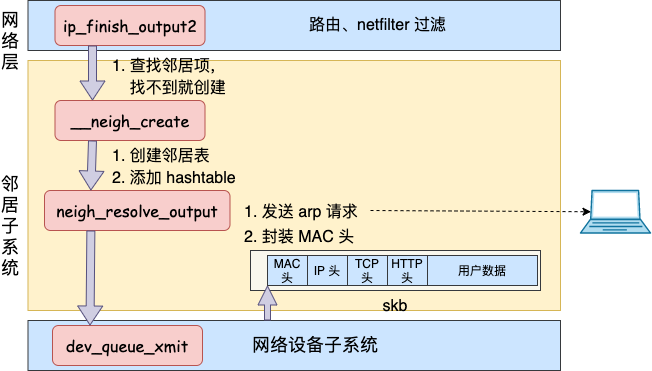

### 网络设备子系统
- 功能：
  - 管理数据包的发送和接收
  - 中断合并：多个数据包合并到一起才触发中断进行发送
- 通过dev_queue_xmit进入网络设备子系统
```
//file: net/core/dev.c 
int dev_queue_xmit(struct sk_buff *skb)
{
    //选择其中一个发送队列
    txq = netdev_pick_tx(dev, skb);

    //获取与此队列关联的排队规则
    q = rcu_dereference_bh(txq->qdisc);

    //如果有队列，则调用__dev_xmit_skb 继续处理数据
    if (q->enqueue) {
    rc = __dev_xmit_skb(skb, q, dev, txq);
    goto out;
    }

    //没有队列的是回环设备和隧道设备
    ......
}
```

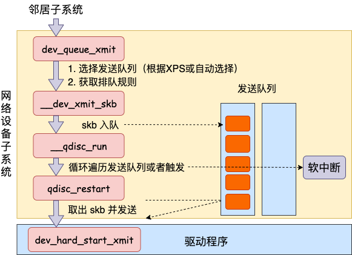

- 大部分设备都有队列（回环设备和隧道设备除外），现在进入__dev_xmit_skb
```
//file: net/core/dev.c
static inline int __dev_xmit_skb(struct sk_buff *skb, struct Qdisc *q,
     struct net_device *dev,
     struct netdev_queue *txq)
{
    //1.如果可以绕开排队系统
    if ((q->flags & TCQ_F_CAN_BYPASS) && !qdisc_qlen(q) &&
        qdisc_run_begin(q)) {
    ......
    }

    //2.正常排队
    else {

    //入队
    q->enqueue(skb, q)

    //开始发送
    __qdisc_run(q);
    }
}
```
- 对于第二种情况，只有quota用尽和其他进程需要CPU时才触发软中断进行发送
```cpp
//file: net/sched/sch_generic.c
void __qdisc_run(struct Qdisc *q)
{
    //控制处理网络包的数量
    int quota = weight_p;

    //循环从队列取出一个 skb 并发送
    while (qdisc_restart(q)) 
    {
    
        // 如果发生下面情况之一，则延后处理：
        // 1. quota 用尽
        // 2. 其他进程需要 CPU
        if (--quota <= 0 || need_resched()) 
        {
            //将触发一次 NET_TX_SOFTIRQ 类型 softirq
            __netif_schedule(q);
            break;
        }
    }
}
```

### 软中断调度
- 如果发送网络包的时候系统态CPU用尽了，会调用__netif_schedule触发软中断
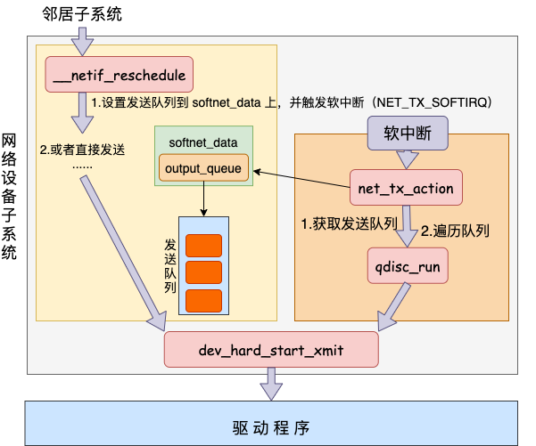

### igb网卡驱动发送
功能：
  - 将skb挂到RingBuffer上
  - 构造DMA内存映射
  - 触发数据真正发送
- 在驱动函数里，会将skb挂到RingBuffer上，驱动调用完毕，数据包将真正从网卡发送出去
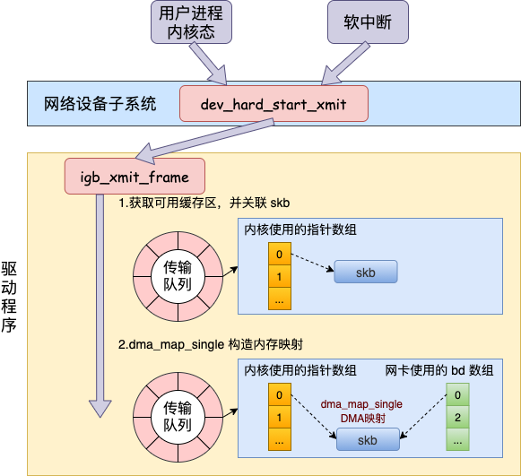
- 从dev_hard_start_smit开始
```
//file: net/core/dev.c
int dev_hard_start_xmit(struct sk_buff *skb, struct net_device *dev,
   struct netdev_queue *txq)
{
    //获取设备的回调函数集合 ops
    const struct net_device_ops *ops = dev->netdev_ops;

    //获取设备支持的功能列表
    features = netif_skb_features(skb);

    //调用驱动的 ops 里面的发送回调函数 ndo_start_xmit 将数据包传给网卡设备
    skb_len = skb->len;
    rc = ops->ndo_start_xmit(skb, dev);
}
```
- ndo_start_xmit在网卡驱动初始化时被赋值
- 网卡从发送队列的RingBuffer取下来一个元素，并将skb挂到元素上
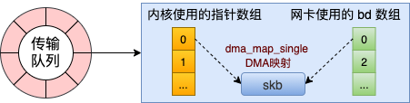
- igb_tx_map将skb数据映射到网卡可访问的内存DMA区域
- 触发真正的发送

## RingBuffer内存回收
- 数据发送完成后，需要清理内存（网卡设备会触发一个硬中断）
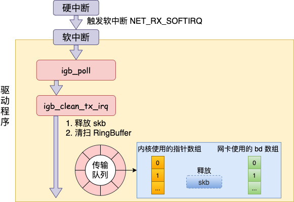
- 软中断回调函数igb_poll
- 释放skb
- 清楚tx_buffer
- 清除最后的DMA位置，解除映射
```
//file: drivers/net/ethernet/intel/igb/igb_main.c
static int igb_poll(struct napi_struct *napi, int budget)
{
    //performs the transmit completion operations
    if (q_vector->tx.ring)
        clean_complete = igb_clean_tx_irq(q_vector);
    ...
}
//file: drivers/net/ethernet/intel/igb/igb_main.c
static bool igb_clean_tx_irq(struct igb_q_vector *q_vector)
{
    //free the skb
    dev_kfree_skb_any(tx_buffer->skb);

    //clear tx_buffer data
    tx_buffer->skb = NULL;
    dma_unmap_len_set(tx_buffer, len, 0);

    // clear last DMA location and unmap remaining buffers */
    while (tx_desc != eop_desc) {
    }
}
```
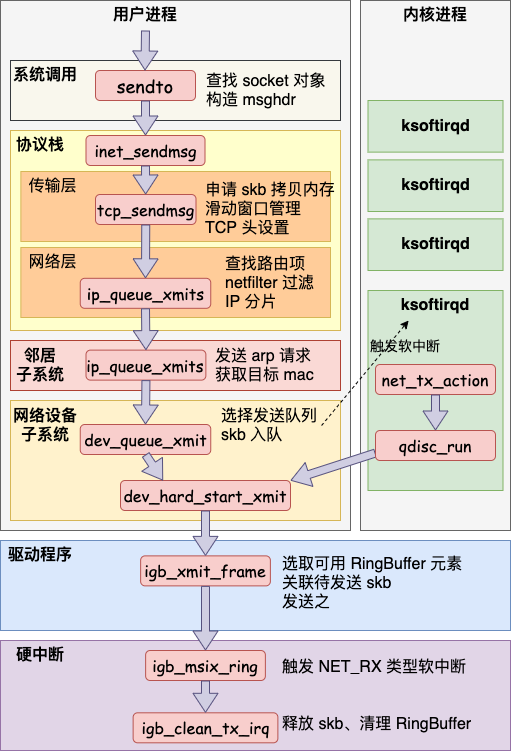

## 本章总结
- 发送网络数据时都涉及哪些内存拷贝操作？
1. 内核申请完skb后，会将用户buffer里的数据拷贝到skb
2. 传输层进入网络层时，会拷贝新的skb，用于重传（TCP）
3. 第三次拷贝不是必须的，当IP层发现skb大于MTU时才需要进行，申请额外的skb

所以，“零拷贝” 不可能是真正的零拷贝，第二次和第三次拷贝省不了

# 深度理解本机网络IO

## 跨机网络通信过程
### 跨机数据发送
- 数据发送流程
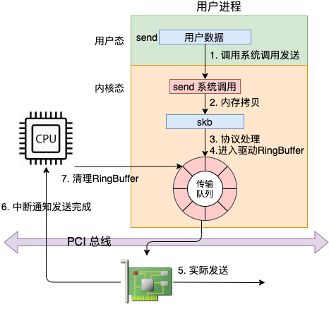
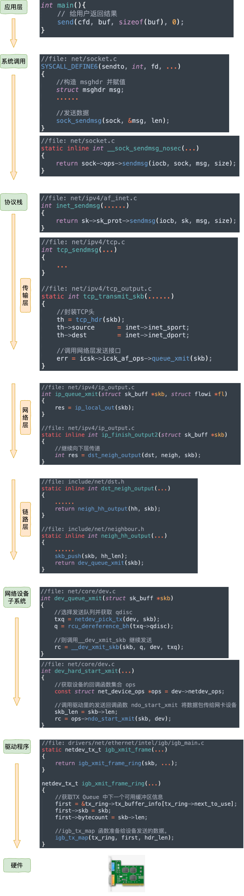

- 当网络发送完成后，会触发硬中断来触发CPU，用于释放RingBuffer中使用的内存
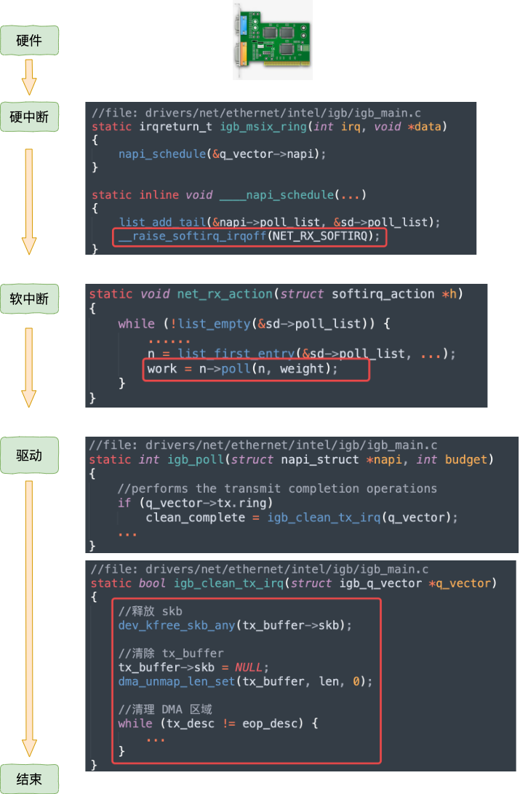

### 跨机数据接收
- 跨机数据接收过程
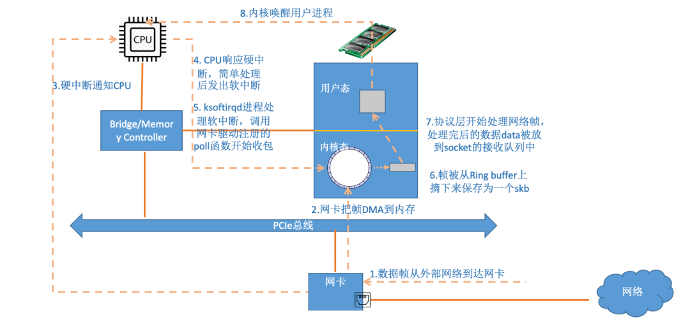
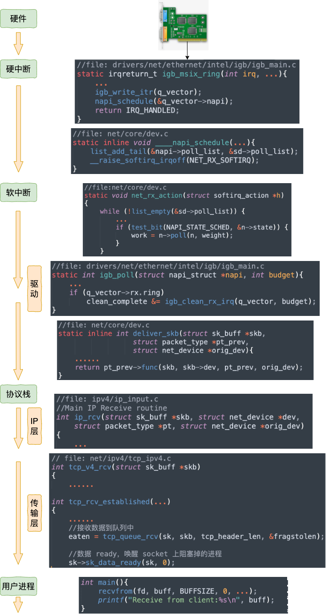

### 跨机网络通信汇总
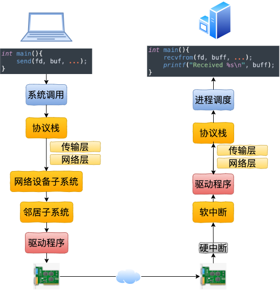

## 本机发送过程
### 网络层路由
- 对于本机网络IO来说，特殊之处在于local路由表中就能找到路由项，对应的设备都将使用loopback网卡
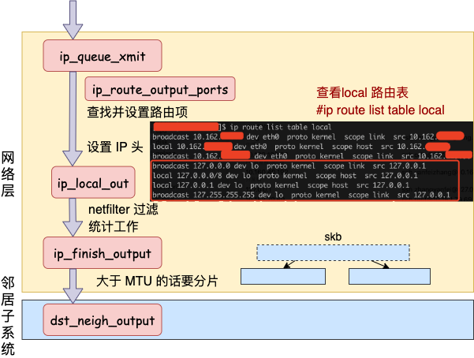
- 从ip_queue_xmit开始
```
//file: net/ipv4/ip_output.c
int ip_queue_xmit(struct sk_buff *skb, struct flowi *fl)
{
    //检查 socket 中是否有缓存的路由表
    rt = (struct rtable *)__sk_dst_check(sk, 0);
    if (rt == NULL) {
    //没有缓存则展开查找
    //则查找路由项， 并缓存到 socket 中
    rt = ip_route_output_ports(...);
    sk_setup_caps(sk, &rt->dst);
 }
```
- 查找路由表的函数依次调用ip_route_output_flow、__ip_route_output_key、fib_lookup函数
```cpp
//file:include/net/ip_fib.h
static inline int fib_lookup(struct net *net, const struct flowi4 *flp,
        struct fib_result *res)
{
    struct fib_table *table;

    //查找local路由表
    table = fib_get_table(net, RT_TABLE_LOCAL);
    if (!fib_table_lookup(table, flp, res, FIB_LOOKUP_NOREF))
    return 0;

    //查找main路由表
    table = fib_get_table(net, RT_TABLE_MAIN);
    if (!fib_table_lookup(table, flp, res, FIB_LOOKUP_NOREF))
    return 0;
    return -ENETUNREACH;
}
```
- 在local找到后，返回__ip_route_output_key函数
```
//file: net/ipv4/route.c
struct rtable *__ip_route_output_key(struct net *net, struct flowi4 *fl4)
{
    if (fib_lookup(net, fl4, &res)) {
    }
    if (res.type == RTN_LOCAL) {
    dev_out = net->loopback_dev;
    ...
    }

    rth = __mkroute_output(&res, fl4, orig_oif, dev_out, flags);
    return rth;
}
```
- 对于本机网络请求，设备全部使用net->loopback_dev，即虚拟网卡
- 接下来的调用和跨机网络一样，进入ip_finish_output，进入邻居子系统
- io虚拟网卡的MTU比Ethernet大很多，物理网卡一般为1500，io虚拟接口又65535
### 本机IP路由
- 本机IP和用127.0.0.1在性能上有差异吗？
都会查询到本机路由表，而且local路由表中所有的路由项都设置成了PIN_LOCAL，所以设置了这个的都会在__ip_route_output_key中走io虚拟网卡

### 网络设备子系统
- 跨机发送过程
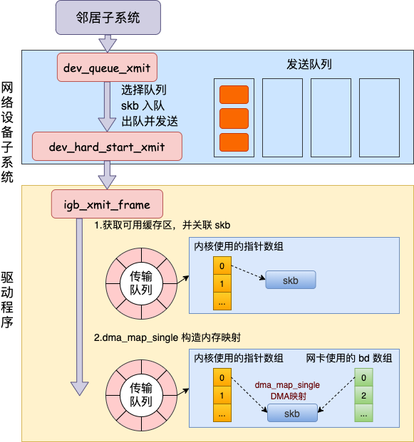

- 对于启动回环设备来说，没有队列的问题（q->enqueue），直接进入dev_hard_start_smit
- 接着进入回环设备的“驱动”力发送回调函数loopback_xmit，将skb发送出去
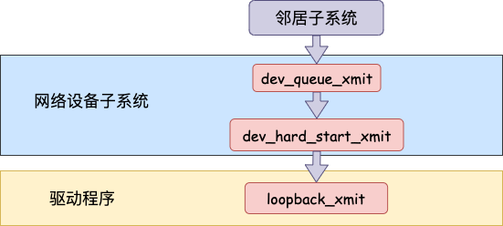
```
//file: net/core/dev.c
int dev_queue_xmit(struct sk_buff *skb)
{
    q = rcu_dereference_bh(txq->qdisc);
    if (q->enqueue) {//回环设备这里为 false
    rc = __dev_xmit_skb(skb, q, dev, txq);
    goto out;
    }

    //开始回环设备处理
    if (dev->flags & IFF_UP) {
    dev_hard_start_xmit(skb, dev, txq, ...);
    ...
    }
}

```
### “驱动”程序
- 回环设备的“驱动”程序的工作流程
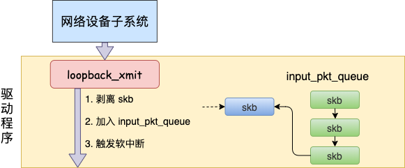
- input_pkt_queue通常用于本机通信中，用于放置数据包
- 调用**NAPI**的相关函数触发完软中断，发送过程算完成了
```cpp
//file:net/core/dev.c
static inline void ____napi_schedule(struct softnet_data *sd,
         struct napi_struct *napi)
{
    list_add_tail(&napi->poll_list, &sd->poll_list);
    __raise_softirq_irqoff(NET_RX_SOFTIRQ);
}
```

## 本机接收过程
- 在跨机的网络包接收过程中，需要经过硬中断才能触发软中断，在本机的网络IO过程中，不需要经过真正的网卡，所以网卡的发送过程、硬中断就省去了
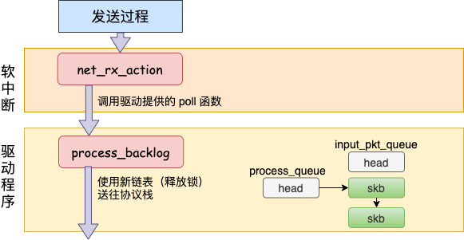
- loopback网卡的poll函数在初始化的时候设置成了process_backlog函数
- 函数将sd->input_pkt_queue里的skb链到sd->process_queue链表上去
- 然后再从sd->process_queue上取下包进行处理
```
static int process_backlog(struct napi_struct *napi, int quota)
{
    while(){
    while ((skb = __skb_dequeue(&sd->process_queue))) {
    __netif_receive_skb(skb);
    }

    //skb_queue_splice_tail_init()函数用于将链表a连接到链表b上，
    //形成一个新的链表b，并将原来a的头变成空链表。
    qlen = skb_queue_len(&sd->input_pkt_queue);
    if (qlen)
    skb_queue_splice_tail_init(&sd->input_pkt_queue,
            &sd->process_queue);
    
    }
}
```


## 本章总结
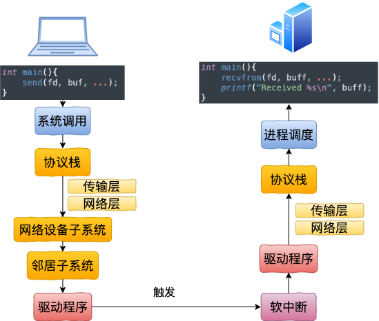
- 本机网络IO不需要进RingBuffer，直接把skb传给协议栈，但是再内核的其他组件上，一点也没少
- 访问本机服务时，所有本机IP都初始化到local路由表里，类型写死了PIN_LOCAL，所以都会选择IO虚拟设备。所以使用127.0.0.1和使用本机IP没有区别

# 深度理解TCP连接建立过程

## 深入理解listen
### listen系统调用
- listen系统调用源码
  - backlog为连接队列
  - net.core.somaxconn和用户传入的back_log比较取最小值
```cpp
//file: net/socket.c
SYSCALL_DEFINE2(listen, int, fd, int, backlog)
{
    //根据 fd 查找 socket 内核对象
    sock = sockfd_lookup_light(fd, &err, &fput_needed);
    if (sock) {
    //获取内核参数 net.core.somaxconn
    somaxconn = sock_net(sock->sk)->core.sysctl_somaxconn;
    if ((unsigned int)backlog > somaxconn)
    backlog = somaxconn;
    
    //调用协议栈注册的 listen 函数
    err = sock->ops->listen(sock, backlog);
    ......
}
```

### 协议栈listen
- sock->ops->listen指向inet_listen函数
- 可以看出，服务端的全连接队列长度是执行listen函数时传入的backlog和net.core.somaxconn之间较小的那个值
```
//file: net/ipv4/af_inet.c
int inet_listen(struct socket *sock, int backlog)
{
    //还不是 listen 状态（尚未 listen 过）
    if (old_state != TCP_LISTEN) {
    //开始监听
    err = inet_csk_listen_start(sk, backlog);
    }

    //设置全连接队列长度
    sk->sk_max_ack_backlog = backlog;
}
```
- inet_connection_listen_start函数
```
//file: net/ipv4/inet_connection_sock.c
int inet_csk_listen_start(struct sock *sk, const int nr_table_entries)
{
    struct inet_connection_sock *icsk = inet_csk(sk);

    //icsk->icsk_accept_queue 是接收队列，详情见 2.3 节 
    //接收队列内核对象的申请和初始化，详情见 2.4节 
    int rc = reqsk_queue_alloc(&icsk->icsk_accept_queue, nr_table_entries);
    ......
}
```
- tcp_sock结构
  - 所以TCP的sock对象随时可以强制转化为tcp_sock、inet_connection、inet_sock来使用，创建时用最大的tcp_sock创建的
```
struct tcp_sock {
    /* inet_connection_sock has to be the first member of tcp_sock */
    struct inet_connection_sock inet_conn;
    u16 tcp_header_len; /* Bytes of tcp header to send      */
    u16 xmit_size_goal_segs; /* Goal for segmenting output packets */
...
};

struct inet_connection_sock {
    /* inet_sock has to be the first member! */
    struct inet_sock      icsk_inet;
    struct request_sock_queue icsk_accept_queue;
    struct inet_bind_bucket   *icsk_bind_hash;
...
};

struct inet_sock {
    /* sk and pinet6 has to be the first two members of inet_sock */
    struct sock     sk;
#if IS_ENABLED(CONFIG_IPV6)
    struct ipv6_pinfo   *pinet6;
#endif
...
};

struct socket {
    socket_state        state;
...
    struct sock     *sk;
    const struct proto_ops  *ops;
};
```
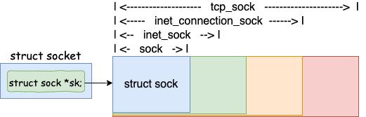


### 接收队列定义
- 接收队列
```
//file: include/net/inet_connection_sock.h
struct inet_connection_sock {
    /* inet_sock has to be the first member! */
    struct inet_sock   icsk_inet;
    struct request_sock_queue icsk_accept_queue;
    ......
}
//file: include/net/request_sock.h
struct request_sock_queue {
    //全连接队列
    struct request_sock *rskq_accept_head;
    struct request_sock *rskq_accept_tail;

    //半连接队列
    struct listen_sock *listen_opt;
    ......
};
//file: 
struct listen_sock {
    u8   max_qlen_log;
    u32   nr_table_entries;
    ......
    struct request_sock *syn_table[0];
};
```
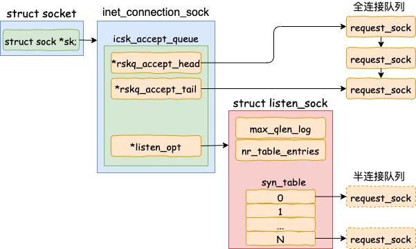
- 因为服务端要在第三次握手时快速查找出来第一次握手时留存的request_sock对象，所以用了一个哈希表来管理半连接队列

### 接收队列申请和初始化
- 半连接队列上每个元素分配的是一个指针大小，真正半连接用的request_sock对象是在握手过程中分配的，计算完哈希值后挂到这个哈希表上

### 半连接队列长度计算
- 半连接队列长度 = min(backlog, somaxconn, tcp_max_syn_backlog) + 1在上取到2的N的幂
- 所以遇到了半连接队列溢出的问题，要加大队列长度，需要同时考虑somaxconn、backlog、txp_max_syn_backlog三个内核参数
- 为了提升性能，内核记录的是队列长度的N次幂，而不是直接记录队列长度

### listen过程小结
- listen主要工作
  - 申请和初始化接收队列，包括全连接和半连接队列，其中全连接队列是一个链表，半连接队列是一个哈希表
  - 有了这两个队列才能进行三次握手

- 全连接队列长度
- 半连接队列长度

## 深入理解connect
- socket数据结构
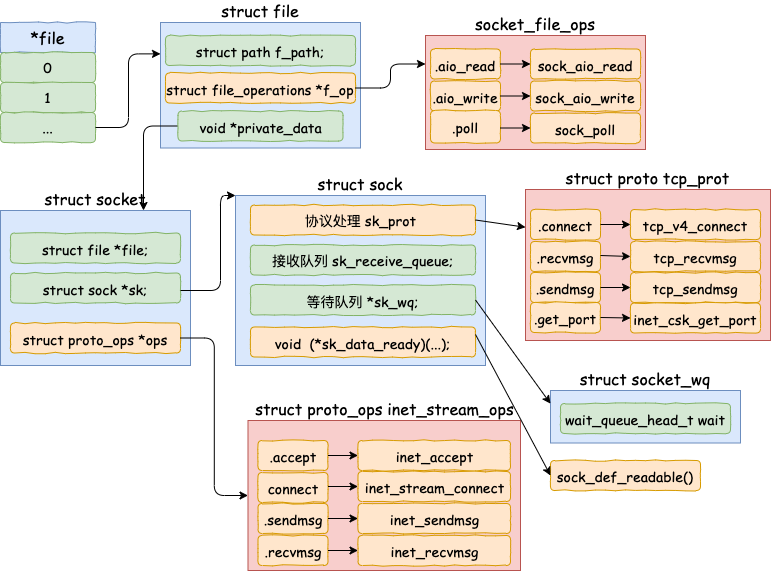

### connect调用链展开

### 选择可用端口
- 端口是如何被选出来的
  - inet_sk_port_offset(sk): 根据要连接的目的IP和端口等信息生成一个随机数
  - 检查是否和现有ESTABLISH状态的连接冲突（当前套接字是否已经建立了连接）
```cpp
//file:net/ipv4/inet_hashtables.c
int inet_hash_connect(struct inet_timewait_death_row *death_row,
        struct sock *sk)
{
    return __inet_hash_connect(death_row, sk,                  inet_sk_port_offset(sk),
    __inet_check_established, __inet_hash_nolisten);
}
```
- 进入__inet_hash_connect函数
  - 如果绑定过bind，那么会选择好设置在inet_num上
  - inet_get_local_port_range用于获取端口范围
```cpp
//file:net/ipv4/inet_hashtables.c
int __inet_hash_connect(...)
{
    //是否绑定过端口
    const unsigned short snum = inet_sk(sk)->inet_num;

    //获取本地端口配置
    inet_get_local_port_range(&low, &high);
    remaining = (high - low) + 1;

    if (!snum) {
    //遍历查找
    for (i = 1; i <= remaining; i++) {
    port = low + (i + offset) % remaining;
    ...
    }
    }
}
```
- 接下来进入for循环，其中offset是计算出来的随机数，故循环的作用就是把某个端口范围的可用端口都遍历一遍，直到找到可用的端口后停止
  - 首先判断是否是保留端口
  - 检查是否端口已经使用
```cpp
//file:net/ipv4/inet_hashtables.c
int __inet_hash_connect(...)
{
    for (i = 1; i <= remaining; i++) {
    port = low + (i + offset) % remaining;

    //查看是否是保留端口，是则跳过
    if (inet_is_reserved_local_port(port))
    continue;

    // 查找和遍历已经使用的端口的哈希链表
    head = &hinfo->bhash[inet_bhashfn(net, port,
        hinfo->bhash_size)];
    inet_bind_bucket_for_each(tb, &head->chain) {

    //如果端口已经被使用
    if (net_eq(ib_net(tb), net) &&
        tb->port == port) {

        //通过 check_established 继续检查是否可用
        if (!check_established(death_row, sk,
        port, &tw))
        goto ok;
    }
    }

    //未使用的话，直接 ok
    goto ok;
    }

    return -EADDRNOTAVAIL;
    ok: 
    ...  
}
```

### 端口被使用过怎么办
- 单独分析端口被使用的情况
  - 如果check_establiished返回0，该端口仍然可以用
```cpp
//file:net/ipv4/inet_hashtables.c
int __inet_hash_connect(...)
{
    for (i = 1; i <= remaining; i++) {
    port = low + (i + offset) % remaining;

    ...
    //如果端口已经被使用
    if (net_eq(ib_net(tb), net) &&
        tb->port == port) {
    //通过 check_established 继续检查是否可用
    if (!check_established(death_row, sk, port, &tw))
        goto ok;
    }
    }
}
```
- 两对四元组中只要任意一个元素不同，都算是两条不同的连接
  - 连接1：192.168.1.101 5000 192.168.1.101 8090
  - 连接2：192.168.1.101 5000 192.168.1.100 8091
- check_established作用就是检测现有的TCP连接是否四元组和要建立的连接四元组完全一致，如果不完全一致，那么该端口仍然可用（这里不是端口复用，端口复用针对的是服务端）
  - 所以一台客户端机最大能建立的连接数并不是65535
```
//file: net/ipv4/inet_hashtables.c
static int __inet_check_established(struct inet_timewait_death_row *death_row,
        struct sock *sk, __u16 lport,
        struct inet_timewait_sock **twp)
{
    //找到hash桶
    struct inet_ehash_bucket *head = inet_ehash_bucket(hinfo, hash);

    //遍历看看有没有四元组一样的，一样的话就报错
    sk_nulls_for_each(sk2, node, &head->chain) {
    if (sk2->sk_hash != hash)
    continue;
    if (likely(INET_MATCH(sk2, net, acookie,
            saddr, daddr, ports, dif)))
    goto not_unique;
    }

    unique:
    //要用了，记录，返回 0 （成功）
    return 0;
    not_unique:
    return -EADDRNOTAVAIL; 
}
```

### 发起syn请求
- 当已经获得了一个可用端口后，进入tcp_v4_connect
```cpp
//file: net/ipv4/tcp_ipv4.c
int tcp_v4_connect(struct sock *sk, struct sockaddr *uaddr, int addr_len)
{
    ......

    //动态选择一个端口
    err = inet_hash_connect(&tcp_death_row, sk);

    //函数用来根据 sk 中的信息，构建一个完成的 syn 报文，并将它发送出去。
    err = tcp_connect(sk);
}
```
- tcp_connect做了这么几件事
  1. 申请一个skb，并将其设置为SYN包
  2. 添加到发送队列上
  3. 调用tcp_transmit_skb将该包发出
  4. 启动一个重传定时器，超时会重传

```cpp
//file:net/ipv4/tcp_output.c
int tcp_connect(struct sock *sk)
{
    //申请并设置 skb
    buff = alloc_skb_fclone(MAX_TCP_HEADER + 15, sk->sk_allocation);
    tcp_init_nondata_skb(buff, tp->write_seq++, TCPHDR_SYN);

    //添加到发送队列 sk_write_queue 上
    tcp_connect_queue_skb(sk, buff);

    //实际发出 syn
    err = tp->fastopen_req ? tcp_send_syn_data(sk, buff) :
        tcp_transmit_skb(sk, buff, 1, sk->sk_allocation);

    //启动重传定时器
    inet_csk_reset_xmit_timer(sk, ICSK_TIME_RETRANS,
        inet_csk(sk)->icsk_rto, TCP_RTO_MAX);
}
```

### connect小结
- 客户端在执行connect函数的的时候
  - 把本地socket状态设置成了TCP_SYN_SENT
  - 选择可用端口
  - 发出SYN握手请求
  - 启动重传定时器
- 如果connect之前使用了bind，会使用bind时确定的端口

## 完整TCP连接建立过程
- 三次握手
```
//服务端核心代码
int main(int argc, char const *argv[])
{
    int fd = socket(AF_INET, SOCK_STREAM, 0);
    bind(fd, ...);
    listen(fd, 128);
    accept(fd, ...);
    ...
}
//客户端核心代码
int main(){
    fd = socket(AF_INET,SOCK_STREAM, 0);
    connect(fd, ...);
    ...
}

```
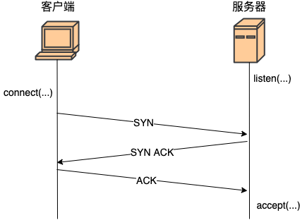

### 客户端connect
- 客户端会进入系统调用tcp_v4_connect
```
//file: net/ipv4/tcp_ipv4.c
int tcp_v4_connect(struct sock *sk, struct sockaddr *uaddr, int addr_len)
{
    //设置 socket 状态为 TCP_SYN_SENT
    tcp_set_state(sk, TCP_SYN_SENT);

    //动态选择一个端口
    err = inet_hash_connect(&tcp_death_row, sk);

    //函数用来根据 sk 中的信息，构建一个完成的 syn 报文，并将它发送出去。
    err = tcp_connect(sk);
}
```

### 服务端响应SYN
- tcp_v4_do_rcv处理握手过程
```cpp
//file: net/ipv4/tcp_ipv4.c
int tcp_v4_do_rcv(struct sock *sk, struct sk_buff *skb)
{
    ...
    //服务器收到第一步握手 SYN 或者第三步 ACK 都会走到这里
    if (sk->sk_state == TCP_LISTEN) {
        // 查看半连接队列
        struct sock *nsk = tcp_v4_hnd_req(sk, skb);
    }

    //根据不同的socket状态进行不同的处理
    if (tcp_rcv_state_process(sk, skb, tcp_hdr(skb), skb->len)) {
        rsk = sk;
        goto reset;
    }
}
```
- tcp_v4_hnd_req查看半连接队列
  - 第一次响应SYN时，半连接队列里什么都没有，直接返回
```cpp
//file:net/ipv4/tcp_ipv4.c
static struct sock *tcp_v4_hnd_req(struct sock *sk, struct sk_buff *skb)
{
    // 查找 listen socket 的半连接队列
    struct request_sock *req = inet_csk_search_req(sk, &prev, th->source,
            iph->saddr, iph->daddr);
    ...
    return sk;
}
```
- 根据不同的socket状态进行不同的处理
```cpp
//file:net/ipv4/tcp_input.c
int tcp_rcv_state_process(struct sock *sk, struct sk_buff *skb,
     const struct tcphdr *th, unsigned int len)
{
    switch (sk->sk_state) {
    //第一次握手
    case TCP_LISTEN:
    if (th->syn) { //判断是 SYN 握手包
        ...
        if (icsk->icsk_af_ops->conn_request(sk, skb) < 0)
        return 1;
    ......
}  
```
- 其中conn_request为函数指针，用于响应SYN的主要处理逻辑
  - 判断半连接队列是否满了
  - 如果满了判断是否开启了tcp_syncookies内核参数（用于防止TCP_SYN攻击，在服务器收到TCP_SYN包并返回TCP SYN+ACK包时，不单独分配一个数据区，而是根据SYN计算出一个cookie值，在收到Tcp ACK包时，Tcp服务器在根据那个cookie值检查这个Tcp ACK包的合法性）
  - 如果满了并且未开启，则该握手包直接放弃
  - 判断全连接队列是否满了，且young_ack数量大于1的化，那么直接丢弃（young_ack是半连接队列里的计数器，记录的是刚有SYN到达，没有被SYN_ACK重传定时器重传过的SYN_ACK，同时也没有完成过三次握手的sock数量）
```cpp
//file: net/ipv4/tcp_ipv4.c
int tcp_v4_conn_request(struct sock *sk, struct sk_buff *skb)
{
    //看看半连接队列是否满了
    if (inet_csk_reqsk_queue_is_full(sk) && !isn) {
        want_cookie = tcp_syn_flood_action(sk, skb, "TCP");
    if (!want_cookie)
        goto drop;
    }

    //在全连接队列满的情况下，如果有 young_ack，那么直接丢
    if (sk_acceptq_is_full(sk) && inet_csk_reqsk_queue_young(sk) > 1) {
        NET_INC_STATS_BH(sock_net(sk), LINUX_MIB_LISTENOVERFLOWS);
        goto drop;
    }
    ...
    //分配 request_sock 内核对象
    req = inet_reqsk_alloc(&tcp_request_sock_ops);

    //构造 syn+ack 包
    skb_synack = tcp_make_synack(sk, dst, req,
    fastopen_cookie_present(&valid_foc) ? &valid_foc : NULL);

    if (likely(!do_fastopen)) {
    //发送 syn + ack 响应
    err = ip_build_and_send_pkt(skb_synack, sk, ireq->loc_addr,
        ireq->rmt_addr, ireq->opt);

    //添加到半连接队列，并开启计时器
    inet_csk_reqsk_queue_hash_add(sk, req, TCP_TIMEOUT_INIT);
    }else ...
}
```
- 最后把握手信息添加到半连接队列，并开启计时器
- 如果在某个时间内没有收到客户端的第三次握手，服务端就会重传synack包

### 客户端响应SYNACK
- 客户端收到服务端发来的synack包的时候，也会进入tcp_rcv_state_process函数
```cpp
//file:net/ipv4/tcp_input.c
//除了 ESTABLISHED 和 TIME_WAIT，其他状态下的 TCP 处理都走这里
int tcp_rcv_state_process(struct sock *sk, struct sk_buff *skb,
     const struct tcphdr *th, unsigned int len)
{
    switch (sk->sk_state) {
        //服务器收到第一个ACK包
        case TCP_LISTEN:
        ...
        //客户端第二次握手处理 
        case TCP_SYN_SENT:
        //处理 synack 包
        queued = tcp_rcv_synsent_state_process(sk, skb, th, len);
        ...
    return 0;
}
```
- synack包主要处理逻辑
```cpp
//file:net/ipv4/tcp_input.c
static int tcp_rcv_synsent_state_process(struct sock *sk, struct sk_buff *skb,
      const struct tcphdr *th, unsigned int len)
{
    ...
    tcp_ack(sk, skb, FLAG_SLOWPATH);

    //连接建立完成 
    tcp_finish_connect(sk, skb);

    if (sk->sk_write_pending ||
        icsk->icsk_accept_queue.rskq_defer_accept ||
        icsk->icsk_ack.pingpong)
    //延迟确认...
    else {
        tcp_send_ack(sk);
    }
} 

//file: net/ipv4/tcp_input.c
static int tcp_clean_rtx_queue(struct sock *sk, int prior_fackets,
       u32 prior_snd_una)
{
    //删除发送队列
    ...

    //删除定时器
    tcp_rearm_rto(sk);
}

//file: net/ipv4/tcp_input.c
void tcp_finish_connect(struct sock *sk, struct sk_buff *skb)
{
    //修改 socket 状态
    tcp_set_state(sk, TCP_ESTABLISHED);

    //初始化拥塞控制
    tcp_init_congestion_control(sk);
    ...

    //保活计时器打开
    if (sock_flag(sk, SOCK_KEEPOPEN))
    inet_csk_reset_keepalive_timer(sk, keepalive_time_when(tp));
}
//file:net/ipv4/tcp_output.c
void tcp_send_ack(struct sock *sk)
{
    //申请和构造 ack 包
    buff = alloc_skb(MAX_TCP_HEADER, sk_gfp_atomic(sk, GFP_ATOMIC));
    ...

    //发送出去
    tcp_transmit_skb(sk, buff, 0, sk_gfp_atomic(sk, GFP_ATOMIC));
}
```
- 客户端响应来自服务端的synack时清除了connect时设置的重传定时器，把当前socket状态设置为ESTABLISHED，开启保活计时器（用于探测当前连接是否有效，长时间没收到数据，就发送探测报文）后发出第三次握手ack确认

### 服务端响应ACK
- 服务端响应第三次握手的ack时同样会进入tcp_v4_do_rcv
```
//file: net/ipv4/tcp_ipv4.c
int tcp_v4_do_rcv(struct sock *sk, struct sk_buff *skb)
{
    ...
    if (sk->sk_state == TCP_LISTEN) {
    struct sock *nsk = tcp_v4_hnd_req(sk, skb);
    }

    if (tcp_rcv_state_process(sk, skb, tcp_hdr(skb), skb->len)) {
        rsk = sk;
        goto reset;
    }
}
```
- 创建子socket
- 删除半连接队列：把连接请求从半连接队列删除
- 添加全连接队列：添加新创建的sock对象
- 设置连接为ESTABLISHED
- 服务端响应第三次握手ACK所做的工作是把当前半连接对象删除，创建了新的sock后加入全连接队列，最后将新连接状态设置为ESTABLISHED

### 服务端accept
- 就是从全连接队列的链表里获取一个头元素返回
```
//file: net/ipv4/inet_connection_sock.c
struct sock *inet_csk_accept(struct sock *sk, int flags, int *err)
{
    //从全连接队列中获取
    struct request_sock_queue *queue = &icsk->icsk_accept_queue;
    req = reqsk_queue_remove(queue);

    newsk = req->sk;
    return newsk;
}
```

### 连接建立过程总结

- 一条TCP连接消耗多少时间
  1. 内核消耗CPU进行接收、发送或者处理
  2. 网络传输
- 网络传输比双端CPU耗时高1000倍左右，所以一般只考虑网络延时

### 异常TCP连接建立情况
- connect系统调用耗时失控
  - 端口不充足，循环执行很多遍
  - 每次循环内部需要等待锁以及在哈希表中执行多次的搜索
  - 这里的锁是自旋锁
```cpp
//file:net/ipv4/inet_hashtables.c
int __inet_hash_connect(...)
{
    inet_get_local_port_range(&low, &high);
    remaining = (high - low) + 1;

    for (i = 1; i <= remaining; i++) {
    // 其中 offset 是一个随机数
    port = low + (i + offset) % remaining;
    head = &hinfo->bhash[inet_bhashfn(net, port,
        hinfo->bhash_size)];

    //加锁
    spin_lock(&head->lock); 


    //一大段的选择端口逻辑
    //......
    //选择成功就 goto ok
    //不成功就 goto next_port

    next_port:
    //解锁
    spin_unlock(&head->lock); 
    }
}
```
- 正常和异常情况
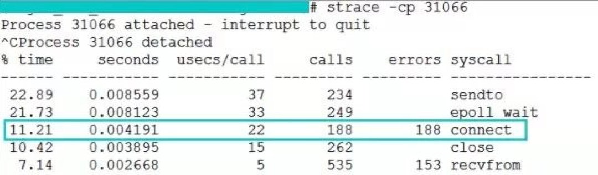
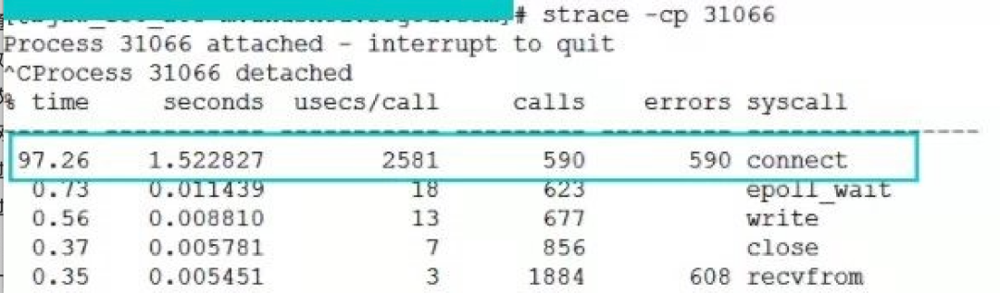
- 解决办法：
  1. 修改内核参数多预留端口号
  2. 改用长连接
  3. 尽快回收TIME_WAIT

### 第一次握手丢包
- 半连接队列满
  - 通过设置tcp_syncookies解决
- 全连接队列满
  - 在全连接队列满，且同时有young_ack的情况下，那么内核同样会丢掉该SYN握手包
```
//file: net/ipv4/tcp_ipv4.c
int tcp_v4_conn_request(struct sock *sk, struct sk_buff *skb)
{
    //看看半连接队列是否满了
    ...

    //看看全连接队列是否满了
    if (sk_acceptq_is_full(sk) && inet_csk_reqsk_queue_young(sk) > 1) {
    NET_INC_STATS_BH(sock_net(sk), LINUX_MIB_LISTENOVERFLOWS);
    goto drop;
    }
    ...
    drop:
    NET_INC_STATS_BH(sock_net(sk), LINUX_MIB_LISTENDROPS);
    return 0; 
}
```
- 客户端发起重试：客户端如果长时间没有收到synack，就会超时重传，但重传计时器是以秒来计算的，所以对接口耗时影响非常大
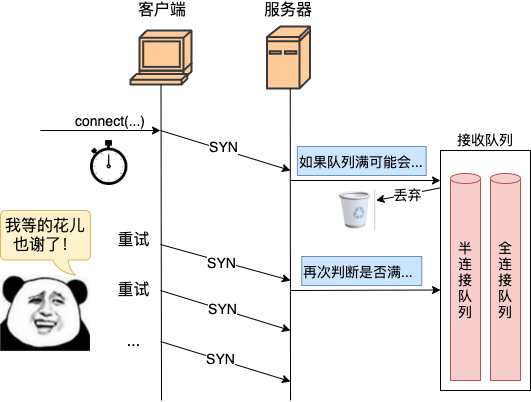
```
//file:net/ipv4/tcp_output.c
int tcp_connect(struct sock *sk)
{
    ...
    //实际发出 syn
    err = tp->fastopen_req ? tcp_send_syn_data(sk, buff) :
        tcp_transmit_skb(sk, buff, 1, sk->sk_allocation);

    //启动重传定时器
    inet_csk_reset_xmit_timer(sk, ICSK_TIME_RETRANS,
        inet_csk(sk)->icsk_rto, TCP_RTO_MAX);
}
```

### 第三次握手丢包
- 服务器全队列满了，来自客户端的ack握手包将被丢弃
  - 不过第三次握手失败并不是客户端重试，而是由服务端来重发synack

### 握手异常总结
- 如果端口不充足，会导致CPU开销上升
  - 通过调整ip_local_port_range来尽量加大端口范围
  - 尽量复用连接
- 服务端在第一次握手时丢包
  - 半连接队列满，且tcp_syncookies为0
  - 全连接队列满，且由未完成的半连接请求
- 服务端在第三次握手时
- 解决办法:
  1. 打开syncookie
  2. 加大连接队列长度
  3. 尽快调用accept
  4. 尽早拒绝：直接报错，不要让客户端超时等待
  5. 尽量减少TCP连接的次数：用长连接代替短连接

## 如何查看是否有连接队列溢出发生

### 全连接队列溢出判断
#### 全连接溢出丢包
- 全连接队列溢出都会记录到ListenOverflows这个MIB，对应SNMP统计信息的ListenDrops这一项
#### netstat工具源码
- 在执行netstat -s的时候，会读取SNMP统计信息

#### 半连接队列溢出判断
- 对应ListenDrops统计项

### 小结
- 对于全连接队列，使用netstat -s可以判断是否有丢包发生
- 对于半连接队列，只要保证tcp_syncookies这个内核参数是1就能保证不会有因为半连接队列满而丢包

## 本章总结
- listen作用
  1. 创建了半连接、全连接队列
- Cannot assign requested address报错？
  - 没找到可用端口
- 一个客户端端口可以同时用在两条连接上吗？
  - 查看四元组是否完全一致
- 服务端半/全连接队列满了会怎么样？
- 新连接的socket内核对象是什么时候建立的？
  - 实际为struct sock，在第三次握手完毕时创建的
  - 在用户进程调用accept的时候，直接把该对象取出来，在包装成一个sock返回
- 建立一条TCP连接需要消耗多长时间？
  - 约等于一个RTT，但是如果出现了丢包，无论哪种原因，最少都要s级了
- 把服务器部署在北京，给纽约的用户访问可行吗
  - 计算下来延迟一般都要200ms

# 一条TCP连接消耗多大的内存
## Linux内核如何管理内存
- 内核使用了一种叫SLAB/SLUB的内存管理机制，这种管理机制通过四个步骤把物理内存条管理起来，供内核申请和分配内核对象
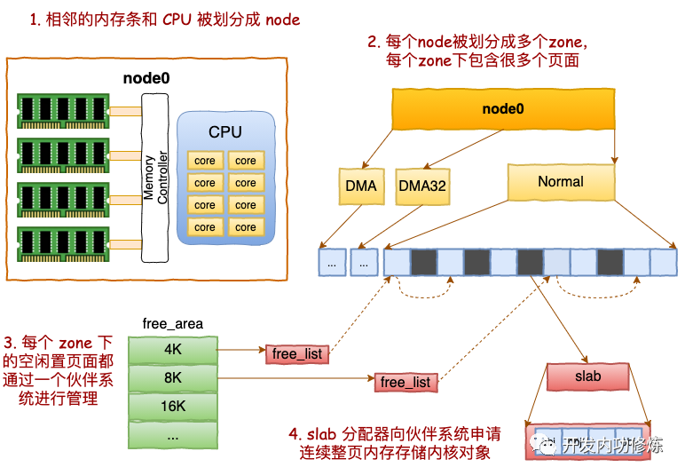
### node划分
- 现代的服务器上，内存和CPU都是所谓的NUMA架构
- 每一个CPU以及和它直连的内存条组成了node
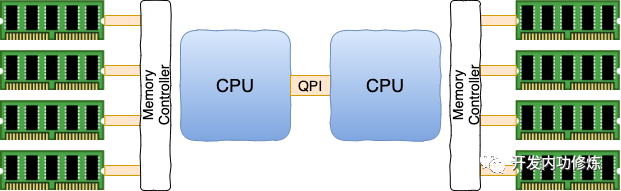

### zone划分
- 每个node又会划分成若干的zone
  - ZONE_DMA：地址最低的一块内存区域，供IO设备DMA访问
  - ZONE_DMA32：该zone用于支持32位地址总线的DMA设备，只在64位系统里有效
  - ZONE_NORMAL：在x86-64架构下，上面两种之外的内存全在NORMAL的zone里管理
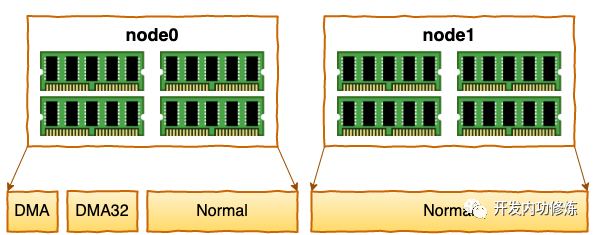

### 基于伙伴系统管理空闲页面
- 伙伴系统
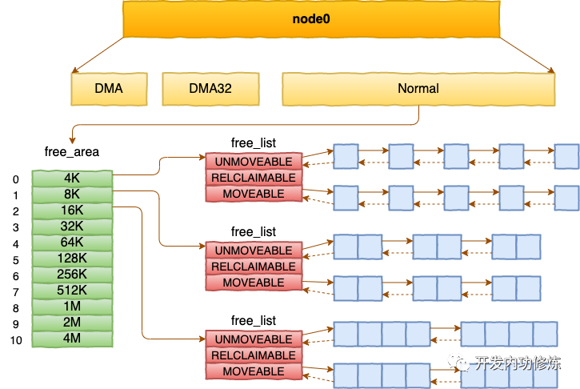
- 申请8kb例子
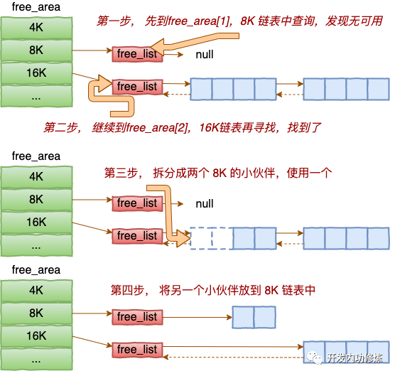

### slab分配器
- 在伙伴系统之上，**内核**又一个专用的内存分配器，叫slab或slub
- 这种分配器最大的特点是只分配特定大小、甚至是特定的对象。这样当一个对象释放后，另一个同类的对象可以直接使用这块内存，极大的降低了碎片发生的概率
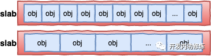
- slab相关的内核对象定义：
```
//file: include/linux/slab_def.h
struct kmem_cache {
    struct kmem_cache_node **node
    ......
}

//file: mm/slab.h
struct kmem_cache_node {
    struct list_head slabs_partial; 
    struct list_head slabs_full;
    struct list_head slabs_free;
    ......
}
```
- 每个slab_cache都有满、半满、空三个链表，每个链表节点都对应一个slab，一个slab又一个或者多个内存页组成，每一个slab内都保存的是同等大小的对象
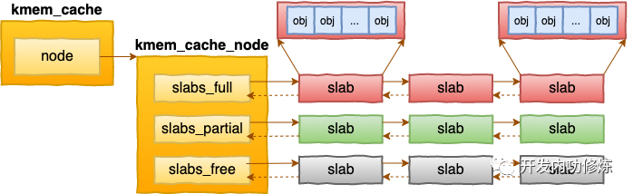
- 当cache中内存不够时，会调用基于伙伴系统的分配器请求整页连续内存的分配
- 内核中会有很多个kmen_cache存在，他们都是在Linux初始化或者是运行的过程中分配出来的，有的是专用的，用的是通用的

### 小结
- 内核怎么使用内存
  - 前三步是基础模块，为应用程序分配内存时也能用到
  - 第四步仅用于内存
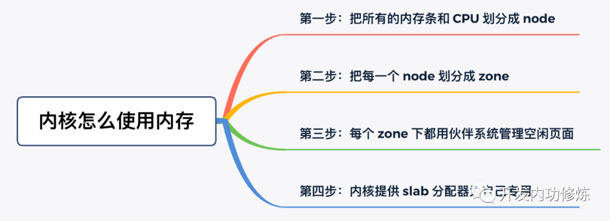

## TCP连接相关内核对象
- socket的创建方式有两种，一种是直接调用socket函数，另外一种是调用accept接收

### socket函数直接创建
- socket函数会进入__sock_create内核函数
```
int __sock_create(...)
{
    //申请struct socket内核对象
    sock = sock_alloc();
    //调用协议族的创建函数sock
    err = pf -> create(net, sock, protocol, kern);
    ......
}
```
#### sock_inode_cache申请
- 在sock_alloc函数中，申请了一个struct socket_alloc内核对象，将socket和inode信息关联了起来

#### TCP对象申请
#### file对象申请
- 在Linxu中，一切皆文件，真是通过和struct file对象关联起来让socket看起来也是一个文件

### 服务端socket创建

## 实测TCP内核对象开销
1. 一条ESTABLISH状态的空连接消耗的内存大约是3KB多一点
2. 对于非ESTABLISH状态下的连接，内核会回收不需要的内核对象
3. 一条TIME_WAIT状态的连接需要的内存也就是0.4KB左右

# 一条机器最多能支持多少条TCP连接
## 理解Linux最大文件描述符限制
- 限制打开文件数的内核参数有三个：fs.nr_open、nofile、fs.file-max
### 找到源码入口
- socket系统调用
```
SYSCALL_DEFINE3(...)
{
    retval = sock_map_fd(sock, ......)
    ......
}
```
- socket调用sock_map_fd来创建相关内核对象
```
static int sock_map_fd(struct socket *sock, int flags)
{
    struct file *newfile;

    //获取可用fd句柄号
    //判断打开文件描述符是否超过soft nofile 和 fs.nr_open
    int fd = get_unused_fd_flags(flags);
    if (unlikely(fd < 0))
    {
        return fd;
    }

    //创建sock_alloc_file对象
    //判断打开文件数是否超过fs.file-max
    newfile = sock_alloc_file(sock, flags, NULL);
    if (likely(!IS_ERR(newfile)))
    {
        fd_install(fd, newfile);
        return fd;
    }

    put_unused_fd(fd);
    return PTR_ERR(newfile);
}
```
- 总结：
  - get_unused_fd_flags：申请fd，找一个可用的下标
  - sock_alloc_file：申请真正的file内核对象
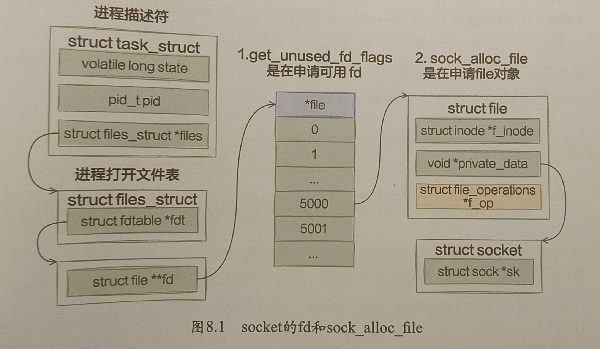

### 寻找进程级限制nofile和fs.nr_open
- get_unused_fd_flags中判断了nofile和fs.nr_open
- 进程打开文件数超过这两个，就会报错
- 内核代码中先判断soft nofile，在判断fs.nr_open
- fs.nr_open 是系统全局的，soft nofile则可以分用户控制

### 寻找系统级限制fs.file-max
- 在sock_alloc_file中判断打开文件数是否超过fs.file-max
```
struct file *get_empty_filp(void)
{
    if (get_nr_files() >= files_stat.max_files &&
     !capable(CAP_SYS_ADMIN))//这里root用户不受影响
     {

     }
}
```
- !capable(CAP_SYS_ADMIN)表示不限制非root用户。所以当文件打开过多无法使用ps、kill等命令，可以直接使用root账号

### 小结
- Linux上能打开多少文件，有两种限制：
  1. 进程级别的两个参数
  2. 系统级别的限制，但不限制root用户

## 一台服务端机器可以最多可以支撑多少条TCP连接
相关：
1. 四元组：如果目的ip和端口号固定，也可以达到$2^{32}*2^{16}$
2. 描述符限制：每维持一条TCP连接，就要创建一个文件对象
3. 内存限制：一条空TCP消耗3.3KB左右（4GB内存可以维持约100万条），但是接收数据的话，又会开缓冲区，增加内存开销
4. CPU限制：业务逻辑复杂，消耗CPU资源

## 一台客户端机器最多只能65535条连接吗
- 可以增加IP以增加连接数
### 端口复用增加连接数
- 同一个客户端使用同一个端口连接不同的服务器或者连接同一个服务器的不同端口

- 是怎么做到区分数据该发到哪条连接上的？
  - socket中的主要数据结构：
  ```cpp
  // file: include/net/sock.h
  struct sock_common {
      union {
      __addrpair skc_addrpair; //TCP连接IP对
      struct {
      __be32 skc_daddr;
      __be32 skc_rcv_saddr;
      };
      }; 
      union {
      __portpair skc_portpair; //TCP连接端口对
      struct {
      __be16 skc_dport;
      __u16 skc_num;
      };
      };
      ......
  }

  ```
  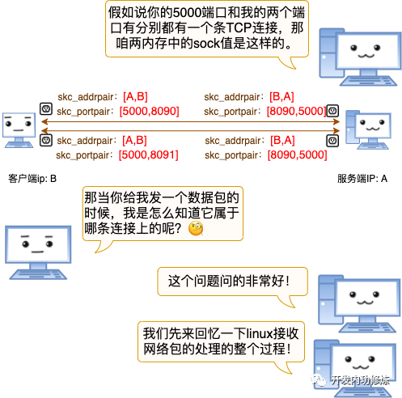

  - 在网络包到达网卡后，依次经历DMA、硬中断、软中断等处理，最后被送到socket接收队列中，对于TCP协议来说：
    ```
    // file: net/ipv4/tcp_ipv4.c
    int tcp_v4_rcv(struct sk_buff *skb)
    {
        ......
        th = tcp_hdr(skb); //获取tcp header
        iph = ip_hdr(skb); //获取ip header

        //寻找连接
        sk = __inet_lookup_skb(&tcp_hashinfo, skb, th->source, th->dest);
        ......
    }
    // file: include/net/inet_hashtables.h
    static inline struct sock *__inet_lookup(struct net *net,
        struct inet_hashinfo *hashinfo,
        const __be32 saddr, const __be16 sport,
        const __be32 daddr, const __be16 dport,
        const int dif)
    {
        u16 hnum = ntohs(dport);
        struct sock *sk = __inet_lookup_established(net, hashinfo,
            saddr, sport, daddr, hnum, dif);

        return sk ? : __inet_lookup_listener(net, hashinfo, saddr, sport,
                daddr, hnum, dif);
    }
    struct sock *__inet_lookup_established(struct net *net,
      struct inet_hashinfo *hashinfo,
      const __be32 saddr, const __be16 sport,
      const __be32 daddr, const u16 hnum,
      const int dif)
    {
        //将源端口、目的端口拼成一个32位int整数
        const __portpair ports = INET_COMBINED_PORTS(sport, hnum); 
        ......

        //内核用hash的方法加速socket的查找
        unsigned int hash = inet_ehashfn(net, daddr, hnum, saddr, sport); 
        unsigned int slot = hash & hashinfo->ehash_mask;
        struct inet_ehash_bucket *head = &hashinfo->ehash[slot];

        begin:
        //遍历链表，逐个对比直到找到
        sk_nulls_for_each_rcu(sk, node, &head->chain) {
        if (sk->sk_hash != hash)
        continue;
        if (likely(INET_MATCH(sk, net, acookie,
                saddr, daddr, ports, dif))) {
        if (unlikely(!atomic_inc_not_zero(&sk->sk_refcnt)))
            goto begintw;
        if (unlikely(!INET_MATCH(sk, net, acookie,
            saddr, daddr, ports, dif))) {
            sock_put(sk);
            goto begin;
        }
        goto out;
        }
        }
    }

    ```
    - 内核使用哈希+链表的方式管理所维护的socket
    - 将tcp header中的_saddr、daddr、__ports和Linux中的socket进行对比，找到对应fd

- 增加TCP并发能力：
  1. 为客户端配置多个IP
  2. 连接不同的服务端，开启端口复用

## 本章总结
- 支持1亿用户，需要多少台机器？
如果内存为128G，那么一台服务器可以考虑用来支持500万条并发，消耗20GB左右的内存来保存socket，剩下的用于开缓冲区。所以，一亿用户需要20台机器左右

# 网络优化性能建议
## 网络请求优化

### 尽量减少不必要的网络IO
例子：在自己开发的接口里请求几个第三方服务，这些服务提供了一个SDK。为了省事直接在本机上把这些SDK部署上来，通过本机网络IO调用这些SDK。而不使用这种方式可以将CPU整体核数消减20%以上

### 尽量合并网络请求
- 尽量经过一次网络IO就能得到想要的数据

### 调用者和被调用者机器尽可能部署的近一点
- 减少网络延迟

### 内网调用不要用外网域名
1. 外网接口慢
2. 带宽成本高：内网通信不涉及通信费用’
3. NAT单点瓶颈：一般一个公司，NAT就可能只有几台，容易成为瓶颈

## 接收过程优化
### 调整网卡RingBuffer大小
- 增大RingBuffer，解决丢包问题
- 但是会增加处理网络包的延时，因为排队的包太多

### 多队列网卡RSS调优
- 每一个队列有自己的中断号，由于CPU的亲和性，每一个中断号由一个CPU来处理。
- 在网卡支持多队列的服务器上，想提高内核的收包能力，就可以增大队列数

### 硬中断合并

### 软中断budget调整
- 设定ksoftirqd一次最多处理多少个包让出CPU，如果想提高内核处理包的效率，可以提高
```
net.core.netdev_budget = 300
```

### 接收处理合并
- 攒一堆数据包后再通知CPU，不过数据包依然是分开的
- LRO/GRO 将数据包合并再往上层传输
- LRO和GRO合并包的位置不同，LRO是再网卡上就把合并做了，必须要网卡硬件支持；GRO是在内核源码中用软件的方式实现的

## 发送过程优化
- 控制数据包的大小
  - 分片越多，丢包风险越大

- 减少内存拷贝
  - 使用mmap和sendfile
  - mmap：还是会涉及到两次内核态和用户态的上下文切换

- 推迟分片
  - 使用TSO和GSO

- 多队列网卡XPS调优
- 使用eBPF绕开协议栈的网络IO

## 内核与进程协作优化
- 进行少使用recvfrom等进程阻塞的方式
  - 每个进程只能同时等待一条连接
  - 进程之间互相切换的时候要消耗很多的CPU周期，一次切换大约是3-5us
  - 频繁的切换导致L1、L2、L3等高速缓存的效果大大折扣

- 使用成熟的网络库
- 使用Kernel-ByPass新技术
  - 可以绕开内核协议栈，在用户态实现网络包的接收

## 握手挥手过程优化
- 配置充足的端口范围
- 客户端最好不要用bind
- 小心连接队列溢出
- 减少握手重试：超时重传的时间是翻倍增加的
- 打开TFO：第三次握手ack包可以携带要发送的数据给服务器的数据，可以节约一个RTT的时间开销
```bash
# vi /etc/sysctl.conf
net.ipv4.tcp_fastopen = 3
```

- 保持充足的文件描述符上限
- 请求频繁，将短连接改用长连接
- TIME_WAIT的优化
  - 使用端口复用
  - 限制TIME_WAIT状态的连接的最大数量

# 容器网络虚拟化
- 这一章笔记写的比较简单，具体见P273
## veth设备对
- 使用软件来模拟网线连接传输

### veth如何使用
- 在linux下，可以使用ip命令创建一对veth，其中link表示link layer，即链路层
```bash
# ip link add veth0 type veth peer name veth1
```
- 使用ip link show进行查看
```bash
# ip link add veth0 type veth peer name veth1
# ip link show
1: lo: <LOOPBACK,UP,LOWER_UP> mtu 65536 qdisc noqueue state UNKNOWN mode DEFAULT
    link/loopback 00:00:00:00:00:00 brd 00:00:00:00:00:00
2: eth0: <BROADCAST,MULTICAST,UP,LOWER_UP> mtu 1500 qdisc mq state UP mode DEFAULT qlen 1000
    link/ether 6c:0b:84:d5:88:d1 brd ff:ff:ff:ff:ff:ff
3: eth1: <BROADCAST,MULTICAST> mtu 1500 qdisc noop state DOWN mode DEFAULT qlen 1000
    link/ether 6c:0b:84:d5:88:d2 brd ff:ff:ff:ff:ff:ff
4: veth1@veth0: <BROADCAST,MULTICAST,M-DOWN> mtu 1500 qdisc noop state DOWN mode DEFAULT qlen 1000
    link/ether 4e:ac:33:e5:eb:16 brd ff:ff:ff:ff:ff:ff
5: veth0@veth1: <BROADCAST,MULTICAST,M-DOWN> mtu 1500 qdisc noop state DOWN mode DEFAULT qlen 1000
    link/ether 2a:6d:65:74:30:fb brd ff:ff:ff:ff:ff:ff
```

- 为其配置ip
```bash
# ip addr add 192.168.1.1/24 dev veth0
# ip addr add 192.168.1.2/24 dev veth1
```
- 启动这两个设备
```bash
# ip link set veth0 up
# ip link set veth1 up
```
- 使用ifconfig查看
```bash
# ifconfig
eth0: ......
lo: ......
veth0: flags=4163<UP,BROADCAST,RUNNING,MULTICAST>  mtu 1500
        inet 192.168.1.1  netmask 255.255.255.0  broadcast 0.0.0.0
        ......
veth1: flags=4163<UP,BROADCAST,RUNNING,MULTICAST>  mtu 1500
        inet 192.168.1.2  netmask 255.255.255.0  broadcast 0.0.0.0
        ......
```
- 现在，一对虚拟设备就建立起来了
- 之后需要进行一些准备工作才能通信：关闭反向过滤rp_filter、打开accept_local等（P275）
  
### veth底层创建过程（P276）
### veth网络通信过程
- 基于veth的网络IO过程和图本机网络通信过程完全一样，只是使用的驱动程序不一样
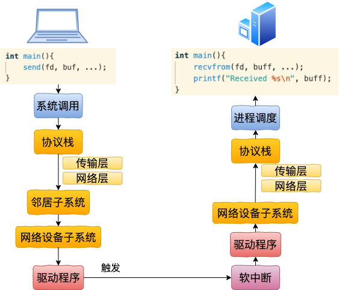
- 回环设备调用高的发送函数是loopback_xmit
- veth发送过程使用的发送函数是veth_xmit
```
//file: drivers/net/veth.c
static netdev_tx_t veth_xmit(struct sk_buff *skb, struct net_device *dev)
{
    struct veth_priv *priv = netdev_priv(dev);
    struct net_device *rcv;

    //获取 veth 设备的对端
    rcv = rcu_dereference(priv->peer);

    //调用 dev_forward_skb 向对端发包
    if (likely(dev_forward_skb(rcv, skb) == NET_RX_SUCCESS)) {
    }
    ......
```

### 小结
- veth和IO设备非常像，和本机网络通信的的过程一致，只是发送函数不同

## 网络命名空间
- 在Linux上实现隔离的技术手段是命名空间
- 可以为不同的命名空间在逻辑上提供独立的网络协议栈
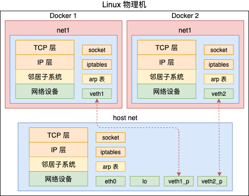

### 如何使用网络命名空间
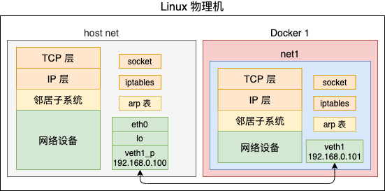

### 结论
- Linux的网络命名空间实现了多个独立的协议栈，这个说法不够准确，内核网络代码只有一套，并没有隔离。只是为不同的空间创建不同的struct net对象，每个net都有自己独立的路由表、iptables等数据结构
- 每个设备、每个socket上也都有指明自己属于哪个网络命名空间
- 从逻辑上看起来真的有多个协议栈一样

## 虚拟交换机Bridge
- Linux中的veth是一对能互相连接、互相通信的虚拟网卡，通过使用可以让Docker容器和母机通信，或者两个Docker容器中进行交流
- 在物理机中，是通过交换机连载一起；在网络虚拟化环境里，实现这种交换机的技术叫做Bridge

### 小结
- 所谓网络虚拟化，就是用软件来模拟实现真实的物理网络连接
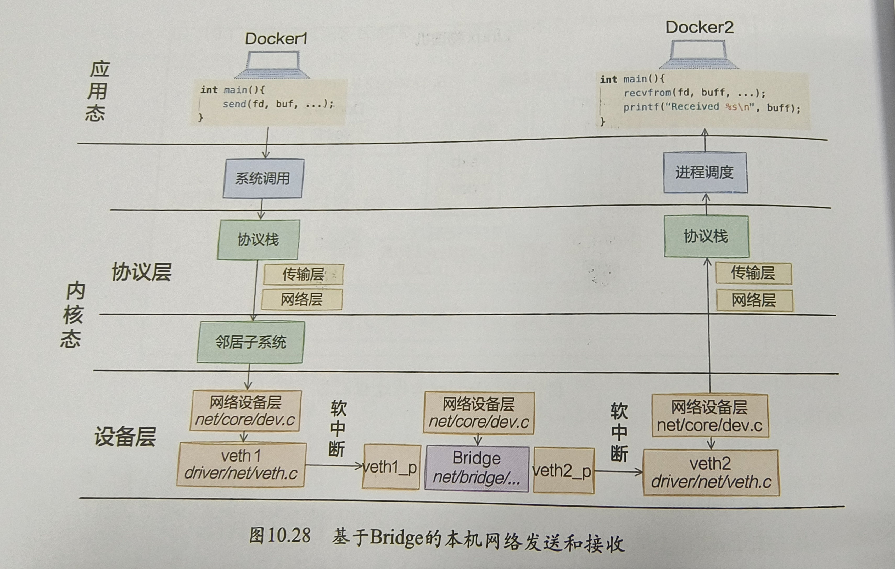

## 外部网络通信
### iptables 与 NAT
- iptables是一个非常常用的干预内核行为的工具，他在内核中埋下了五个钩子函数，称为五链
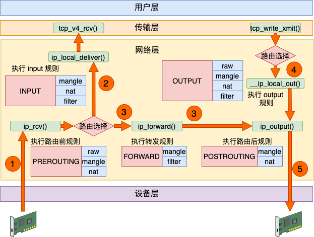


