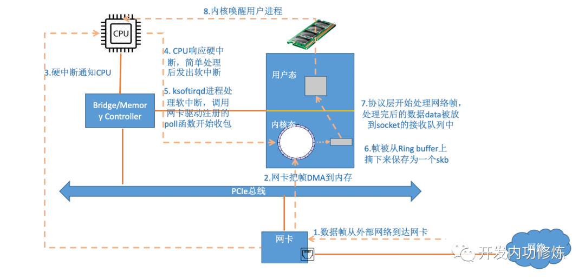
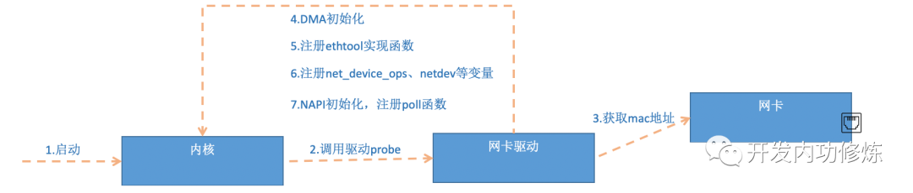

# 内核是如何接受网络包的

- ksoftirqd内核线程：用于执行软中断
- 

## 数据是如何从网卡到协议栈的
- 内核接受包路径


## Linux启动
- 在接受网卡数据包之前，需要做好准备工作
  1. 创建ksoftirqd内核线程
     - 通过执行spawn_ksoftirqd（位于kernel/softirq.c）来创建出softirqd线程
     - 当ksoftirqd被创建出来后，会进入自己的线程循环函数ksoftirqd_should_run和run_ksoftirqd
     - 判断有无软中断需要处理，不仅有网络软中断，还有其他软中断

      ```
      //file: kernel/softirq.c

      static struct smp_hotplug_thread softirq_threads = {

          .store          = &ksoftirqd,
          .thread_should_run  = ksoftirqd_should_run,
          .thread_fn      = run_ksoftirqd,
          .thread_comm        = "ksoftirqd/%u",
      };
      static __init int spawn_ksoftirqd(void)
      {
          register_cpu_notifier(&cpu_nfb);

          //创建线程
          BUG_ON(smpboot_register_percpu_thread(&softirq_threads));
          return 0;
      }

      early_initcall(spawn_ksoftirqd);
      ```
  
  2. 网络子系统初始化
     - 为每个CPU初始化softnet_data，也会为PX_SOFTIRQ和TX_SOFTIRQ注册处理函数
     - Linux内核通过subsys_initcall来初始化各个子系统，这里使用net_dev_init函数进行网络子系统初始化
    ```
    //file: net/core/dev.c

    static int __init net_dev_init(void)
    {
        ......

        for_each_possible_cpu(i) {
            struct softnet_data *sd = &per_cpu(softnet_data, i);

            memset(sd, 0, sizeof(*sd));
            skb_queue_head_init(&sd->input_pkt_queue);
            skb_queue_head_init(&sd->process_queue);
            sd->completion_queue = NULL;
            INIT_LIST_HEAD(&sd->poll_list);
            ......
        }
        ......
        //为每个软中断注册处理函数
        open_softirq(NET_TX_SOFTIRQ, net_tx_action);
        open_softirq(NET_RX_SOFTIRQ, net_rx_action);

    }
    //初始化网络子系统
    subsys_initcall(net_dev_init);
    ```
     - 会为每个CPU都申请一个softnet_data数据结构，这个数据结构中的poll_list用于等待驱动程序将其poll函数注册进来 
  

  3. 协议栈注册
     1. 内核实现了网络层的ip协议，也实现了传输层的TCP和UDP协议，这些协议对应的函数分别为ip_rcv、tcp_v4_rcv、udp_rcv
     2. 内核中的fs_initcall调用inet_init后开始协议栈注册，将这些函数注册到inet_protos和ptype_base数据结构中
      ```
      //file: net/ipv4/af_inet.c

      static struct packet_type ip_packet_type _read_mostly = {
          .type = cpu_to_be16(ETH_P_IP),
          .func = ip_rcv,
      }
      static const struct net_protocol udp_protocol = {
          .handler = udp_rcv,
          .err_handler = udp_err,
          .no_policy = 1,
          .netns_ok = 1,
      }
      ......
      static int __init inet_init(void)
      {

          ......
          if (inet_add_protocol(&icmp_protocol, IPPROTO_ICMP) < 0)
              pr_crit("%s: Cannot add ICMP protocol\n", __func__);
          if (inet_add_protocol(&udp_protocol, IPPROTO_UDP) < 0)
              pr_crit("%s: Cannot add UDP protocol\n", __func__);
          if (inet_add_protocol(&tcp_protocol, IPPROTO_TCP) < 0)
              pr_crit("%s: Cannot add TCP protocol\n", __func__);
          ......
          dev_add_pack(&ip_packet_type);

      }
      ```
  

  4. 网卡驱动初始化
     1. 每一个驱动程序会使用module_init向内核注册一个初始化函数，当驱动程序被加载时，内核会调用这个函数。如igb网卡驱动程序的代码：
      ```
      //file: drivers/net/ethernet/intel/igb/igb_main.c

      static struct pci_driver igb_driver = {

          .name     = igb_driver_name,
          .id_table = igb_pci_tbl,
          .probe    = igb_probe,
          .remove   = igb_remove,
          ......

      };

      static int __init igb_init_module(void){

          ......
          ret = pci_register_driver(&igb_driver);
          return ret;

      }
      ```
     2. 当pci_register_dirver调用完成后，Linux内核就知道了该驱动的相关信息，如igb_dirver_name和igb_probe函数地址
     3. 当网卡设备被识别后，内核调用其驱动的probe方法，目的是为了让设备处于ready状态
     4. 在第5步中，网卡驱动设置了ethtool所需要的接口。故当ethtool发起一个系统调用后，内核会找到对应的回调函数；所以之所以这个命令能查看网卡收发包统计、修改网卡自适应模式等，是因为调用了相应的网卡驱动的相应方法
     5. 第6步注册的变量，在网卡被启动时调用
  
  5. 启动网卡
     1. 向内核注册的struct net_device_ops变量，包含着网卡启用、设置MAC地址等回调函数，当启用一个网卡时，net_device_ops变量中定义的ndo_open方法会被调用
      ```
      //file: drivers/net/ethernet/intel/igb/igb_main.c

      static int __igb_open(struct net_device *netdev, bool resuming)
      {

        /* 分配Tx内存，使用RingBuffer实现 */
        err = igb_setup_all_tx_resources(adapter);

        /* 分配Rx内存 */
        err = igb_setup_all_rx_resources(adapter);

        /* 注册中断处理函数 */
        err = igb_request_irq(adapter);
        if (err)
            goto err_req_irq;

        /* 启用NAPI */
        for (i = 0; i < adapter->num_q_vectors; i++)
            napi_enable(&(adapter->q_vector[i]->napi));
        ......

      }
      ```
  
  - RingBuffer的内部不是仅有一个环形队列数组，而是有两个
    - igb_rx_buffer: 供内核使用
    - e1000_adv_rx_desc数组：供网卡硬件使用
  

## 迎接数据的到来
### 硬中断处理
1. 当数据包从网线到达网卡的时候，第一站是网卡的接收队列
2. 网卡在分配给自己的RingBuffer中寻找可用的内存位置
3. 找到后DMA引擎会把数据DMA到网卡之前关联的内存里
4. DMA操作完成后，网卡向CPU发起一个硬中断，通知有数据到达

- 当RingBuffer满的时候，新来的数据包将丢弃（使用ifconfig命令查看时，里面有个overturns，可以使用ethtool命令加大环形队列的长度）
- 硬中断只完成简单必要的工作，剩下的全部交给软中断

### ksoftirqd内核线程处理软中断
- 网络包的接收过程主要都在ksoftirqd内核线程中完成
1. 进入内核线程处理函数,在_do_softirq中，根据当前的CPU软中断类型，调用其注册的action方法 
```
static void run_ksoftirqd(unsigned int cpu)
{
    local_irq_disable();
    if (local_softirq_pending()) {
        __do_softirq();
        rcu_note_context_switch(cpu);
        local_irq_enable();
        cond_resched();
        return;
    }
    local_irq_enable();

}
asmlinkage void __do_softirq(void)
{
    do {
        if (pending & 1) {
            unsigned int vec_nr = h - softirq_vec;
            int prev_count = preempt_count();
            ...
            trace_softirq_entry(vec_nr);
            h->action(h);
            trace_softirq_exit(vec_nr);
            ...
        }
        h++;
        pending >>= 1;
    } while (pending);

}
```
2. 硬中断中设置软中断标记，核ksoftirqd中的判断是否有软中断到达，都是基于smp_processor_id()的。这意味着只要硬中断在哪个CPU上被响应，那么软中断也是在这个CPU上的
```
static void net_rx_action(struct softirq_action *h)
{
    struct softnet_data *sd = &__get_cpu_var(softnet_data);
    unsigned long time_limit = jiffies + 2;
    int budget = netdev_budget;
    void *have;

    //关闭硬中断,防止设备重复添加
    local_irq_disable();
    while (!list_empty(&sd->poll_list)) {
        ......
        n = list_first_entry(&sd->poll_list, struct napi_struct, poll_list);

        work = 0;
        if (test_bit(NAPI_STATE_SCHED, &n->state)) {
            work = n->poll(n, weight);
            trace_napi_poll(n);
        }
        budget -= work;
    }

}
```
3. 获取当前CPU变量softnet_data，对其poll_list进行遍历，然后执行网卡驱动注册到的poll函数
```
static int igb_poll(struct napi_struct *napi, int budget)
{
    ...
    if (q_vector->tx.ring)
        clean_complete = igb_clean_tx_irq(q_vector);

    if (q_vector->rx.ring)
        clean_complete &= igb_clean_rx_irq(q_vector, budget);
    ...

}
```
4. igb_fetch_rx_buffer和igb_is_non_eop的作用就是把数据从RingBuffer取下来
```
static bool igb_clean_rx_irq(struct igb_q_vector *q_vector, const int budget)
{
    ...
    do {
        /* retrieve a buffer from the ring */
        skb = igb_fetch_rx_buffer(rx_ring, rx_desc, skb);

        /* fetch next buffer in frame if non-eop */
        if (igb_is_non_eop(rx_ring, rx_desc))
            continue;
        }

        /* verify the packet layout is correct */
        if (igb_cleanup_headers(rx_ring, rx_desc, skb)) {
            skb = NULL;
            continue;
        }

        /* populate checksum, timestamp, VLAN, and protocol */
        igb_process_skb_fields(rx_ring, rx_desc, skb);

        napi_gro_receive(&q_vector->napi, skb);
}
```
5. 在netif_receive_skb中，数据包将被送到协议栈中
```
//file: net/core/dev.c

gro_result_t napi_gro_receive(struct napi_struct *napi, struct sk_buff *skb)
{
    skb_gro_reset_offset(skb);
    return napi_skb_finish(dev_gro_receive(napi, skb), skb);

}
//file: net/core/dev.c

static gro_result_t napi_skb_finish(gro_result_t ret, struct sk_buff *skb)
{

    switch (ret) {
    case GRO_NORMAL:
        if (netif_receive_skb(skb))
            ret = GRO_DROP;
        break;
    ......

    }

}
```


### 网络协议栈处理
- netif_receive_skb函数会根据包的协议进行处理
```
//file: net/core/dev.c

int netif_receive_skb(struct sk_buff *skb)
{

    //RPS处理逻辑，先忽略    ......
    return __netif_receive_skb(skb);

}

static int __netif_receive_skb(struct sk_buff *skb)
{

    ......  
    ret = __netif_receive_skb_core(skb, false);}static int __netif_receive_skb_core(struct sk_buff *skb, bool pfmemalloc){
    ......

    //pcap逻辑，这里会将数据送入抓包点。tcpdump就是从这个入口获取包的    list_for_each_entry_rcu(ptype, &ptype_all, list) {
        if (!ptype->dev || ptype->dev == skb->dev) {
            if (pt_prev)
                ret = deliver_skb(skb, pt_prev, orig_dev);
            pt_prev = ptype;
        }
    }
    ......
    list_for_each_entry_rcu(ptype,
            &ptype_base[ntohs(type) & PTYPE_HASH_MASK], list) {
        if (ptype->type == type &&
            (ptype->dev == null_or_dev || ptype->dev == skb->dev ||
             ptype->dev == orig_dev)) {
            if (pt_prev)
                ret = deliver_skb(skb, pt_prev, orig_dev);
            pt_prev = ptype;
        }
    }

}
```


### IP层处理
- IP层接收网络包处理：
```
//file: net/ipv4/ip_input.c

int ip_rcv(struct sk_buff *skb, struct net_device *dev, struct packet_type *pt, struct net_device *orig_dev){

    ......
    return NF_HOOK(NFPROTO_IPV4, NF_INET_PRE_ROUTING, skb, dev, NULL,ip_rcv_finish);

}
```
- 当执行完注册的hook后就会执行最后一个参数ip_rcv_finish
```
static int ip_rcv_finish(struct sk_buff *skb)
{
    ......
    if (!skb_dst(skb)) {
        int err = ip_route_input_noref(skb, iph->daddr, iph->saddr, ph->tos, skb->dev);
        ...
    }
    ......
    return dst_input(skb);

}
......
static int ip_local_deliver_finish(struct sk_buff *skb){

    ......
    int protocol = ip_hdr(skb)->protocol;
    const struct net_protocol *ipprot;

    ipprot = rcu_dereference(inet_protos[protocol]);
    if (ipprot != NULL) {
        ret = ipprot->handler(skb);
    }

}
```
- 之后skb包会进一步到更上层的协议

### 收包小结
- 在开始收包之前，Linux的准备工作：
  1. 创建ksoftirq线程，用于处理软中断
  2. 协议栈注册
  3. 网卡驱动初始化
  4. 启动网卡：分配RX、TX队列，注册中断对应的处理函数 

- 当数据到来后：
  1. 网卡将数据帧DMA到内存的RingBuffer中，然后向CPU发起中断
  2. CPU响应中断请求，调用网卡启动时注册的中断处理函数
  3. 中断处理函数几乎没干什么，发起软中断请求
  4. 内核线程发现有软中断请求到来，先关闭硬中断
  5. 内核线程调用驱动的poll函数接收包
  6. poll函数将收到的包送到协议栈的ip_rcv函数中
  7. ip_rcv函数将数据包送入到udp_rcv函数中
  
# 内核是如何与用户进程协作的

## socket的直接创建
1. 创建一个socket，用户层面看到的返回的是一个整数型的句柄，但其实在内核内部创建了一系列的socket相关内核对象
```
//file:net/socket.c
SYSCALL_DEFINE3(socket, int, family, int, type, int, protocol)
{
    ......
    retval = sock_create(family, type, protocol, &sock);
}
```
2. 在__sock_create中，先分配一个socket对象，接着获取协议族的操作函数表，并调用其create方法
```
//file:net/socket.c
int __sock_create(struct net *net, int family, int type, int protocol,
    struct socket **res, int kern)
{
    struct socket *sock;
    const struct net_proto_family *pf;

    ......

    //分配 socket 对象
    sock = sock_alloc();

    //获得每个协议族的操作表
    pf = rcu_dereference(net_families[family]);

    //调用每个协议族的创建函数， 对于 AF_INET 对应的是
    err = pf->create(net, sock, protocol, kern);
}
```


3. 以ipv4为例，执行的是inet_create方法。根据SOCK_STREAM查找到对于TCP定义的操作方法实现集合inet_stream_ops和tcp_port，并把它们分别设置
```
//file:net/ipv4/af_inet.c
tatic int inet_create(struct net *net, struct socket *sock, int protocol,
         int kern)
{
    struct sock *sk;

    //查找对应的协议，对于TCP SOCK_STREAM 就是获取到了
    //static struct inet_protosw inetsw_array[] =
        //{
    //    {
    //     .type =       SOCK_STREAM,
    //     .protocol =   IPPROTO_TCP,
    //     .prot =       &tcp_prot,
    //     .ops =        &inet_stream_ops,
    //     .no_check =   0,
    //     .flags =      INET_PROTOSW_PERMANENT |
    //            INET_PROTOSW_ICSK,
    //    },
    //}
        list_for_each_entry_rcu(answer, &inetsw[sock->type], list) {

    //将 inet_stream_ops 赋到 socket->ops 上 
    sock->ops = answer->ops;

    //获得 tcp_prot
    answer_prot = answer->prot;

    //分配 sock 对象， 并把 tcp_prot 赋到 sock->sk_prot 上
    sk = sk_alloc(net, PF_INET, GFP_KERNEL, answer_prot);

    //对 sock 对象进行初始化
    sock_init_data(sock, sk);
}
```


4. sock_init_data方法将sock中的sk_data_ready函数指针进行了初始化;当软中断上收到数据包时会通过调用sk_data_ready函数指针来唤醒sock上等待的进程


## 内核和用户进程协作之阻塞方式


### 等待接收消息
1. 根据用户传入的fd找到对应的socket对象
```
//file: net/socket.c
SYSCALL_DEFINE6(recvfrom, int, fd, void __user *, ubuf, size_t, size,
  unsigned int, flags, struct sockaddr __user *, addr,
  int __user *, addr_len)
{
    struct socket *sock;

    //根据用户传入的 fd 找到 socket 对象
    sock = sockfd_lookup_light(fd, &err, &fput_needed);
    ......
    err = sock_recvmsg(sock, &msg, size, flags);
    ......
}

static inline int __sock_recvmsg_nosec(struct kiocb *iocb, struct socket *sock,
           struct msghdr *msg, size_t size, int flags)
{
    ......
    return sock->ops->recvmsg(iocb, sock, msg, size, flags);
}
```
2. 调用socket里的ops里的recvmsg，其指向inet_recvmsg方法

3. 接着调用socket对象里的sk_prot下的recvmsg方法
```
//file: net/ipv4/tcp.c
int tcp_recvmsg(struct kiocb *iocb, struct sock *sk, struct msghdr *msg,
  size_t len, int nonblock, int flags, int *addr_len)
{
    int copied = 0;
    ...
    do {
        //遍历接收队列接收数据
        skb_queue_walk(&sk->sk_receive_queue, skb) {
        ...
    }
    ...
    }

    if (copied >= target) {
        release_sock(sk);
        lock_sock(sk);
    } else //没有收到足够数据，启用 sk_wait_data 阻塞当前进程
        sk_wait_data(sk, &timeo);
}
```

4. skb_queue_walk在访问sock对象下的接收队列，如果为空，调用sk_wait_data把当前进程设置为阻塞帧
5. sk_wait_data是怎么将当前进程阻塞掉的：
   1. 在DEFINE_WAIT宏下，定义了一个等待队列wait
   2. 在这个新的等待队列上，注册了回调函数autoremove_wake_function，并把当前进程描述符current关联到其.private成员上
   3. 紧接着在sk_wait_data中调用sk_sleep获取sock对象下的等待队列表头wait_queue_head_t
6. 这样后面当内核收完数据产生就绪事件的事件，就可以查找socket等待队列上的等待项，进而可以找到回调函数和在等待该socket就绪事件的进程了

 


### 软中断模块
- Linux里ksoftirqd线程收到数据包，如发现是TCP包就会执行tcp_v4_rcv
- 在tcp_v4_rcv中，首先根据收到的网络包的header里的source和dest信息在本机上查询对应的socket，之后进入主体函数tcp_v4_do_rcv
```
// file: net/ipv4/tcp_ipv4.c
int tcp_v4_rcv(struct sk_buff *skb)
{
    ......
    th = tcp_hdr(skb); //获取tcp header
    iph = ip_hdr(skb); //获取ip header

    //根据数据包 header 中的 ip、端口信息查找到对应的socket
    sk = __inet_lookup_skb(&tcp_hashinfo, skb, th->source, th->dest);
    ......

    //socket 未被用户锁定
    if (!sock_owned_by_user(sk)) {
    {
    if (!tcp_prequeue(sk, skb))
    ret = tcp_v4_do_rcv(sk, skb);
    }
    }
}

//file: net/ipv4/tcp_ipv4.c
int tcp_v4_do_rcv(struct sock *sk, struct sk_buff *skb)
{
    if (sk->sk_state == TCP_ESTABLISHED) { 

    //执行连接状态下的数据处理
    if (tcp_rcv_established(sk, skb, tcp_hdr(skb), skb->len)) 
    {
        rsk = sk;
        goto reset;
    }
        return 0;
    }

    //其它非 ESTABLISH 状态的数据包处理
    ......
}
```
- 假设处理的是TSTABLISH状态下的包
```
//file: net/ipv4/tcp_input.c
int tcp_rcv_established(struct sock *sk, struct sk_buff *skb,
   const struct tcphdr *th, unsigned int len)
{
    ......

    //接收数据到队列中
    eaten = tcp_queue_rcv(sk, skb, tcp_header_len,
                &fragstolen);

    //数据 ready，唤醒 socket 上阻塞掉的进程
    sk->sk_data_ready(sk, 0);
}
```


- 调用tcp_queue_rcv接收完成后，接着调用sk_data_ready来唤醒socket上等待的用户进程，这是一个函数指针，唤醒等待的进程

### 同步阻塞总结
- 第一部分是我们自己代码所在的进程
  1. 调用socket()函数会进入内核态创建必要的内核对象
  2. recv()函数进入内核态以后负责查看接收队列，以及在没有数据可以处理的时候把当前进程阻塞掉
- 第二部分是硬中断、软中断上下文
  1. 将包处理完后会放在socket的接收队列中
  2. 根据socket内核对象找到其等待队列中正在因为等待而被阻塞的进程，将其唤醒


## 内核和用户进程协作之epoll
- 在Linux上多路复用的方案select、poll、epoll

### epoll内核对象的创建
- 当用户进程调用epoll_create时，内核会创建一个struct eventpoll的内核对象，并把它关联到当前进程的已打开文件列表中

